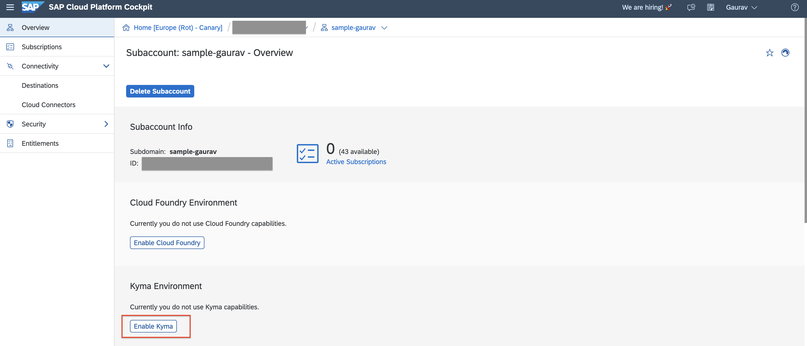

# Kyma Runtime Extension Samples

This project contains sample applications for building extensions using lambdas and microservices on [SAP Cloud Platform, Kyma runtime](https://blogs.sap.com/2020/05/12/get-a-fully-managed-runtime-based-on-kyma-and-kubernetes/).

The samples are implemented in multiple languages and demonstrate various Kyma runtime features and use case scenarios.
Developers should be able to refer to these samples and implement their own business scenarios.

## Prerequisites

Running various samples requires access to the Kyma runtime. There are also other sample-specific requirements that you can find in the Prerequisites section of each sample.

## Samples

Jumpstart your Kyma journey by using these samples to build event and api based extensions in your favorite technology.

- [Java-based microservice as an Event Trigger using CloudEvents SDK](./sample-event-trigger-java/README.md)
- [Java-based extension with API exposed via Microgateway](./sample-extension-java/README.md)
- [MS SQL database](./database-mssql/README.md)
- [Azure MS SQL database](./database-azure-mssql/README.md)
- [Golang MS SQL database API](./api-mssql-go/README.md)
- [OIDC Protected Golang MS SQL database API](./api-mssql-go-auth/README.md)
- [Serverless Function MS SQL database API](./api-mssql-function/README.md)
- [React frontend MS SQL](./frontend-react-mssql/README.md)
- [UI5 frontend MS SQL](./frontend-ui5-mssql/README.md)
- [C4C UI extensibility](./c4c-customization/README.md)
- [ASP.NET-based extension with API exposed via Microgateway](./sample-extension-dotnet/README.md)
- [S/4HANA Nodejs SAP Cloud SDK Example](./s4hana-materialstock-function/README.md)
- [Scala AKKA HTTP based extesnsion with API exposed via Microgateway](./sample-extension-scala/README.md)
- [SAP Cloud SDK Java based extension with API exposed via Microgateway](./sample-cloudsdk-java/README.md)

## Helm Charts

It is also possible to deploy each sample as a helm chart and template your Kyma extenions.

- [Helm Chart Examples](./helm-charts/README.md)

## Resources

For further resources, go to:

- Twitter: [@kymaproject](https://twitter.com/kymaproject)
- LinkedIn: [linkedin.kyma-project.io](http://linkedin.kyma-project.io)
- Youtube: [youtube.kyma-project.io](http://youtube.kyma-project.io)
- Slack: [slack.kyma-project.io](http://slack.kyma-project.io)
- GitHub: [github.com/kyma-project](http://github.com/kyma-project)
- Open SAP course: [open.sap.com/courses/kyma1](https://open.sap.com/courses/kyma1)

## Known issues

The samples are provided on the "as-is" basis. Currently, there are no known issues for the sample projects.

## Get support

The samples are provided "as-is". There is no guarantee that raised issues will be answered or addressed in future releases. For more information, visit SAP Community and [ask a question](https://answers.sap.com/questions/ask.html), or contact your SAP contact to get support. In case you observe any defect in the product usage itself, kindly use the SAP Product Support channel and raise an incident adequately for the defects observed.

## License

Copyright (c) 2020 SAP SE or an SAP affiliate company. All rights reserved. This project is licensed under the Apache Software License, version 2.0 except as noted otherwise in the [LICENSE](LICENSES/Apache-2.0.txt) file.
