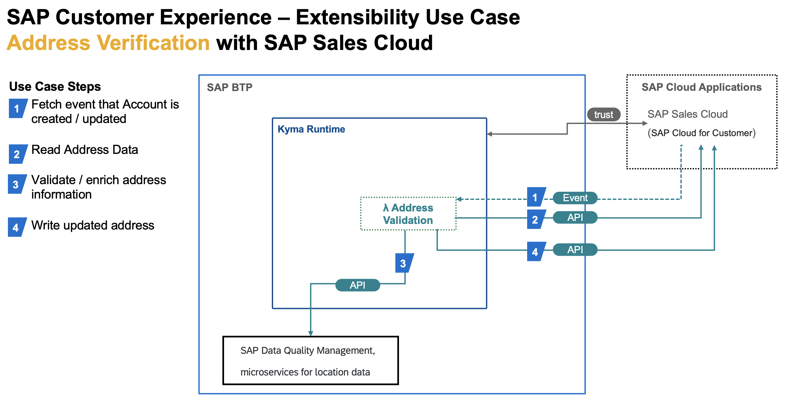
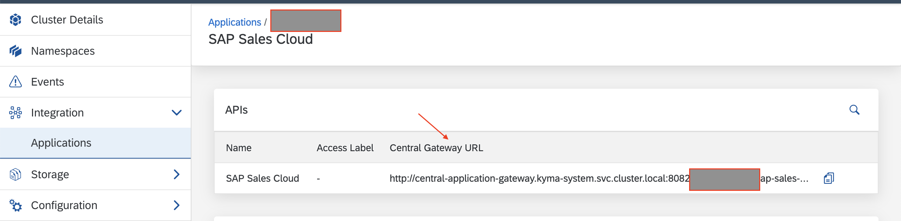

# Overview

This sample provides details on how  SAP BTP Kyma runtime can be used to extend SAP Sales Cloud (SAP Cloud for Customer).
It verifies and corrects the address data entered for the Account by using an extension built on SAP BTP Kyma runtime.



## Prerequisites

* [SAP BTP, Kyma runtime instance](../../prerequisites/#kyma)
* [Kubernetes tooling](../../prerequisites/#kubernetes)
* [SAP Sales Cloud Tenant](https://help.sap.com/learning-journeys/04f41f184f684b84b3d8ab0b4d7c4b18)
* [SAP Sales Cloud paired with Kyma runtime](https://help.sap.com/viewer/d5fec61c279741048109d851d4d3d1ad/1908/en-US/a84a5e9266264af8ac32fe627de10bd7.html)
* `Account.Root.Created` and `Account.Root.Updated` events are registered
* [SAP Data Quality Management, microservices for location data entitled to your subaccount](https://discovery-center.cloud.sap/serviceCatalog/data-quality-services?region=all) [API Reference](https://api.sap.com/api/mld/resource)

## Deploy

* Set up environment variables

  * OSX

    ```shell script
    export NS={your-namespace}
    ```

  * Windows PowerShell

    ```powershell
    $NS={your-namespace}
    ```

* Create an instance of the SAP Data Quality Management Service

   ```shell script
   kubectl -n $NS apply -f k8s/dqs_service.yaml
   ```

* Create a secret containing central gateway url

   

   ```shell script
   kubectl -n $NS create secret generic address-completion-sap-dqs --from-literal=centralGwUrl={your-connected-c4c-application-central-gateway-url}
   ```

* Deploy the function

   Update the `{provide-your-application-name-as-shown-in-kyma}` in [k8s/function.yaml](k8s/function.yaml)

   ```shell script
   kubectl -n $NS apply -f k8s/function.yaml
   ```

* Create event subscription to `Account.Root.Created` and `Account.Root.Updated` events from SAP Sales Cloud

   Update `{provide-your-application-name-as-shown-in-kyma}` and `{your-namespace}` in [k8s/subscription.yaml](k8s/subscription.yaml)

## Verify

* Login to your SAP Sales Cloud Tenant
* Create / update a new Account in SAP Sales Cloud.
* Provide wrong address details such as a wrong pin code.
* Observe the address getting automatically corrected after few seconds.
