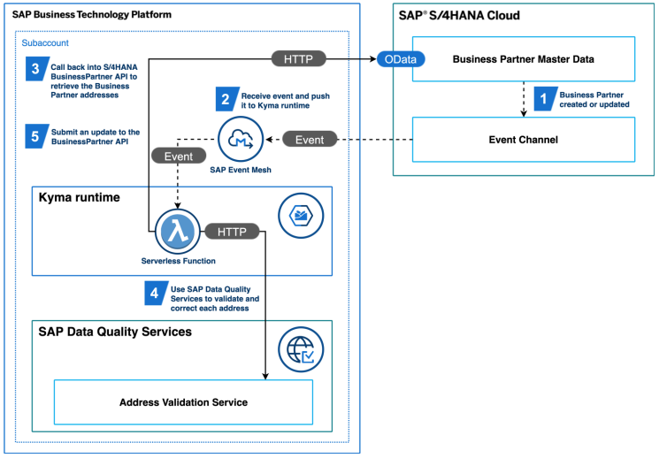

# Scenario Overview

This example provides the necessary configuration to acheive an extension of S4HANA in the Kyma runtime by utilizing both S4HANA events and APIs. In this scenario the extension validates any change to the address of a business partner. The process flow follows the steps:

- Subscribe to the event business partner created/update
- Enterprise Messaging will receive event and push to Kyma runtime
- Using the received BusinessPartner ID call back into S4Hana BusinessPartner API to retrieve the BusinessPartner addresses
- Each address is validated and corrected using either the SAP Data Qaulity Services. There is also an implementation using Google Maps Services and one for using HERE Technologies.
- If corrections are made we will submit a update to the BusinessPartner API



## Prerequisites

- Kyma runtime is configured
- S4HANA is configured
- Appropiate user rights exist on both systems and BTP

## Scenario Implementation

### Pairing the Systems

In this step a CMP create system and formation for designated Kyma runtime is created. An integration token is generated and then copied within the S4HANA app **Maintain Extensions on SAP BTP** to pair the systems

- Follow the process described in the [help](https://help.sap.com/viewer/65de2977205c403bbc107264b8eccf4b/Cloud/en-US/28171b629f3549af8c1d66d7c8de5e18.html).
  - The name of the System will be used in the SAP S/4HANA Cloud Extensibility Entitlement and each related service instance that is created

### Configure Entitlements

In this step the necessary entitlement are assigned for the subaccount which has the Kyma runtime enabled.

- Follow the process described in the [help](https://help.sap.com/docs/BTP/65de2977205c403bbc107264b8eccf4b/65ad330d11ac49a196948aa8db6470fb.html) add the entitements
  - SAP S/4HANA Cloud Extensibility (Add for the system created in the previous step) - **Plan**: messaging, api-access
  - Enterprise Messaging - **Plan**: standard (Application), default
  - SAP Data Quality Services (If using the DQS scenario) - **Plan**: standard

### Create the Subscription

In this step the SAP Event Mesh application is enabled and the role Enterprise Messaging Administrator is assigned to the user

- Enable the SAP Event Mesh and assigned the user roles as described in the [help](https://help.sap.com/docs/SAP_EM/bf82e6b26456494cbdd197057c09979f/83777b586ec54a01b5e807620f5c4660.html)

### Create the S4HANA BP API Service Instance

This step generates a **Communication Arrangement** for scenario **SAP_COM_0008**. This scenario enables the communication for the Business Partner API. This relies on the configuration related to the enablement of the **SAP S/4HANA Cloud Extensibility** entitlement.

[API Docs](https://api.sap.com/api/API_BUSINESS_PARTNER/overview)

- Within the file [s4-busi-partner-si](./k8s/s4-busi-partner-si.yaml) adjust the value **<CMP System Name>** to the system name created in CMP.
- Apply the service instance. Additional detail about the service instance can be found [here](https://help.sap.com/docs/BTP/65de2977205c403bbc107264b8eccf4b/553a4c6b98be4c1ba7d1dfa0e9df8669.html)

```
kubectl apply -f ./k8s/s4-busi-partner-si.yaml -n dev
```

- Apply the service binding

```
kubectl apply -f ./k8s/s4-busi-partner-sb.yaml -n dev
```

### Create the S4HANA Event Mesh Service Instance

This step generates a **Communcation Arrangement** for scenarion **SAP_COM_0092**. This scenario configures the connection of S4HANA to SAP Event Mesh. Within SAP Event Mesh the Message Client **s4bp** will be generated which will receive the events configured in S4HANA. The event configuration will be done in a later step.

- Within the file [s4-event-mesh](./k8s/s4-event-mesh.yaml) adjust the value **<CMP System Name>** to the system name created in CMP.
- Apply the service instance

```
kubectl apply -f ./k8s/s4-event-mesh.yaml -n dev
```

### Create the Kyma Event Mesh Service Instance

To send the events from the SAP Event Mesh we also need to create another Message Client **kybp** which will subscribe to events received by the **s4bp** client. This is done by specifing a topicRules.

- Apply the service instance

```
kubectl apply -f ./k8s/kyma-event-mesh.yaml -n dev
```

### Create Channel Binding

When appling the **s4-event-mesh.yaml** it also creates an Event Channel named **SAP_CP_XF\_\<Message Client>**, which is this case is SAP_CP_XF_S4BP. This channel is then configured for specific events to send to SAP Event Mesh. Once the topic is saved the Message Client **s4bp** will be updated with the assigned events.

- In S4HANA open the application **Maintain Event Channel Binding**
- Choose SAP_CP_XF_S4BP
- Choose Create to create an Outbound Topic for **sap/s4/beh/businesspartner/v1/BusinessPartner/\***

### Create the Queue for Event Mesh Service Instance

This step creats the connection between the two Message Clients in SAP Event Mesh. This is done by creating a Queue within the client **kybp** that subscribes to the other Message Client **s4bp**

> Queue subscription as describe in [help](https://help.sap.com/docs/BTP/65de2977205c403bbc107264b8eccf4b/e54e6094bb0c4c8d9aef58c54c842c98.html) for **sap/S4HANAOD/s4bp/\***

- In SAP Event Mesh choose the Message Client **kybp**
- Choose the tab **Queues**
- Choose **Create Queue**
- Provide name **s4bp**
- Choose **Create**
- Under **Actions** choose **Queue Subscriptions**
- Provide the topic **sap/S4HANAOD/s4bp/\*** and choose **Add**
- Choose **Close**

## Using SAP Data Quality Services

### Create the SAP DQS Service Instance and Binding

The APIs for the DQS service can be found [here](https://api.sap.com/api/mld/resource). The addressCleanse endpoint is used in this scenario.

- Apply the service instance

```
kubectl apply -f ./k8s/dqs-si.yaml -n dev
kubectl apply -f ./k8s/dqs-sb.yaml -n dev
```

### Apply the function

[Address Cleanse output fields](https://help.sap.com/docs/SAP_DATA_SERVICES/8092b085a68941f6aaa6708685a62b0d/b863af00de174a9dac5f369295f75d08.html?version=4.2.10)

```
kubectl apply -f ./k8s/function-dqs.yaml -n dev
```

## Using HERE Services

### Create HERE account and Enable the APIs

- Create HERE account and access the [portal](https://platform.here.com/portal/)
- Follow the [Quick Start Guide](https://developer.here.com/documentation/geocoding-search-api/dev_guide/topics/quick-start.html)
- Add the service **HERE Search - Forward Geocoder** to the project

### Apply the function

```
kubectl apply -f ./k8s/function-here.yaml -n dev
```

- Provide the value for the environment variable **HERE_API_KEY**

## Using Google Maps Services

### Create a Google Project and Enable the APIs

- Create a New Project or use an existing one in Google Cloud console
- Within the APIs menu enable the APIs
  - Geocoding API
  - Geolocation API
  - Maps JavaScript API
- Within the Credentials menu create an API key and copy the value

### Apply the function

```
kubectl apply -f ./k8s/function-google.yaml -n dev
```

- Provide the value for the environment variable **googleAPIKey**

## Expose the Functions and Configure the Webhook

### Apply APIRule and Oauth client

```
kubectl apply -f ./k8s/apirule-oauth.yaml -n dev
```

### Add Webhook

- In SAP Event Mesh choose the Message Client **kybp**
- Choose the tab **Webhooks**
- Choose **Create Webhook**
- Provide the name **kyma-bp-add-corr**
- Set **Quality of Service** to 1
- Toggle **Excempt Handshake** to **Yes**
- Set the **Webhook URL** to **https://s4-address-validation.<kyma domain\>**
- Set **Default Content-Type** to **application/json**
- Set **Authentication** to **OAuth2ClientCredentials**
- Provide the client_id and client_secret values from the oauth client **s4-busi-partner**, which can be obtained by running

```
kubectl get secret s4-busi-partner -n dev -o jsonpath='{.data.client_id}' | base64 --decode
kubectl get secret s4-busi-partner -n dev -o jsonpath='{.data.client_secret}' | base64 --decode
```

- Set the **Token URL** to **https://oauth2.<kyma domain\>/oauth2/token**
- Set the scope to **s4-bp-write**
- Choose **Create**
- Make sure **Subscription Status** is **Active**, otherwise in the **Action** menu choose **Resume**

## Test the scenario

- In SAP S4HANA open the application **Manage Business Partner Master Data** or GUI Transaction **Display Vendor**
- Choose a business partner
- Choose **Edit**
- Adjust the address to an invalid value, such as the zipcode
- Validate that the value was fixed by refreshing the page
- The function logs should report messages similar to

  ```
  received data for BusinessPartner: xxxxx
  Getting BusinessPartner: xxxxx
  validating address...
  Corrections necessary - updating BusinessPartner address...
  [2022-09-08T19:53:20.421Z] WARN (response-data-accessor): The given response data does not have the standard OData v2 format for single results.
  [2022-09-08T19:53:20.422Z] WARN (batch-response-transformer): Could not parse constructor from response body.
  received data for BusinessPartner: xxxxx
  Getting BusinessPartner: xxxxx
  validating address...
  No corrections were necessary for the BusinessPartner addresses..
  ```

## Troubleshooting

- The connection to Kyma can be tested by...
  - Copy an Event Topic for the Message Client **s4bp** found in the **Events** tab
  - Open the tab **Test** and copy the topic into the Publish Messages topic input
  - Set the **Content-type** to **application/json**
  - Set the message to
  ```
  {"data":{"BusinessPartner":"valid BusinessPartner ID"}}
  ```
  - You should see the call to the function being made, otherwise check
    ```
    kubectl logs -n kyma-system --selector="app.kubernetes.io/instance=api-gateway"
    kubectl logs -n kyma-system --selector="app.kubernetes.io/instance=ory"
    ```
- Make sure the Communication Arrangement is Active
  - In the **Communication Arrangement** app
  - Search for **SAP_COM_0092_COMM_AR**
  - Toggle the check box and choose **Reactivate**
- https://blogs.sap.com/2020/08/27/enterprise-event-enablement-troubleshooting/
