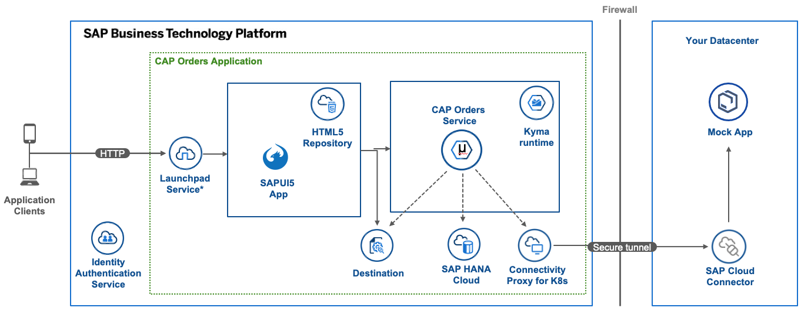

## Overview

This sample provides a CAP Service application service which displays orders. Within the service a CDS action is used to call an external application. This application generates an order which is then saved into the database. Deployment to Kyma is done using a Helm chart generated by CAP. Within Kyma, the external application is being accessed using a BTP Destination via the Cloud Connector.



## This sample demonstrates how to:

- Configure the CAP application to run locally
- Configure and build docker images using Paketo
- Generating a Helm chart with the CAP tooling which includes
  - Connecting a CAP application to Hana Cloud
  - Creating an XSUAA service instance
  - Creating a Destination service instance
  - Creating a Connectivity proxy service instanace

## Prerequisites

- SAP BTP, Kyma runtime instance
- [Docker](https://www.docker.com/)
- [Docker Hub Account](https://hub.docker.com/signup)
- [Node.js](https://nodejs.org/en/)
- [kubectl](https://kubernetes.io/docs/tasks/tools/install-kubectl/) configured to use the `KUBECONFIG` file downloaded from the Kyma runtime.
- [Paketo](https://paketo.io/)
- [SAP Cloud Connector](https://tools.eu1.hana.ondemand.com/#cloud)

## Steps

### Run the frontend locally

1. Clone the project.

2. Inside the `app` directory, run:

```shell
npm install
```

3. Install the CAP tools

```shell
npm i -g @sap/cds-dk
```

4. Verify the CAP tools install by running

```shell
cds
```

5. Run the app using the command

```shell
cds watch
```

The application loads at `http://localhost:4004` and is configured with dummy authentication and can be accessed using **user**: kyma **password**: kyma

> The file **request.http** can also be used to call the service which requires **REST Client for Visual Studio Code** to be installed.

```shell
curl http://localhost:4004/orders/Orders -u kyma:kyma
```

### Run the mock appliction locally

This example relies on the mock application found in the [connectivity-proxy](../connectivity-proxy/). Following the instructions to run this application locally. The mock application is accessed by calling the following action of the CAP application.

```shell
curl -X POST http://localhost:4004/orders/external -u kyma:kyma -H "Content-Type: application/json" -d '{"orderNo":100}'
```

### Creating the Destination

This sample will rely on the Destination service to obtain the details of the localmock system. Within your BTP subaccount, choose the menu option **Connectivity -> Destinations**. Choose the option to import and import the file [destination](./btp/destination). The CAP applications expects the name of the destination to be **localmock**.

### Configure the SAP Cloud Connector

Following the instructions to configure the localmock application within the SAP Cloud Connector found in the mock application sample at [connectivity-proxy](../connectivity-proxy/)

### Provising the HANA Database

⚠ NOTE: The creation of the instance will take some time. Also please note that when using the SAP BTP trial, the HANA instance will need to be restarted each day.

1. In the SAP BTP global account choose Entitlements -> Entity Assignments. Choose your subaccount and choose Go. This will list all assigned entitlements.
2. Choose Configure Entitlements and Add Service Plans to select additional entitlements.
3. For the Entitlement choose **SAP HANA Cloud** and choose the Plan **hana**
4. Creat the Instance by choosing within the the subaccount view, open Cloud Foundry -> Spaces and select the dev space and choose the menu item SAP HANA Cloud. Choose Create -> SAP HANA Database.
5. In SAP HANA Cloud Central, select as Type the entry SAP HANA Cloud, SAP HANA Database. Choose Next Step at the bottom right.

6. Provide the following values:
   1. Instance Name: kyma
   2. Administrator Password: Any value
   3. Chose Next Step and keep the default values of the next two screens by choosing Next Step twice.
   4. On the SAP HANA Database Advanced Settings choose the option Allow all IP addresses and choose Next Step.
   5. Lastly, choose Review and Create and then Create Instance.

### Provising the SAP HANA Schemas & HDI Containers

⚠ NOTE: The step requires that the creation of the SAP HANA Cloud has completed.

1.  Within your SAP BTP subaccount choose Service Marketplace and select SAP HANA Schemas & HDI Containers. Choose Create with the options
    1. **Plan**: hdi-shared
    2. **Instance Name**: orders-db
2.  Choose Create and select the option View Instance. Once the instance is created, open the instance and choose the option Create under Service Keys. Provide the service Key Name **kyma** and choose Create.

3.  Once created choose the option View and copy the credentials.
4.  Open the file `k8s/hana-db-secret.yaml` and copy the values into the file.
5.  Create a new `dev` Namespace:

```shell script
kubectl create namespace dev
kubectl label namespaces dev istio-injection=enabled
```

6.  Apply the secret

```shell
kubectl -n dev apply -f ./k8s/hana-db-secret.yaml
```

### Prepare the app for deployment

1. Within the directory `app`, run the command to build the for production

```shell
cds build --production
```

2. Build the service container using paketo

```shell
pack build <dockerid>/orders-srv --path gen/srv --builder paketobuildpacks/builder:base
```

3. Build the database deployer container using paketo

```shell
pack build <dockerid>/orders-hana-deployer --path gen/db --builder paketobuildpacks/builder:base
```

4. Push the two images to your docker account.

```shell
docker push <dockerid>/orders-srv
docker push <dockerid>/orders-hana-deployer
```

### Prepare the Helm chart

1. Within the directory `app`, run the command to add the helm feature to the project

```shell
cds add helm
```

2. Within the directory `app`, run the command to add the XSUAA feature to the project. This will result in an XSUAA instance being created when the helm chart is deployed.

```shell
cds add helm:xsuaa
```

3. Within the directory `app`, run the command to add the Connectivity feature to the project. This will result in an Connectivity Proxy instance being created when the helm chart is deployed. The the Connecitivity Proxy is used to communicate to the SAP Cloud Connector.

```shell
cds add helm:connectivity
```

4. Within the directory `app`, run the command to add the Destinations feature to the project. This will result in an Destinations instance being created when the helm chart is deployed. This is used to obtain the details of the **localmock** destination.

```shell
cds add helm:destinations
```

### Configure the Helm chart

1. Open the file `app/chart/values.yaml` and provide the values

   1. **Domain**: your kyma cluster-domain
   2. **Repository**: your docker/repository account
   3. **imagePullSecret.name**: if using a secured docker/repository account provide the secret name, otherwise use **notused**
   4. **srv.bindings.db.fromsecret**: orders-db
   5. **hana_deployer.bindings.hana.fromSecret**: orders-db

2. Open the file `app/chart/charts/web-application` and adjust the value
   1. **port**: 4004

### Deploy the app to Kyma

1. helm upgrade --install orders ./chart --namespace dev

### Testing the application

The CAP application will be bound to an XSUAA instance which will handle the authentication. The values: `url`, `clientid`, and `clientsecret` will be needed to create a request to obtain an access token. This can be obtained within the Kyma dashboard by finding the secret `orders-srv-auth` under the menu option `Configuration -> Secrets` and using the option to `Decode` the value. The request to call the remote APIs can also be found in **request.http**.

1. To use `curl` within a shell.

```shell
export URL=$(kubectl get secrets/orders-srv-auth -n dev -o jsonpath="{.data.url}" | base64 -d)
export CLIENTID=$(kubectl get secrets/orders-srv-auth -n dev -o jsonpath="{.data.clientid}" | base64 -d)
export CLIENTSECRET=$(kubectl get secrets/orders-srv-auth -n dev -o jsonpath="{.data.clientsecret}" | base64 -d)
```

2. Run the command, which utilizes [jq](https://stedolan.github.io/jq/) to extract the `access_token` from the response.

```shell
export ACCESSTOKEN=$(curl --location --request POST $URL/oauth/token \
--header 'Content-Type: application/x-www-form-urlencoded' \
--data-urlencode 'client_id='$CLIENTID \
--data-urlencode 'client_secret='$CLIENTSECRET \
--data-urlencode 'grant_type=client_credentials' \
--data-urlencode 'response_type=token' | jq -r '.access_token' )
```

3. Pass the access_token when calling the endpoint using curl

```shell
curl https://orders-srv-dev.<cluster domain>/orders/Orders --header 'Authorization: Bearer '$ACCESSTOKEN
```

4. Call the CDS action which calls mocked service and creates an new order.

```shell
curl -X POST  https://orders-srv-dev.<cluster domain>/orders/external --header 'Authorization: Bearer '$ACCESSTOKEN --header "Content-Type: application/json" -d '{"orderNo": 1231123}'
```

This should return a response similar to

```
{"@odata.context":"$metadata#OrdersService.return_OrdersService_external","affectedRows":1,"orders":[{"ID":"027e2eb5-8a22-4ad2-9ff9-abfd3bf6da4d"}]}
```
