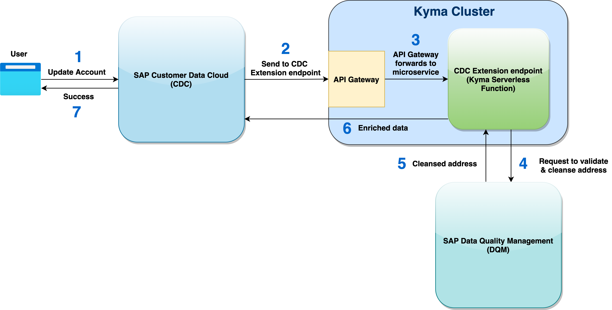
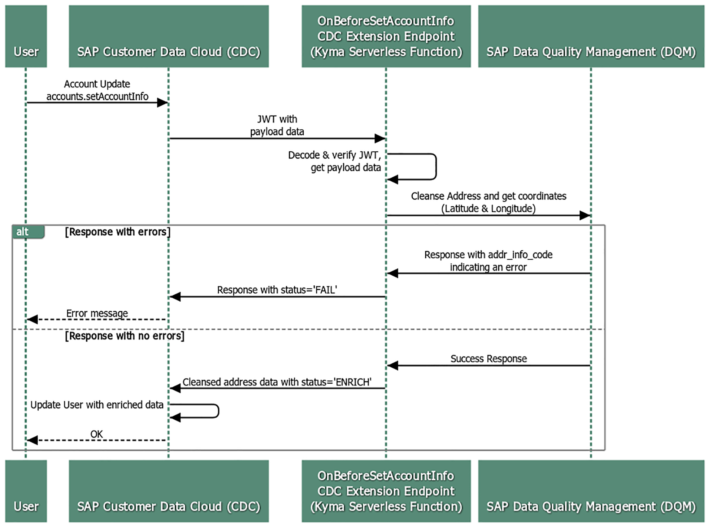

# Deploying an SAP Customer Data Cloud Extension to SAP BTP, Kyma Runtime

The objective of this example is to demonstrate how to setup a **Kyma serverless function** to be used as an **[SAP Customer Data Cloud](https://help.sap.com/viewer/product/SAP_CUSTOMER_DATA_CLOUD/GIGYA/en-US) (CDC; aka: Gigya) extension endpoint**.

**CDC Extensions** support secure, server-side, synchronous execution of custom logic and intercept specific CDC REST API calls. They can be used to meet a wide range of business use-cases, such as to:

* Prevent a user from registering with an abusive username
* Prevent a user from registering with a disposable email address
* Validate that zip codes match the country and state provided
* Check that hidden fields have not been modified
* Populate the value of a field based on the value of another field
* Check for duplicate accounts
* Prevent login from certain locations

Currently, the following CDC REST API calls can be intercepted using CDC extensions:

* **accounts.register** - Registration (OnBeforeAccountsRegister extension)
* **accounts.login** - Login (OnBeforeAccountsLogin extension)
* **socialize.login** - Social Login (OnBeforeSocialLogin extension)
* **accounts.setAccountInfo** - Profile Updates (OnBeforeSetAccountInfo extension)
* **accounts.resetPassword** - Reset Password (OnBeforeResetPassword extension)
* **Send SMS** - Communication (OnBeforeSendSMS extension)

In this example, the **accounts.setAccountInfo** REST API endpoint has been intercepted to cleanse addresses via an external SAP Data Quality Management microservice.

The code of this example can be easily re-used to build any other CDC extension and deploy it to SAP BTP, Kyma Runtime.

**Notes:** 

* All the functionality presented here are subject to change and may be changed by SAP at any time for any reason without notice.
* For demonstration, this example uses an API Key to authenticate requests to SAP DQM. In a real-world scenario, either [OAuth 2.0](https://help.sap.com/viewer/d95546360fea44988eb614718ff7e959/Cloud/en-US/1fa6310be4e14ebb86c0411491bcff97.html) or [Client Certificate Authentication](https://help.sap.com/viewer/d95546360fea44988eb614718ff7e959/Cloud/en-US/7e983cce55604a8bb23a137483ea5dca.html) are to be used.

## Scenario

This example includes a **Kyma serverless function**, ***cdc-extension***, that is exposed as a **CDC extension endpoint**, and demonstrates how to:

- Create a [CDC extension](https://help.sap.com/viewer/8b8d6fffe113457094a17701f63e3d6a/GIGYA/en-US/4153ec2f70b21014bbc5a10ce4041860.html) endpoint using a [Kyma serverless function](https://kyma-project.io/docs/kyma/latest/01-overview/main-areas/serverless/svls-01-overview/#documentation-content)
- Deploy a Kyma serverless function and an API Rule using the [Kubernetes command-line tool](https://kubernetes.io/docs/reference/kubectl/overview/)
- Alternately, deploy a Kyma serverless function and an API Rule using the Kyma Console User Interface
- Explore [api.sap.com](https://api.sap.com/) and try out REST API calls using a sandbox environment
- Use the [SAP Data Quality Management microservice](https://www.sap.com/canada/products/data-quality-management.html) for location data to cleanse addresses

#### Solution Architecture

#### Sequence Diagram

## Suggested Pre-reads

- [What is an SAP Customer Data Cloud Extension?](https://help.sap.com/viewer/8b8d6fffe113457094a17701f63e3d6a/GIGYA/en-US/4153ec2f70b21014bbc5a10ce4041860.html)
- [An Introduction to SAP Customer Data Cloud Extensions (video)](https://microlearning.opensap.com/media/1_ucyxrfoj)
- [What is Kyma Environment?](https://help.sap.com/viewer/65de2977205c403bbc107264b8eccf4b/Cloud/en-US/468c2f3c3ca24c2c8497ef9f83154c44.html)
- [What is a Kyma Serverless Function?](https://kyma-project.io/docs/kyma/latest/01-overview/main-areas/serverless/svls-01-overview/#documentation-content)
- [What is a Kyma API Rule?](https://kyma-project.io/docs/kyma/latest/05-technical-reference/00-custom-resources/apix-01-apirule/#documentation-content)
- [Project Kyma Documentation](https://kyma-project.io/)
- [Administration and Operations in the Kyma Environment](https://help.sap.com/viewer/65de2977205c403bbc107264b8eccf4b/Cloud/en-US/b8e16869e64a4abe93cc194aa6fdacf5.html)

## Pre-requisites

- Provision [SAP Customer Data Cloud](https://www.sap.com/canada/products/crm/customer-data-management.html) (CDC; aka: Gigya) and [setup a CDC site](https://help.sap.com/viewer/8b8d6fffe113457094a17701f63e3d6a/GIGYA/en-US/41720d7370b21014bbc5a10ce4041860.html).
- [Get a Free Account on SAP BTP Trial](https://developers.sap.com/tutorials/hcp-create-trial-account.html).
- [Enable SAP BTP, Kyma Runtime](https://developers.sap.com/tutorials/cp-kyma-getting-started.html).
- [Download and install the Kubernetes Command Line Tool](https://developers.sap.com/tutorials/cp-kyma-download-cli.html#d81e7789-ced4-4df6-b4a0-132d8c637077).
- [Test the kubectl installation](https://developers.sap.com/tutorials/cp-kyma-download-cli.html#4709f3b9-b9bc-45f1-89c1-cd6f097c55f5).
- [Download the Kyma Runtime kubeconfig](https://developers.sap.com/tutorials/cp-kyma-download-cli.html#2ef10816-b759-4080-a8ec-eadbc3317ebd).
- Create your [api.sap.com](https://api.sap.com/) account.

## Deployment steps

1. Go to the [kyma-runtime-extension-samples](https://github.com/SAP-samples/kyma-runtime-extension-samples) repository and clone it. This repository contains a collection of Kyma sample applications including this example (in the **cdc-extension** folder). 

	Download the code by choosing the green **Code** button, and then choosing one of the options to download the code locally. 
	
	Alternately, you can also run the following command using your command-line interface within your desired folder location:
	
	`git clone https://github.com/SAP-samples/kyma-runtime-extension-samples`
		
	**Note:** The source code of this example is in the cdc-extensions subfolder of [this repository](https://github.com/SAP-samples/kyma-runtime-extension-samples).

2. Update the values of the following environment variables in the **./kyma-runtime-extension-samples/cdc-extension/k8s/function.yaml** file: `CDC_API_KEY`, `SAP_API_HUB_API_KEY`, `PUBLIC_KEY_KID`, `PUBLIC_KEY_N` and `PUBLIC_KEY_E`

    - `CDC_API_KEY` - This is the API Key of the CDC site and can be got from the [CDC console](https://console.gigya.com/).
    
    - `SAP_API_HUB_API_KEY` - This is the API Key of SAP API Business Hub. Login to [api.sap.com](https://api.sap.com/). Then, go to your profile settings and click on **Show API Key** to get the value for this variable.

	Go to "https://accounts.`CDC_Data_Center`/accounts.getJWTPublicKey?apiKey=`Your-CDC-Site-API-key`".
	
	[Find your CDC Data Center](https://help.sap.com/viewer/8b8d6fffe113457094a17701f63e3d6a/GIGYA/en-US/41573b6370b21014bbc5a10ce4041860.html). Replace `CDC_Data_Center` with your Data Center (For example, the US Data Center is **us1.gigya.com**). Replace **Your-CDC-Site-API-key** with your CDC site's API Key.
	
	The response JSON body will also include the following fields: **kid**, **n** and **e**

   - `PUBLIC_KEY_KID` - This is the value of the **kid** field in the response above.
   
   - `PUBLIC_KEY_N` - This is the value of the **n** field in the response above.
    
   - `PUBLIC_KEY_E` - This is the value of the **e** field in the response above.

3. Create a Kubernetes namespace with the name `cdc`.

	- `kubectl create namespace cdc`

	**Alternately, use the Kyma Console User Interface to create a new namespace**
	
	- Open the Kyma console and click on **Add new namespace**. Enter its name as **cdc** and click the **Create** button.

4. Create/update Kubernetes resources of the **cdc-extension serverless function**.

	- `kubectl apply -f ./kyma-runtime-extension-samples/cdc-extension/k8s/function.yaml`
	
	- `kubectl apply -f ./kyma-runtime-extension-samples/cdc-extension/k8s/api-rule.yaml`

	**Note:** As a prerequisite, please follow the steps listed in the following tutorial: [Download the Kyma Runtime kubeconfig](https://developers.sap.com/tutorials/cp-kyma-download-cli.html#2ef10816-b759-4080-a8ec-eadbc3317ebd)

	> The resources are represented as declarative YAML objects. Applying the resources will perfom the following steps:
	
	- Deploy the Kyma serverless function
	- Expose the serverless function using a Kyma API Rule that will serve as the CDC Extension endpoint

	**Alternately, deploy the Kyma serverless function and API Rule using the Kyma Console User Interface:**
	
	- Open the Kyma console and select the **cdc** namespace.
	- Click on **Workloads**. Then, click on **Deploy new workload** and select **Upload YAML**.
	- Then, click on **Browse** to select the following YAML file, and click on **Deploy**: **./kyma-runtime-extension-samples/cdc-extension/k8s/function.yaml**
	- Repeat the above steps and select the following YAML file. Then, click on **Deploy**: **./kyma-runtime-extension-samples/cdc-extension/k8s/api-rule.yaml**

5. Go to the Kyma Console -> CDC namespace -> Discovery & Network -> API Rules. Copy the **host** URL of the cdc-extension API Rule. Then, go to the [CDC Console](https://console.gigya.com/). Select your site and click on Extensions -> Add. Enter a name, select the API as **accounts.setAccountInfo (OnBeforeSetAccountInfo)**, paste the **host** URL, and click on the Save button.

6. Add the following two fields to the CDC schema with **Type** as **string** and **Write Access** as **clientModify**.

	- data.addr_latitude
	- data.addr_longitude

7. Add the following text fields to the CDC Registration Completion screen and set them to be required in the CDC schema.

	- Screen-Set ID: **Default-RegistrationLogin**
	- Screen ID: **gigya-complete-registration-screen**
	- Four fields (Three Textbox components and one Dropdown component) to be added and to be mapped to the following schema fields:
		- profile.address
		- profile.city
		- profile.state
		- profile.zip
		- profile.country

	**Note:** Set the above schema fields as **required**.

## Steps to test the solution

1. Register an account in your CDC site. 

	**Note:** This can also be done by previewing the registration screen of the **Default-RegistrationLogin** screen-set in the [CDC console](https://console.gigya.com/).
 
2. The registration completion screen will be displayed. 

3. Enter an invalid address and click the **Submit** button. An error message will be returned.

4. Fix the address and click the **Submit** button. The form should be processed successfully.
 
5. View the details of the account that was registered in the **Identity Access** screen of the CDC console. It can be observed that the address of the user has been cleansed, and the geo codes of the address have also been added.

## Troubleshooting steps

### Check the logs of your Kubernetes pods

In the Kyma Console, within the **cdc** namespace, go to **Workloads** > **Pods** to see the list of all running pods.

To see the logs of a specific function, open the function in the Kyma console and you will see the logs in an expandable window at the bottom of the page.

Optionally, use the following kubectl command to get the list of pods running in the cdc namespace.

`kubectl get pods -n cdc`

Then, to see the logs of any of the pods, use the following syntax:

`kubectl logs <pod-name> -n <namespace-name>`

Example:

`kubectl logs cdc-extension-td98x-59dcbcff48-l294e -n cdc`