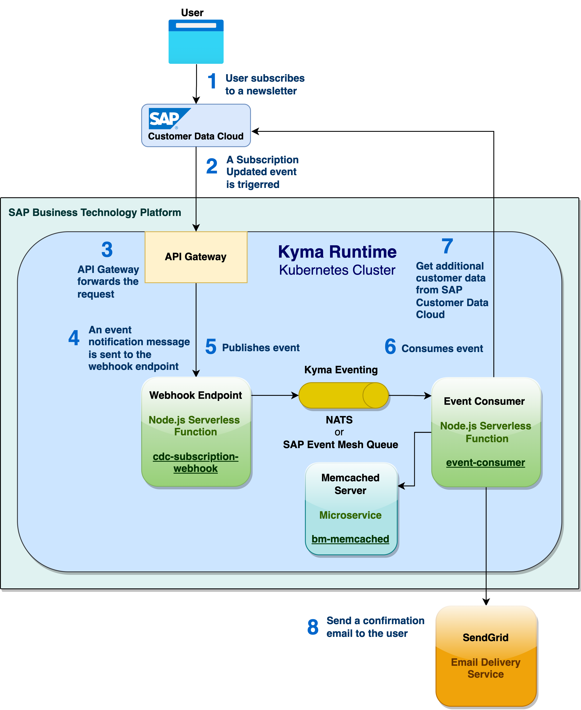
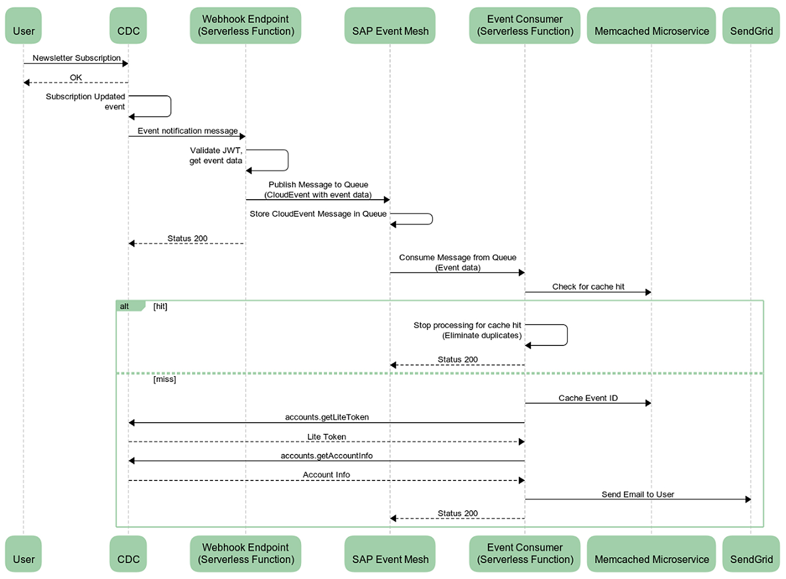

# Sample SAP Customer Data Cloud Webhook

## Solution Architecture

## Sequence Diagram

## Build and deployment steps

- [**Pre-requisites**](docs/setup/pre-requisites.md)
- [**Step 1** - Pre-requisite SendGrid setup steps](docs/setup/step-1.md)
- [**Step 2** - Create a lite registration screen in SAP Customer Data Cloud](docs/setup/step-2.md)
- [**Step 3** - Deploy a Memcached memory-caching service](docs/setup/step-3.md)
- [**Step 4** - Deploy the Webhook endpoint](docs/setup/step-4.md)
- [**Step 5** - Deploy the Event Consumer Serverless Function](docs/setup/step-5.md)
- [**Step 6** - Apply the Webhook Event Subscription](docs/setup/step-6.md)

## Verification steps

- [**Step 1** - Verify that all the resources of the app are running](docs/verification/step-1.md)
- [**Step 2** - Subscribe for a newsletter and receive a customized confirmation email](docs/verification/step-2.md)

### [Troubleshooting steps](docs/verification/troubleshooting-steps.md)
