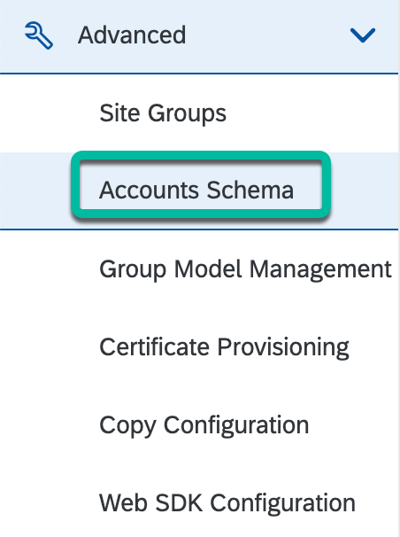
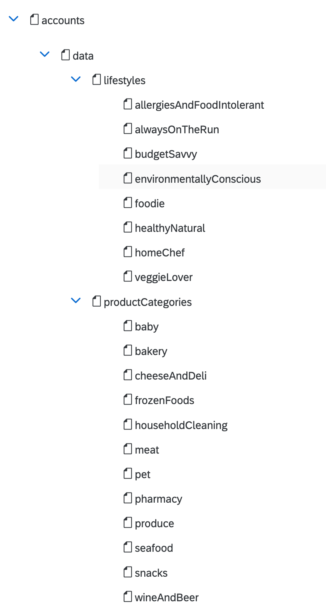
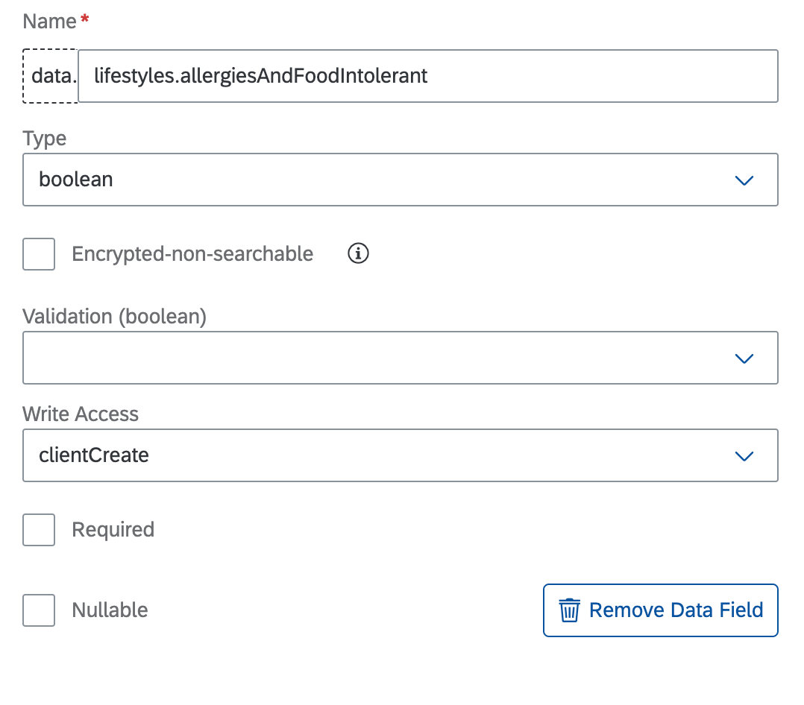
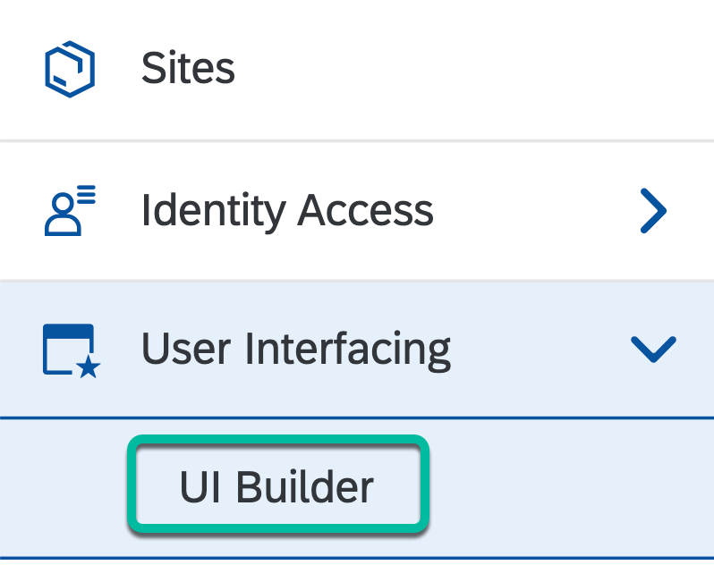
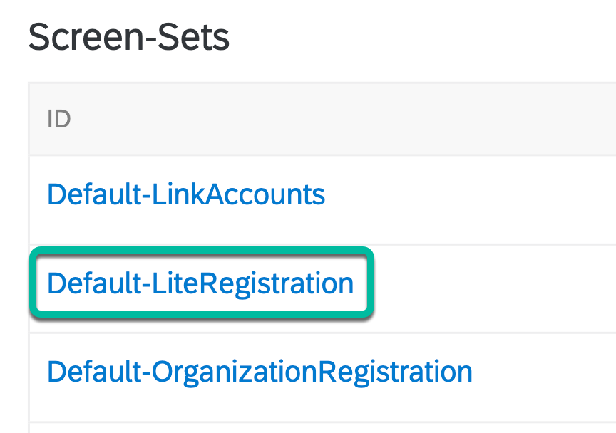
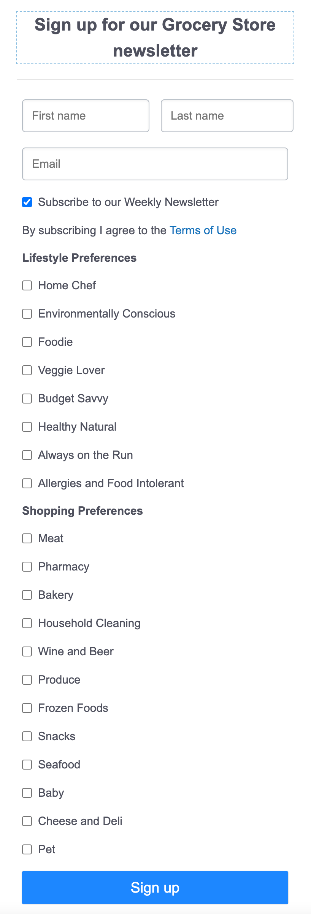
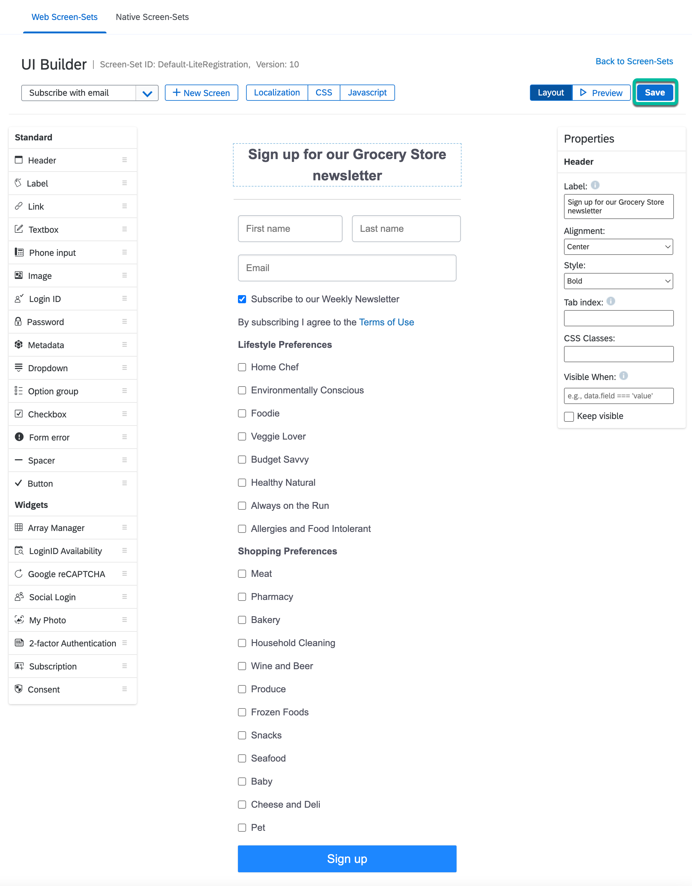

# Step 2 - Create a lite registration screen in SAP Customer Data Cloud

1. Login to [console.gigya.com](https://console.gigya.com)

2. Select your **SAP Customer Data Cloud site** from the list of sites (or create a new site).

3. In the left menu, select **Advanced** -> **Accounts Schema**

   

4. Add the boolean fields listed below to the data object of the Accounts Schema of your site.

   * lifestyles.homeChef
   * lifestyles.environmentallyConscious
   * lifestyles.foodie
   * lifestyles.veggieLover
   * lifestyles.budgetSavvy
   * lifestyles.healthyNatural
   * lifestyles.alwaysOnTheRun
   * lifestyles.allergiesAndFoodIntolerant
   * productCategories.meat
   * productCategories.pharmacy
   * productCategories.bakery
   * productCategories.householdCleaning
   * productCategories.wineAndBeer
   * productCategories.produce
   * productCategories.frozenFoods
   * productCategories.snacks
   * productCategories.seafood
   * productCategories.baby
   * productCategories.cheeseAndDeli
   * productCategories.pet

   **Example:**

   

5. Ensure that all the fields are of `boolean` **Type** and with `clientModify` **Write Access**. Example:

   

6. Then, click on `Save Changes` in the Schema screen.

   

7. Next, in the left menu, select **User Interfacing** -> **UI Builder**

   

8. Click on the **Default-LiteRegistration** screen-set to open it.

   

9. Add some fields to the screen as shown in the mockup below.

   

10. Map the input fields to the respective schema fields as shown in the table below.

      Component Type | Field Label | Schema field
      ---------|----------|---------
      Textbox | First name | profile.firstName
      Textbox | Last name | profile.lastName
      Textbox | Email | profile.email
      Checkbox | Subscribe to our Weekly Newsletter | subscriptions.marketing.email.isSubscribed
      Checkbox | Home Chef | data.lifestyles.homeChef
      Checkbox | Environmentally Conscious | data.lifestyles.environmentallyConscious
      Checkbox | Foodie | data.lifestyles.foodie
      Checkbox | Veggie Lover | data.lifestyles.veggieLover
      Checkbox | Budget Savvy | data.lifestyles.budgetSavvy
      Checkbox | Healthy Natural | data.lifestyles.healthyNatural
      Checkbox | Always on the Run | data.lifestyles.alwaysOnTheRun
      Checkbox | Allergies and Food Intolerant | data.lifestyles.allergiesAndFoodIntolerant
      Checkbox | Meat | data.productCategories.meat
      Checkbox | Pharmacy | data.productCategories.pharmacy
      Checkbox | Bakery | data.productCategories.bakery
      Checkbox | Household Cleaning | data.productCategories.householdCleaning
      Checkbox | Wine and Beer | data.productCategories.wineAndBeer
      Checkbox | Produce | data.productCategories.produce
      Checkbox | Frozen Foods | data.productCategories.frozenFoods
      Checkbox | Snacks | data.productCategories.snacks
      Checkbox | Seafood | data.productCategories.seafood
      Checkbox | Baby | data.productCategories.baby
      Checkbox | Cheese and Deli | data.productCategories.cheeseAndDeli
      Checkbox | Pet | data.productCategories.pet

11. Finally, click on `Save` to save the changes to the  screen-set.

   

## Navigation

| [:house:](../../README.md) | :arrow_backward: [Setup : Step 1 - Pre-requisite SendGrid setup steps](step-1.md) | :arrow_forward: [Setup : Step 3 - Deploy a Memcached memory-caching service](step-3.md) |
| -------------------------- | --------------------------------------------------------------------------------- | -------------------------------------------------------------------------------- |
