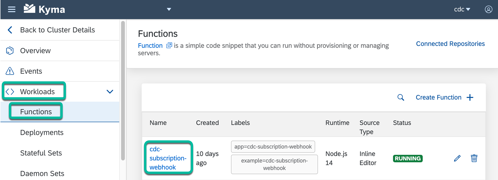
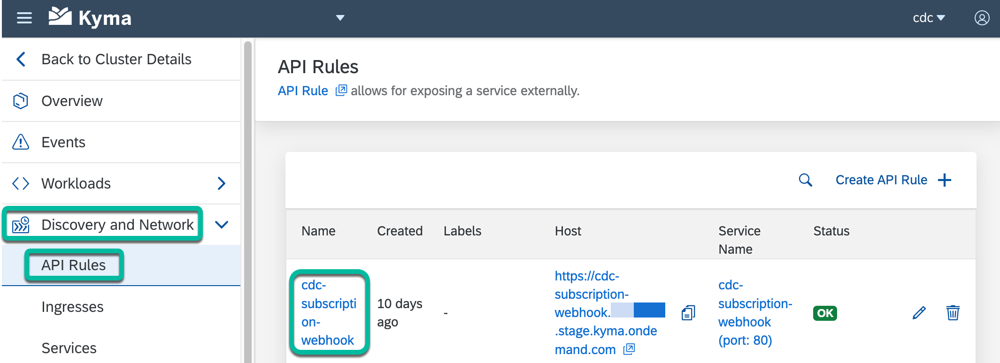

# Step 4 - Deploy the Webhook endpoint

## 1. Deploy the cdc-subscription-webhook Serverless Function

1. Download the source code of the **kyma-runtime-extension-samples** GitHub repo.

   ```shell
   git clone https://github.com/SAP-samples/kyma-runtime-extension-samples
   ```

2. Go to the **cdc-webhook** folder.

   ```shell
   cd cdc-webhook
   ```

3. Run the following command,

   ```shell
   curl 'https://accounts.<Data_Center>/accounts.getJWTPublicKey?apiKey=<CDC_API_KEY>'
   ```

   **Where:**

   `<CDC_API_KEY>` is the API Key of the SAP Customer Data Cloud site.

   `<Data_Center>` is

   * **us1.gigya.com** - for the US data center
   * **eu1.gigya.com** - for the European data center
   * **au1.gigya.com** - for the Australian data center
   * **eu2.gigya.com** - for the European Azure data center
   * **ru1.gigya.com** - for the Russian data center
   * **cn1.sapcdm.cn** - for the Chinese data center
   * **global.gigya.com** - for all Global site groups

4. From the response of the above request, copy the values of the `kid`, `n` and `e` fields and update the values of the `CDC_API_KEY`, `CDC_KID`, `CDC_N_MODULUS` & `CDC_E_EXPONENT` environment variables in the `./cdc-subscription-webhook/k8s/secret.yaml` file.

5. Create the Kubernetes resources of the **cdc-subscription-webhook Serverless Function**.

   ```shell
   kubectl apply -f ./cdc-subscription-webhook/k8s/secret.yaml
   kubectl apply -f ./cdc-subscription-webhook/k8s/function.yaml
   ```

6. Check to confirm that the **cdc-subscription-webhook Serverless Function**  is running in the **cdc** namespace.

   

## 2. Create an API Rule

1. Create the **cdc-subscription-webhook API Rule**.

   ```shell
   kubectl apply -f ./cdc-subscription-webhook/k8s/api-rule.yaml
   ```

2. Check to confirm that the **cdc-subscription-webhook API Rule** is running in the **cdc** namespace.

   

## 3. Add the endpoint of the webhook to your SAP Customer Data Cloud site

1. Login to [console.gigya.com](https://console.gigya.com/)

2. Select your SAP Customer Data Cloud site and navigate to `Orchestrate` > `Webhooks`.

3. Click on the `Create Webhook` button and enter the following values and click `Save Changes`.

   * For `Name`, enter `cdc-subscription-webhook`.
   * For `Notification URL`, enter the URL of the **cdc-subscription-webhook API Rule** that was created in the previous step above.
   * For `Version`, select `2.0 - Signed with a JWS`.
   * Under `Events`, select `Subscription updated`.

## Navigation

| [:house:](../../README.md) | :arrow_backward: [Setup : Step 3 - Deploy a Memcached memory-caching service](step-3.md) | :arrow_forward: [Setup : Step 5 - Deploy the Event Consumer Serverless Function](step-5.md) |
| -------------------------- | --------------------------------------------------------------------------------- | -------------------------------------------------------------------------------- |
