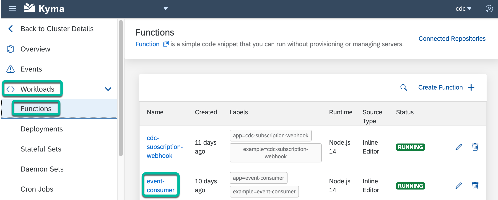

# Step 5 - Deploy the Event Consumer Serverless Function

## 1. Create a Permission Group in your SAP Customer Data Cloud site

1. Login to [console.gigya.com](https://console.gigya.com/)

2. Navigate to `Administration` > `Access Management` > `Permission Groups`.

3. Click on the `Create Group` button and enter a name for the permission group of your site.

4. Click to select the permission group that you created in the above step.

5. Under `Privileges` > `Identity Access`, select `User Records` and `Write Access`.

6. Under `Privileges` > `External Integrations`, select `Full API Access` and click `Save`.

7. Under `Scope`, select the `This group applies only to the sites listed below` radio button and select your site from the list below it. Then, click `Update Scope`.

## 2. Create an Application in your SAP Customer Data Cloud Site

1. Login to [console.gigya.com](https://console.gigya.com/)

2. Navigate to `Administration` > `Access Management` > `Applications`.

3. Click on `Create New Application`. Give it a name. Then, select the permission group that you created in the above step and click `Create`.

4. Copy the generated `User Key` and `User Secret` and use it in the next step.

## 3. Deploy the Serverless Function

1. Update the values of the `SENDGRID_API_KEY`, `SENDGRID_SENDER_EMAIL`, `CDC_API_KEY`, `CDC_APP_USER_KEY`, `CDC_APP_SECRET` and `MEMCACHED_ENDPOINT` environment variables in the `./event-consumer/k8s/secret.yaml` file.

   Where:

   * `SENDGRID_API_KEY` and `SENDGRID_SENDER_EMAIL` can be taken from your SendGrid account.
   * `<CDC_API_KEY>` is the API Key of the SAP Customer Data Cloud site.
   * `CDC_APP_USER_KEY` and `CDC_APP_SECRET` are the `User Key` and `User Secret` from the previous step above.
   * `MEMCACHED_ENDPOINT` should only be changed if you have used a different name for your Memcached instance.

2. Create the Kubernetes resources of the **event-consumer Serverless Function**.

   ```shell
   kubectl apply -f ./event-consumer/k8s/secret.yaml
   kubectl apply -f ./event-consumer/k8s/function.yaml
   ```

3. Check to confirm that the **event-consumer Serverless Function** is running in the **cdc** namespace.

   

## Navigation

| [:house:](../../README.md) | :arrow_backward: [Setup : Step 4 - Deploy the Webhook endpoint](step-4.md) | :arrow_forward: [Setup : Step 6 - Apply the Webhook Event Subscription](step-6.md) |
| -------------------------- | ----------------------------------------------------------------------------------------------------------- | --------------------------------------------------------------------------------------- |
