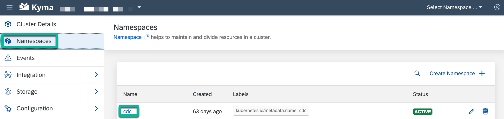
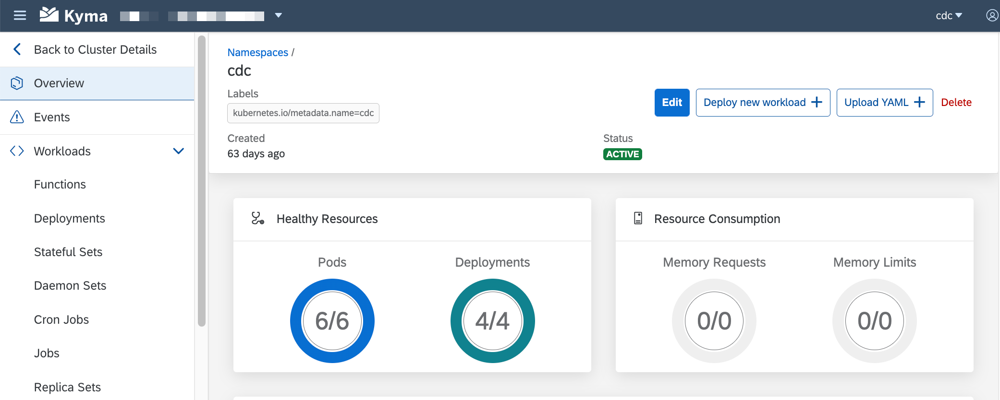
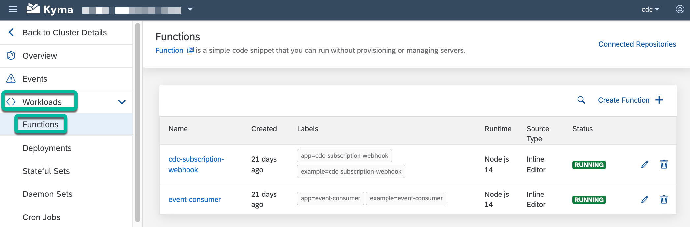
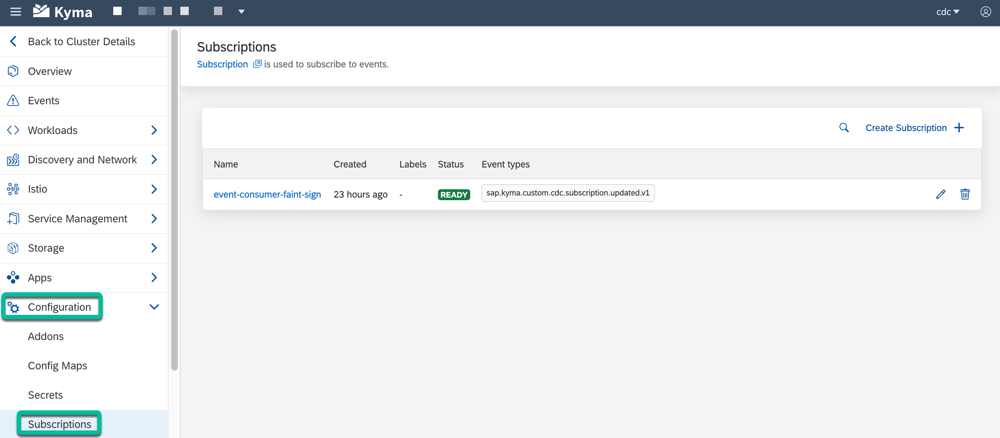

# Step 1 - Verify that all the resources of the app are running

1. Go to your Kyma workspace. Select `Namespaces` and then select the **cdc** namespace to explore it.

    

2. Verify that all the pods are healthy.

    

3. Go to `Workloads` -> `Functions` and verify that all the Functions have a `RUNNING` status.

    

4. Go to `Configuration` -> `Subscriptions` and verify that the event-consumer Subscription has a `READY` status.

    

5. Go to `Discovery and Network` -> `API Rules` and verify that the API Rules have an `OK` status.

    

## Navigation

| [:house:](../../README.md) | :arrow_backward: [Setup : Step 6 - Apply the Webhook Event Subscription](../setup/step-6.md) | :arrow_forward: [Verification : Step 2 - Subscribe for a newsletter and receive a customized confirmation email](step-2.md) |
| -------------------------- | ------------------------------------------------------------------------------- | ----------------------------------------------------------------------------------------------------- |
