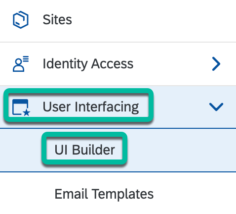
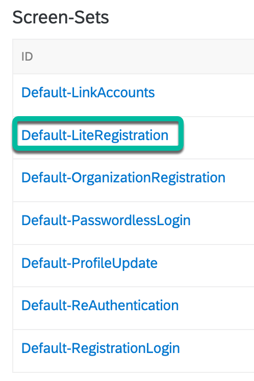
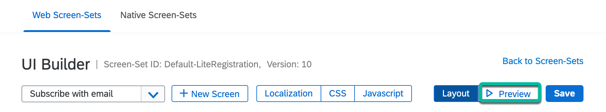
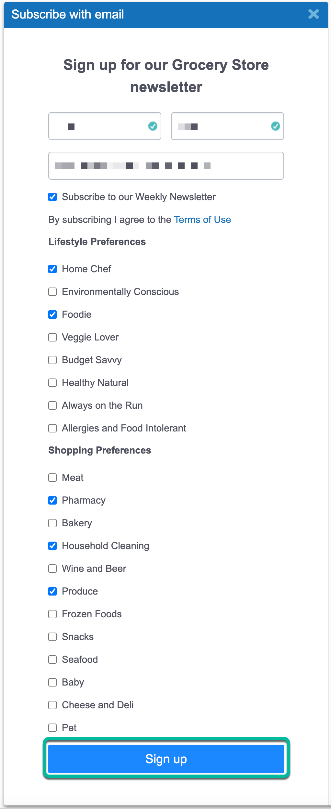
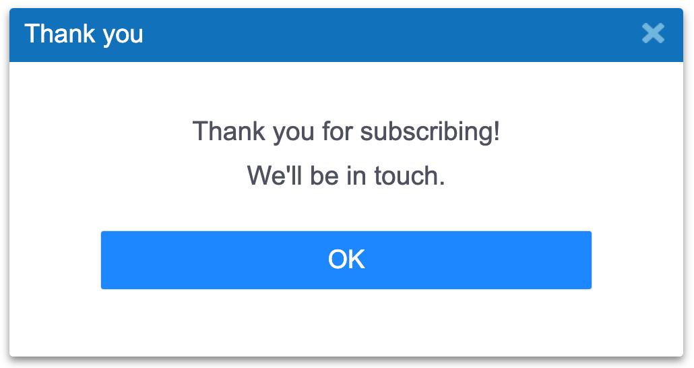
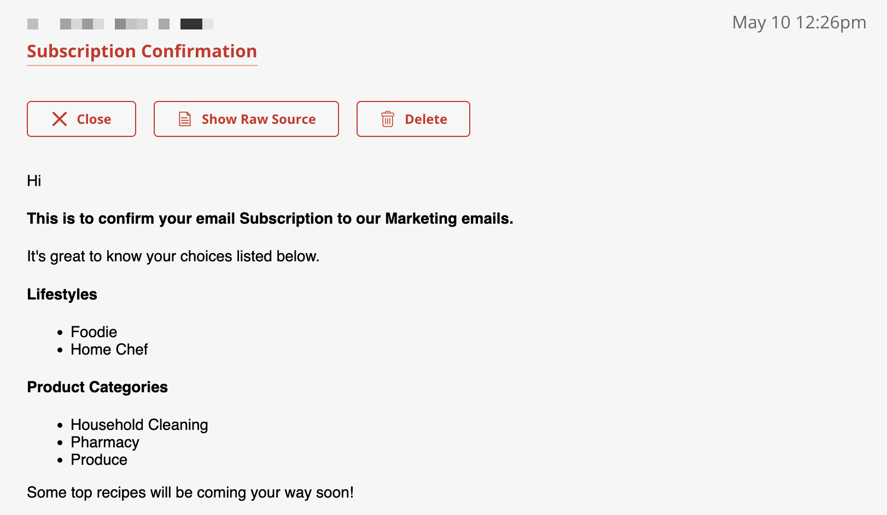

# Step 2 - Subscribe for a newsletter and receive a customized confirmation email

The purpose of this step is to verify that you receive a customized confirmation email when you subscribe for a newsletter via SAP Customer Data Cloud.

## Sign up to receive a newsletter

1. Login to [console.gigya.com](https://console.gigya.com)

2. Select your **SAP Customer Data Cloud site** from the list of sites.

3. In the left menu, select **User Interfacing** -> **UI Builder**

   

4. Scroll down on the page and select the **Default-LiteRegistration** screen-set.

   

5. Click on the **Preview** button.

   

6. Fill in the form and click on the **Sign up** button.

   

7. A confirmation message will be displayed after you have signed up.

   

## Verify that you get a customized confirmation email

1. Check you email **Inbox** to confirm that a confirmation email was sent to you.

   

## Navigation

| [:house:](../../README.md) | :arrow_backward: [Verification : Step 1 - Verify that all the resources of the app are running](step-1.md) | :arrow_forward: [Troubleshooting steps](troubleshooting-steps.md) |
| -------------------------- | ---------------------------------------------------------------------------------------------------------- | ------------------------------------------------------------------------------------------------- |
