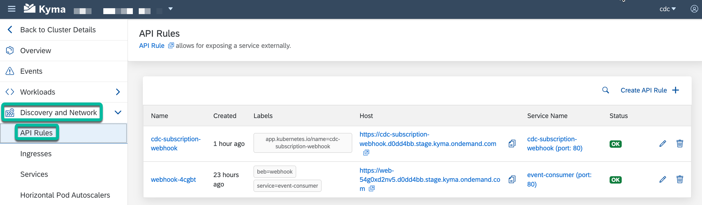
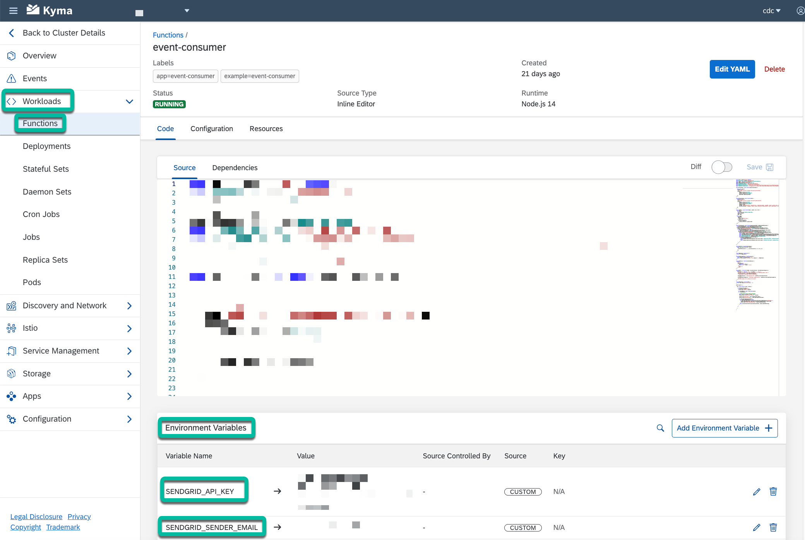

# Troubleshooting steps

## If you don’t receive an email

If you don’t receive an email, then:

* Either the API Rule may not have been setup correctly.

* Or some of the environment variables haven’t been set correctly.

## Check your API Rule

To check if your API Rule has been setup correctly, verify that it looks as shown in the screenshot below.

   

## Check the Send Grid environment variables of the event-consumer function

To verify your environment variables, go to **Workloads** > **Functions** > **event-consumer**.

Then, verify that the values of the **SENDGRID_API_KEY** & **SENDGRID_SENDER_EMAIL** environment variables are correct.

   

## Check the logs of your different pods

1. Within the **cdc** namespace, go to **Workloads** > **Pods** to see the list of all running pods.

2. To see the logs of the serverless function, go to the function in the Kyma console and view the Logs in the expandable window at the bottom of the page.

3. Optionally, use the following kubectl command to get the list of pods running in the **cdc** namespace.

   ```shell
   kubectl get pods -n cdc
   ```

4. Then, to see the logs of any of the pods, use the following syntax:

   ```shell
   kubectl logs <pod-name> -n <namespace>
   ```

   **Example:**

   ```shell
   kubectl logs event-consumer-build-gz5tp-wpw8h -n cdc
   ```

## Navigation

| [:house:](../../README.md) | :arrow_backward: [Verification : Step 2 - Subscribe for a newsletter and receive a customized confirmation email](step-2.md) |
| -------------------------- | --------------------------------------------------------------------------------------------------------------------------- |
