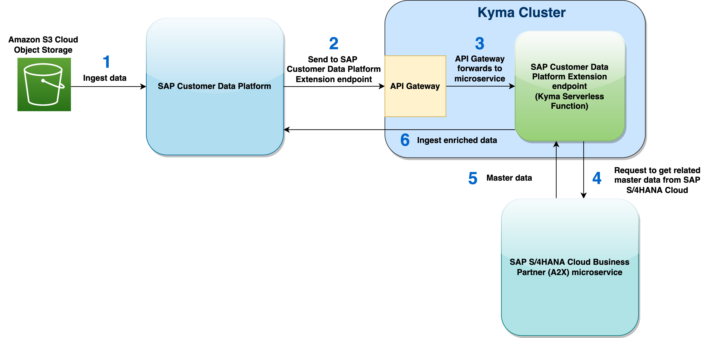
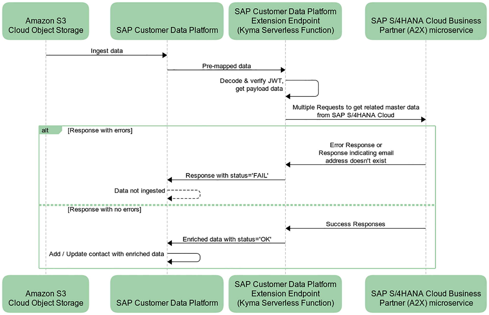

# Sample SAP Customer Data Platform Extension

## Scenario

This example includes a **Kyma Serverless Function**, *cdp-extension*, that is exposed as an **SAP Customer Data Platform Extension endpoint**, and demonstrates how to:

* Create an [SAP Customer Data Platform Extension](https://help.sap.com/viewer/8438f051ded544d2ba1303e67fc5ff86/PROD/en-US/67ac7304cead44a9a6b762f583fe1fe1.html) endpoint using a [Kyma Serverless Function](https://kyma-project.io/docs/kyma/latest/01-overview/main-areas/serverless/svls-01-overview/#documentation-content)
* Deploy a Kyma Serverless Function and an API Rule with **JWT Access strategy** using the [Kubernetes command-line tool](https://kubernetes.io/docs/reference/kubectl/overview/)
* Alternately, deploy a Kyma Serverless Function and an API Rule with **JWT Access strategy** using the Kyma Console User Interface
* Explore [api.sap.com](https://api.sap.com/) and try out REST API calls using a sandbox environment
* Use the [SAP S/4HANA Cloud Business Partner (A2X) microservice](https://www.sap.com/canada/products/data-quality-management.html) for Business Partner, Supplier, and Customer master data in SAP S/4HANA Cloud system

#### Solution Architecture



#### Sequence Diagram



## Suggested introductory readings

* [What is an SAP Customer Data Platform Extension?](https://help.sap.com/viewer/8438f051ded544d2ba1303e67fc5ff86/PROD/en-US/67ac7304cead44a9a6b762f583fe1fe1.html)
* [SAP Customer Data Platform Sources and Destinations](https://help.sap.com/viewer/8438f051ded544d2ba1303e67fc5ff86/PROD/en-US/f4b17b0302e248da805fd9e4530934e5.html)
* [Using Kyma with SAP Customer Data Platform Extensions](https://help.sap.com/viewer/8438f051ded544d2ba1303e67fc5ff86/PROD/en-US/8722f8e5157b4cf9be5f0177906a0351.html)
* [What is Kyma Environment?](https://help.sap.com/viewer/65de2977205c403bbc107264b8eccf4b/Cloud/en-US/468c2f3c3ca24c2c8497ef9f83154c44.html)
* [What is a Kyma Serverless Function?](https://kyma-project.io/docs/kyma/latest/01-overview/main-areas/serverless/svls-01-overview/#documentation-content)
* [What is a Kyma API Rule?](https://kyma-project.io/docs/kyma/latest/05-technical-reference/00-custom-resources/apix-01-apirule/#documentation-content)
* [Project Kyma Documentation](https://kyma-project.io/)
* [Administration and Operations in the Kyma Environment](https://help.sap.com/viewer/65de2977205c403bbc107264b8eccf4b/Cloud/en-US/b8e16869e64a4abe93cc194aa6fdacf5.html)

## Pre-requisites

* Provision [SAP Customer Data Platform](https://www.sap.com/canada/products/customer-data-platform.html).
* [Get a Free Account on SAP BTP Trial](https://developers.sap.com/tutorials/hcp-create-trial-account.html).
* [Enable SAP BTP, Kyma Runtime](https://developers.sap.com/tutorials/cp-kyma-getting-started.html).
* [Download and install the Kubernetes Command Line Tool](https://developers.sap.com/tutorials/cp-kyma-download-cli.html#d81e7789-ced4-4df6-b4a0-132d8c637077).
* [Test the kubectl installation](https://developers.sap.com/tutorials/cp-kyma-download-cli.html#4709f3b9-b9bc-45f1-89c1-cd6f097c55f5).
* [Download the Kyma Runtime kubeconfig](https://developers.sap.com/tutorials/cp-kyma-download-cli.html#2ef10816-b759-4080-a8ec-eadbc3317ebd).
* Create your [api.sap.com](https://api.sap.com/) account.

## Deployment steps

### Deploy the Kyma Serverless Function

1. Go to the [kyma-runtime-extension-samples](https://github.com/SAP-samples/kyma-runtime-extension-samples) repository and clone it. This repository contains a collection of Kyma sample applications including this example (in the **cdp-extension** subfolder). Download the code by choosing the green Code button, and then choosing one of the options to download the code locally. Alternately, you can also run the following command using your command-line interface within your desired folder location:

    ```shell
    git clone https://github.com/SAP-samples/kyma-runtime-extension-samples
    ```

    >> **Note:** The source code of this example is in the [cdp-extension](https://github.com/SAP-samples/kyma-runtime-extension-samples/tree/main/cdp-extension) subfolder of this repository.

2. Update the values of the following environment variable in the **./kyma-runtime-extension-samples/cdp-extension/k8s/function.yaml** file: `SAP_API_HUB_API_KEY`

    * `SAP_API_HUB_API_KEY` - This is the API Key of SAP API Business Hub. Login to [api.sap.com](https://api.sap.com/). Then, go to your profile settings and click on **Show API Key** to get the value for this variable.

3. Make the following changes in the **./kyma-runtime-extension-samples/cdp-extension/k8s/api-rule.yaml** file:

    * Replace `DATA_CENTER` with the Data Center that is closest to you. As an example, the US Data Center is `us1.gigya.com`. For other locations, check [Finding your Data Center](https://help.sap.com/viewer/8b8d6fffe113457094a17701f63e3d6a/GIGYA/en-US/41573b6370b21014bbc5a10ce4041860.html).
    * Replace `BUSINESS_UNIT_ID` with your Business Unit ID, which can be located in your SAP Customer Data Platform console URL after `/business-unit/`.

4. Create a Kubernetes namespace with the name `cdp`.

    ```shell
    kubectl create namespace cdp
    ```

    >> **Note:** As a prerequisite, please follow the steps listed in the following tutorial: [Download the Kyma Runtime kubeconfig](https://developers.sap.com/tutorials/cp-kyma-download-cli.html#2ef10816-b759-4080-a8ec-eadbc3317ebd)

    **Alternately, use the Kyma Console User Interface to create a new namespace**

    * Open the Kyma console and click on **Add new namespace**. Enter its name as **cdp** and click the **Create** button.

5. Create/update Kubernetes resources of the **cdp-extension serverless function**.

    ```shell
    kubectl apply -f ./kyma-runtime-extension-samples/cdp-extension/k8s/function.yaml
    ```

    ```shell
    kubectl apply -f ./kyma-runtime-extension-samples/cdp-extension/k8s/api-rule.yaml
    ```

    >> **Note:** As a prerequisite, please follow the steps listed in the following tutorial: [Download the Kyma Runtime kubeconfig](https://developers.sap.com/tutorials/cp-kyma-download-cli.html#2ef10816-b759-4080-a8ec-eadbc3317ebd)

    >> The resources are represented as declarative YAML objects. Applying the resources will perform the following steps:

 
    * Deploy the Kyma serverless function
    * Expose the serverless function using a Kyma API Rule with **JWT Access strategy** that will serve as the SAP Customer Data Platform Extension endpoint

    **Alternately, deploy the Kyma serverless function and API Rule using the Kyma Console User Interface:**

    * Open the Kyma console and select the **cdp** namespace.
    * Click on **Workloads**. Then, click on **Deploy new workload** and select **Upload YAML**.
    * Then, click on **Browse** to select the following YAML file, and click on **Deploy**: **./kyma-runtime-extension-samples/cdp-extension/k8s/function.yaml**
    * Repeat the above steps and select the following YAML file. Then, click on **Deploy**: **./kyma-runtime-extension-samples/cdp-extension/k8s/api-rule.yaml**

6. Go to the Kyma Console --> **cdp** namespace --> **Discovery & Network** --> **API Rules**. Copy the **host** URL of the cdp-extension API Rule and use it in the last step below.

### Update the Schema in the SAP Customer Data Platform console

1. Login to the [SAP Customer Data Platform console](https://universe.cdp.gigya.com/).

2. Go to Dashboard --> Connect --> Customer Schema 

3. Select Profile Entity. Then, click on JSON and enter the following JSON:

    >> Note: If you already have some custom fields, then only add the **phoneNumberDetails** and **contactPersonBPID** fields listed in the JSON below.

    ```json
    {
        "$schema": "http://json-schema.org/draft-07/schema#",
        "type": "object",
        "properties": {
            "firstName": {
                "type": "string"
            },
            "lastName": {
                "type": "string"
            },
            "primaryEmail": {
                "type": "string"
            },
            "primaryPhone": {
                "type": "string"
            },
            "masterDataId": {
                "type": "array",
                "items": {
                    "type": "string"
                }
            },
            "crmId": {
                "type": "array",
                "items": {
                    "type": "string"
                }
            },
            "ciamId": {
                "type": "array",
                "items": {
                    "type": "string"
                }
            },
            "emails": {
                "type": "array",
                "items": {
                    "type": "string"
                }
            },
            "phones": {
                "scopes": [],
                "type": "array",
                "items": {
                    "type": "string"
                }
            },
            "cookieId": {
                "type": "array",
                "additionalItems": true,
                "items": {
                    "type": "string"
                }
            },
            "searchHistory": {
                "type": "array",
                "additionalItems": true,
                "items": {
                    "type": "string"
                }
            },
            "phoneNumberDetails": {
                "type": "object",
                "additionalProperties": false,
                "properties": {
                    "phoneNumber": {
                        "type": "string"
                    },
                    "phoneNumberExtension": {
                        "type": "string"
                    },
                    "phoneNumberType": {
                        "type": "string"
                    }
                }
            },
            "contactPersonBPID": {
                "type": "string"
            }
        }
    }
    ```

4. Select Activities -> Create New Activity. Enter its name as "groups". Then, click on JSON and enter the following JSON:

    ```json
    {
        "type": "array",
        "items": {
            "type": "object",
            "properties": {
                "customerBPID": {
                    "type": "string"
                },
                "relationshipNumber": {
                    "type": "string"
                },
                "relationshipCategory": {
                    "type": "string"
                }
            }
        }
    }
    ```

### Add a source and create a new event

1. Login to the [SAP Customer Data Platform console](https://universe.cdp.gigya.com/).

2. Go to Dashboard --> Connect --> Sources --> Connect Application --> Select connect within AWS S3 (under Cloud Storage).

3. Enter the connection details as depicted in the screenshots below.

4. Once the aws-cdp-integration source has been created, click to select it. 

5. Then, click on **Create New Event**.

6. In the **Settings** screen, enter the settings as per the screenshots below and click **Next**.

7. In the **Model** screen, click on JSON and enter the following JSON:

    ```json
    {
        "type": "object",
        "additionalProperties": true,
        "properties": {
            "profile": {
                "type": "object",
                "additionalProperties": true,
                "properties": {
                    "UID": {
                        "type": "string"
                    },
                    "email": {
                        "type": "string"
                    },
                    "firstName": {
                        "type": "string"
                    },
                    "lastName": {
                        "type": "string"
                    }
                }
            },
            "data": {
                "type": "object",
                "additionalProperties": true,
                "properties": {
                    "phoneNumber": {
                        "type": "string"
                    },
                    "phoneNumberExtension": {
                        "type": "string"
                    },
                    "internationalPhoneNumber": {
                        "type": "string"
                    },
                    "phoneNumberType": {
                        "type": "string"
                    },
                    "contactPersonBPID": {
                        "type": "string"
                    },
                    "groups": {
                        "type": "array",
                        "additionalItems": true,
                        "items": {
                            "type": "object",
                            "additionalProperties": true,
                            "properties": {
                                "customerBPID": {
                                    "type": "string"
                                },
                                "relationshipNumber": {
                                    "type": "string"
                                },
                                "relationshipCategory": {
                                    "type": "string"
                                }
                            }
                        }
                    }
                }
            }
        }
    }
    ```

8. Perform the following mappings in the **Mapping** screen:

    | EVENT SCHEMA                  | CUSTOMER SCHEMA                                   |
    | ------------------------------| ------------------------------------------------- |
    | profile.UID                   | PROFILE.ciamId                                    |
    | profile.email                 | PROFILE.primaryEmail                              |
    | profile.firstName             | PROFILE.firstName                                 |
    | profile.lastName              | PROFILE.lastName                                  |
    | data.phoneNumber              | PROFILE.phoneNumberDetails.phoneNumber            |
    | data.phoneNumberExtension     | PROFILE.phoneNumberDetails.phoneNumberExtension   |
    | data.internationalPhoneNumber | PROFILE.primaryPhone                              |
    | data.phoneNumberType          | PROFILE.phoneNumberDetails.phoneNumberType        |
    | data.contactPersonBPID        | PROFILE.contactPersonBPID                         |
    | data.groups                   | GROUPS                                            |

9. Click Next. Finally, in the Scheduled Polling screen, click on Extensions.

10. Under Pre-mapping, enter the name and URL of the extension, which is the **host** URL of the cdp-extension API Rule.

11. Click Save and Done.

### Upload a file to AWS S3

Upload the `input_20211119_001.json` file (located in the `./kyma-runtime-extension-samples/cdp-extension/input` folder of the **cdp-extensions** repo) to the **input** folder of your AWS S3 bucket.

>> Note: The `input_20211119_001.json` file contains mock email addresses that are currently used by the [SAP S/4HANA Cloud Business Partner (A2X) microservice](https://www.sap.com/canada/products/data-quality-management.html) for Business Partner, Supplier, and Customer master data in SAP S/4HANA Cloud system.

## Test the solution

1. Login to the [SAP Customer Data Platform console](https://universe.cdp.gigya.com/).

2. Go to Dashboard --> Connect --> Sources --> aws-cdp-integration --> Load users from AWS S3 --> Ingest Now.

3. If SAP API Hub is up and running and your Extension has been setup correctly, then the data is enriched during ingestion with additional data from SAP S/4HANA Cloud.

## Troubleshooting steps

### Check the logs of your Kubernetes pods

* To see the logs of a specific function, open the function in the Kyma console (Go to **Workloads** > **Functions** > **cdp-extension**) and you will see the logs in an expandable window at the bottom of the page.

* Alternately, go to **Workloads** > **Pods** in the Kyma Console (within the cdp namespace) to see the list of all running pods. Then, click on the three dots to the right of the running pod of the cdp-extension function, and click on Show Logs to see the logs of the pod.

* Or use the following `kubectl` command to get the list of pods running in the cdp namespace.

    ```shell
    kubectl get pods -n cdp
    ```

* Then, to see the logs of any of the pods, use the following syntax:

    ```shell
    kubectl logs <pod-name> -n <namespace-name>
    ```

    Example:

    ```shell
    kubectl logs cdp-extension-65khj-58b6d69cd9-l7dgs -n cdp
    ```
