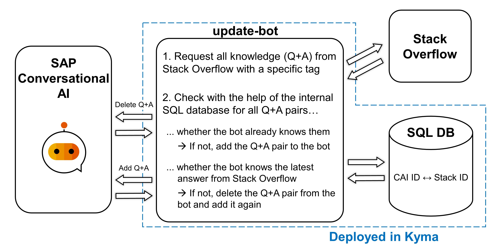

# Self-learning FAQ Chatbot based on SAP Conversational AI

## Overview

This sample provides a tutorial and the code to set up an FAQ chatbot in SAP Conversational AI (CAI) that learns question and answer pairs from Stack Overflow. The learning process is based on a Kubernetes CronJob. It receives all questions with a specific tag from Stack Overflow, stores the question IDs in a simple SQL database, and adds new questions to the SAP CAI bot. The SQL database is necessary to keep track of which question from Stack Overflow corresponds to which question in the bot knowledge.



The following code is included in this sample:

- Knowledge database: simple [MS SQL database](knowledge-database/database-mssql/app/setup.sql) that stores all IDs of the questions the bot can answer
- Bot observer tool: [node.js server](bot-observer-tool/app/server.js) that displays the current bot knowledge, the Stack Overflow content, and the knowledge database content. This server can also be used to verify that everything was set up correctly.
- Update functionality: [Kubernetes CronJob](update-bot/k8s/cronjob.yaml) and [JS-script](update-bot/app/update-bot.js) to update the bot automatically
- Alert Notification when an error occurs: [Alert Notification](alert-notif/k8s/deployment.yaml)

This sample demonstrates how to:

- Set up an FAQ chatbot in SAP Conversational AI
- Connect the FAQ chatbot to a communication platform, e.g., Slack
- Deploy the SQL knowledge database to the Kyma runtime
- Deploy the bot observer tool to the Kyma runtime and connect everything together
- Deploy the Kubernetes CronJob to the Kyma runtime that updates the bot automatically
- Deploy the Alert Notification that sends notifications when an error occurs
- Deploy the knowledge database, the bot observer tool, the update functionality as well as the alert notification using a helm-chart

## Prerequisites

- SAP BTP, Kyma runtime instance
- Alert Notification Service set up in your SAP BTP Subaccount
- [Docker](https://www.docker.com/)
- [kubectl](https://kubernetes.io/docs/tasks/tools/install-kubectl/) configured to use the `KUBECONFIG` file downloaded from the Kyma runtime
- [SAP Conversational AI](https://cai.tools.sap/)

## Steps

### 1. Set up an FAQ Chatbot in SAP Conversational AI

1. Create a new FAQ chatbot in SAP CAI by performing Step 3 and Step 4 of the [Conversational AI FAQ chatbot beginner](https://developers.sap.com/tutorials/conversational-ai-faq-chatbot-beginner.html) tutorial:

    - Go to <https://cai.tools.sap/> and sign in.
    - Create a new bot and choose `Retrieve Answers from FAQ documents`.
    - Give the bot a name, e.g., `karl-kyma` or `kyma-faq-bot`.
    - For the data policy choose `non-personal` and `non-vulnerable`.
    - Choose the bot visibility to be `public` and press the `Create` button.

2. On the **Train** tab, click the `Upload Document` button and upload the [kymafaq.csv](kymafaq.csv) that you can find in this Git repository. After the upload you should be able to click on the document and see that there is already one question-answer pair.

3. On the **Build** tab, go to `customer-satisfaction-reply` and scroll down to the section `if user chooses no`. There, delete the two existing actions, click on `Choose Message Type`, then on `Text` and paste the following message:

    ```shell
    Sorry, that I couldn't find an answer to your question. Please post it on Stack Overflow.
    ```
  
4. On the **Build** tab, go to `faq` and make the following three changes to the actions:
   - Edit the first action and replace the pairs of two asterisks by single asterisks

      ```shell
      *{{qna.faq.answers.0.question}}*
      {{qna.faq.answers.0.answer}}
      ```

   - Edit the second action and also replace the pairs of two asterisks by single asterisks

      ```shell
      *Did you mean to ask?*
      1) {{qna.faq.answers.0.question}}
      2) {{qna.faq.answers.1.question}}
      3) {{qna.faq.answers.2.question}}
      ```

   - Delete the third action. Scroll down to `if ?qna.faq.max_confidence lower-than .05`. There, delete the existing reply `I was not able to find what you were looking for in my document.` by clicking on the trash can with the label `Delete action`.

### 2. Connect the FAQ Chatbot to a Communication Platform

The FAQ chatbot can be connected to multiple communication platforms. In the previously created FAQ chatbot, go to the **Connect** tab and explore the options. In this tutorial, the bot is connected to Slack following the [Deploy an SAP Conversational AI Chatbot on Slack](https://developers.sap.com/tutorials/conversational-ai-deploy-slack.html) tutorial.

1. In the **Connect** tab, click on `Slack`.

2. Click on `Create a Slack app` and follow the instructions there:
  
    - Click on the link which will bring you to https://api.slack.com/apps. 
    - There, choose `Create New App` and select `From scratch`.
    - Give the app a name (e.g., `Karl Kyma`) and select your workspace.
    - Click `Create App`.

3. Click on `Get your credentials` (again at the CAI platform) and follow the instructions there:
  
    - In the Slack API go to `Settings` and `Basic Information`.
    - In the section `App Credentials` copy the `Client ID` and the `Client Secret`.

4. On the CAI platform, insert the `Client ID` and the `Client Secret`, and click `GET TOKENS`.

5. Copy the `OAuth URL` and the `Event URL` to your clipboard.

6. Click on `Set the OAuth redirect URL` and follow the instructions there:
  
    - In the Slack API go to `OAuth & Permissions`.
    - Click `Add New Redirect URL` and add the `OAuth URL` you just copied.
    - Click `Save URLs`.

7. Click on `Enable Interactive Components` and follow the instructions there:

    - In the Slack API go to `Interactivity & Shortcuts`.
    - Turn on the `Interactivity`.
    - In the field `Request URL` paste the `Events URL` you just copied.
    - Click `Save Changes`.

8. Click on `Enable OAuth Permissions` and follow the instructions there:
    
    - In the Slack API go to `OAuth & Permissions`.
    - Via the `Add an OAuth Scope` button add the following `Bot Token Scopes` to the bot:
      - channels:history
      - channels:read
      - chat:write
      - groups:history
      - groups:read
      - groups:write
      - im:history
      - im:read
      - users:read
      - users:write

9. Click on `Fill the Events redirect URL` and follow the instructions there:

    - In the Slack API go to `Event Subcriptions`.
    - Enable Events and fill the `Event URL` you copied earlier into the `Request URL` field.
    - In the section `Subscribe to bot events`, add the following three events:
      - message.im
      - message.groups
      - message.channels
    - Click `Save Changes`.

10. Give the bot a discription, add an app icon, and add it to the Slack workspace:

    - In the Slack API go to `Basic Information`.
    - Scroll down to `Display Information` and add a short discription and an app icon.
    - Click `Save Changes`.
    - Scroll up again and click `Install to Workspace`. Click `Allow` and then you are done in the Slack API.

11. Go back to the CAI platform and click on `Add my bot to Slack`. There is a link, you need to follow. Then, click again on `allow` and you will get the feedback that the bot was successfully added to the workspace.

12. Open Slack, go to the workspace you selected further above and go to a channel you want to add the bot to.

13. Click on the cluster of profile pictures at the top right. Go to the tab `Integrations`, click on `Add an App`, and search for the name of your bot. Then, simply click `Add` and the bot will be added to this channel.

14. Verify that everything was set up correctly by sending some greeting like "*Hello*" and the question "*What is your name?*" in the Slack channel. The bot should respond to both messages.

### Optional Deployment with Helm to Skip Steps 3 to 7

Instead of following the steps 3 to 7 as described below, the deployment of all needed objects could also be handled via helm.
If you decide to do the deployment with helm, follow [these instructions](https://github.com/SAP-samples/kyma-runtime-extension-samples/tree/main/helm-charts/chatbot#prerequisits).

### 3. Deploy the Knowledge Database to Kyma

The first step will be to deploy the knowledge database. Make sure that you have a running Docker installation and a Docker Hub account (In case of a private docker repository, you have to add a kubernetes secret called "regcred" that contains the given credentials). The proceed with the following steps:

1. Switch to the directory `knowledge-database/database-mssql`.

2. Build the database image:

    ```shell
    docker build -t yourDockerHubAccount/bot-db -f docker/Dockerfile .
    ```

3. Push the database image to your Docker Hub account:
  
    ```shell
    docker push yourDockerHubAccount/bot-db
    ```

    If you do not have an own Docker Hub account, you can also pull the built images from my account `lasseurban`.

4. Within the `deployment.yaml` in the k8s directory, adjust the value of `spec.template.spec.containers.image`, commented with `#change it to your image`, to use your Docker image.

5. Go to the SAP BTB Cockpit and from there to your Kyma dashboard.

6. Download the Kubeconfig and export it. If you don't know how to do this, check step 3 of [this tutorial](https://developers.sap.com/tutorials/cp-kyma-download-cli.html).

    ```shell
    export KUBECONFIG=<KUBECONFIG_FILE_PATH>
    ```

7. Create a namespace and a context for this namespace (make sure that you replace ******* with your cluster ID):

    ```shell
    kubectl create namespace chatbot
    ```

    ```shell
    kubectl get namespaces
    ```

    ```shell
    kubectl config set-context chatbot-context --namespace=chatbot --cluster=*******.kyma-stage.shoot.live.k8s-hana.ondemand.com --user=OIDCUser
    ```

    ```shell
    kubectl config use-context chatbot-context
    ```

8. From the Command Line, deploy the database secret, the persistent volume claim, and the database itself:

    ```shell
    kubectl apply -f k8s/secret.yaml
    ```

    ```shell
    kubectl apply -f k8s/pvc.yaml
    ```

    ```shell
    kubectl apply -f k8s/deployment.yaml
    ```

    >> *NOTE:* The order of deploying is important and it might take a few minutes until everything is up and running.

    If you want to have more details about what is going on here, please check out [this tutorial](https://developers.sap.com/tutorials/cp-kyma-mssql-deployment.html).

### 4. Deploy the API Function for the Database to Kyma

Next, an API function must be deployed to allow manipulation of the database from outside. This is very similar to the [api-mssql-function](https://github.com/SAP-samples/kyma-runtime-extension-samples/tree/main/api-mssql-function) in this Git repository.

1. Change to the directory `knowledge-database/api-mssql-function`.

2. Within the `k8s/deployment.yaml` in the k8s directory, adjust the value of `spec.env.host.value`, commented with `#change chatbot to your namespace`.

3. Deploy the function: 

    ```shell
    kubectl apply -f k8s/deployment.yaml
    ```

4. Verify that the Function is up and running:

    ```shell
    kubectl get function api-mssql-function
    ```

    You should get something like this:

    | NAME               | CONFIGURED | BUILT      | RUNNING    | RUNTIME    | VERSION    | AGE  |
    | ------------------ | ---------- | ---------- | ---------- | ---------- | ---------- | ---- |
    | api-mssql-function | True       | True       | True       | nodejs14   | 1          | XXs  |

5. You can now use the API function (ensure that you replace `{cluster-domain}` with your domain):

    - You can get all questions in the database (should be empty at the moment):

      ```shell
      curl -X GET "https://api-mssql-function.{cluster-domain}/"
      ```

    - You can also get a single question with a specific ID:

      ```shell
      curl -X GET "https://api-mssql-function.{cluster-domain}/ID"
      ```

    - Or, you can delete one or multiple questions from the database:

      ```shell
      for x in {1..3}; do curl -X DELETE "https://api-mssql-function.{cluster-domain}/$x"; done
      ```

### 5. Deploy the Bot Observer Tool to Kyma

Now, it is time to deploy the bot observer tool. This is a simple node.js server that displays the current bot knowledge (requested from SAP CAI), the Stack Overflow content, and the knowledge database content.

1. Change to the directory `bot-observer-tool`.

2. Build the bot observer tool image:

    ```shell
    docker build -t yourDockerHubAccount/bot-observer-tool -f docker/Dockerfile .
    ```

3. Push the bot observer tool image to your Docker Hub account:

    ```shell
    docker push yourDockerHubAccount/bot-observer-tool
    ```

    If you do not have an own Docker Hub account, you can also pull the built images from my account `lasseurban`.

4. Open the file `k8s/secret.yaml` with your favorite editor and make the following adjustments:

    | Name                   | value      |
    | ---------------------- | ---------- |
    | cai-credentials-id     | 1. Go to your chatbot in [SAP Conversational AI](https://cai.tools.sap).<br />2. Select your bot, click on `Settings` and go to the tab `Tokens`.<br />3. Next to `Designtime APIs` click on the `Generate` button.<br />4. Select `Client Credentials` and click `Next`.<br />5. Copy the `Client ID` and paste it in the secret.yaml as the value of `cai-credentials-id`. |
    | cai-credentials-secret | Copy the `Client Secret` and paste it in the secret.yaml as the value of `cai-credentials-secret`. |
    | bot-url                | The bot URL is needed to communicate with the FAQ bot in SAP Conversational AI and needs to be of this format:<br /><br />`{user_slug}/bots/{bot_slug}/versions/{version_slug}/qna/topic/knowledge_sources/{knowledge_source_id}/answers`<br /><br />- The user_slug can be found in the `Settings` of the CAI bot on the tab `Tokens` at the bottom.<br />- The bot_slug is the name of the bot and can be found in the `Settings` of the CAI bot on the tab `Bot Options`.<br />- The version_slug can be found in the `Settings` of the CAI bot on the tab `Versions` (the value is most likely `v1`).<br />- The knowledge_source_id is the name of the csv-file that you uploaded in step 1.2<br />&nbsp; &nbsp;(if you took the one from this repo, the value is `kymafaq`).<br /><br />Please check the [SAP CAI API reference](https://api.sap.com/api/FAQBot_API/resource) for more information. |
    | cai-x-token            | 1. Go back to the `Settings` of the CAI bot and to the tab `Tokens`.<br />2. Copy the `Developer token` and paste it in the secret.yaml as the value of `cai-x-token`. |
    | stack-tag              | Choose a tag that is used for questions the bot should learn, e.g., `kyma-runtime`. |
    | stack-key              | 1. Go to the Stack Overflow instance you want to connect to.<br />2. Next to the search bar at the top click on your profile picture to access your profile.<br />3. Click on `Edit profile and settings`.<br />4. Click on `API access keys`.<br />5. Choose a name and click `Create access key`.<br />6. Copy the `Key` and paste it in the secret.yaml as the value of `stack-key`.      |
    | db-name                | Use the value `spec.env.database.value` from the `knowledge-database/api-mssql-function/k8s/deployment.yaml` file. |
    | db-host                |  Use the value `spec.env.host.value` from the `knowledge-database/api-mssql-function/k8s/deployment.yaml` file. |
    | db-username            |  Use the value `spec.env.username.value` from the `knowledge-database/api-mssql-function/k8s/deployment.yaml` file. |
    | db-password            |  Use the value `spec.env.password.value` from the `knowledge-database/api-mssql-function/k8s/deployment.yaml` file. |

5. From the Command Line, deploy the bot secret, the bot observer tool itself and the apirule to access the tool:

    ```shell
    kubectl apply -f k8s/secret.yaml
    ```

    ```shell
    kubectl apply -f k8s/deployment.yaml
    ```

    ```shell
    kubectl apply -f k8s/apirule.yaml
    ```

    >> *NOTE:* The order of deploying is important and it might take a minute until everything is up and running.

6. In the Kyma dashboard, select the namespace and click on `API Rules` in the menu bar on the left.

7. There should be two entries. Click on the link next to `bot-observer-apirule`.

8. A new tab should be opened and you should see the main API endpoint of the node.js server `bot-observer`.

9. Check if everything is working by accessing all the endpoints (you should just append the path of every endpoint to the URL of the node.js server):
    - You can check all the knowledge the bot currently has:

      ```shell
      https://bot-observer.{cluster-domain}/bot
      ```

     (should return one default question about the bots name)
    - You can also check the bot credentials that are automatically requested from SAP CAI:

      ```shell
      https://bot-observer.{cluster-domain}/botcredentials
      ```

    - You can also request all the knowledge from Stack Overflow that is tagged with the tag that you specified in the secret.yaml:

      ```shell
      https://bot-observer.{cluster-domain}/stack
      ```

    - Or, you can list all the entries of the database:

      ```shell
      https://bot-observer.{cluster-domain}/db
      ```

      (should be empty at the moment)
      
### 6. Deploy the Alert Notification Functionality that sends messages when an error occurs

To ensure that you get notified in case errors happen, you have to follow the following steps:

1. Change to the directory `alert-notif/k8s`

2. Open the file `deployment.yaml`

3. For the ServiceInstance change the value of `spec.parameters.configuration.actions.properties.destination` for the e-mail action to an e-mail to which you would like to receive notifications. If you want to use slack instead of e-mail, then you should change the value `spec.parameters.configuration.actions.properties.destination` for the slack action to the webhook of a given slack channel. [Here](https://api.slack.com/messaging/webhooks) you will find more informations about how to set up a webhook for your slack channel. Furthermore, you have to mention the type of notification `email`or `slack` in the spec.parameters.configuration.subscriptions.actions` field.

4. To allow proper association of the function in the cluster, you have to adjust two more values for the Functions.
The environment variable `CLUSTER_DOMAIN` has to get the value of the domain of the cluster.
The environment variable `url` should have the value of the url of the region 

5. Now you can save and close the `deployment.yaml` file

6. Finally, the alert notification has to be deployed to the cluster. For this you have to run the following command in the terminal:
        
        ```
        kubectl apply -f deployment.yaml
        ```
        
7. After some minutes the alert notification function should be up and running in your cluster.


### 7. Deploy the Kubernetes CronJob that updates the Bot

1. Change to the directory `update-bot`.

2. Build the bot update image:

    ```shell
    docker build -t yourDockerHubAccount/bot-update -f docker/Dockerfile .
    ```

3. Push the bot observer tool image to your Docker Hub account:

    ```shell
    docker push yourDockerHubAccount/bot-update
    ```

    If you do not have an own Docker Hub account, you can also pull the built images from my account `lasseurban`.

4. From the Command Line, deploy the bot secret:

    >> *NOTE:* You only need to do this, if you have not already deployed the bot secret while deploying the bot observer tool in step 5.5. Please doublecheck now wether you have correctly deployed the bot secret. If you are unsure you can use the command `kubectl get secrets`. You should see the bot-secret of the Type `Opaque` with 10 data items.

   If you have not already done the deployment of the secret, go to step 5.5 and make the described adjustments in `k8s/secret.yaml`. Afterwards, use the following command to deploy the secret:

    ```shell
    kubectl apply -f k8s/secret.yaml
    ```

5. Deploy the Kubernetes Job or the CronJob. Decide wether you want to update the chatbot immediately (use the job.yaml) or repetitively with a fixed schedule (use the cronjob.yaml). Both execute the same update-bot functionality.To use the simple **Kubernetes Job**, do the following steps:

    1. Within the `job.yaml` in the k8s directory, adjust the value of `spec.template.spec.containers.image`, commented with `#change it to your image`, to use your Docker image.

    2. From the Command Line, deploy the Job:

        ```shell
        kubectl apply -f k8s/job.yaml
        ```

    3. If you want to kill the job, use the following command:

        ```shell
        kubectl delete -f k8s/job.yaml
        ```

    To use the **Kubernetes CronJob**, do the following steps:

    1. Within the `cronjob.yaml` in the k8s directory, adjust the value of `spec.template.spec.containers.image`, commented with `#change it to your image`, to use your Docker image.
    2. In the same file, adjust the value of `spec.schedule`, commented with `#change it to your schedule`. Information on how you do that, can be found [here](https://kubernetes.io/docs/concepts/workloads/controllers/cron-jobs/). For example, you could set the schedule to "0 0 * * *" to update the bot every day at midnight.
    3. From the Command Line, deploy the CronJob:

        ```shell
        kubectl apply -f k8s/cronjob.yaml
        ```

    4. You can check the status of the CronJob:

        ```shell
        kubectl get cronjobs
        ```

    5. If you want to kill the CronJob, use the following command:

        ```shell
        kubectl delete -f k8s/cronjob.yaml
        ```


## About the Contributor and the Project

The development of this chatbot and the tutorial was a project contributed by Lasse Urban, who is a vocational training student at SAP. He spent one rotation in the STAR (Student Training and Rotation) Program with the Kyma Runtime Adoption team from April 2021 until October 2021.
Improvements of the chatbot were done by Alexander Weers, Cansu Doganay and Jano Hanzlik (STAR students that joined the department from April 2022 until October 2022).
