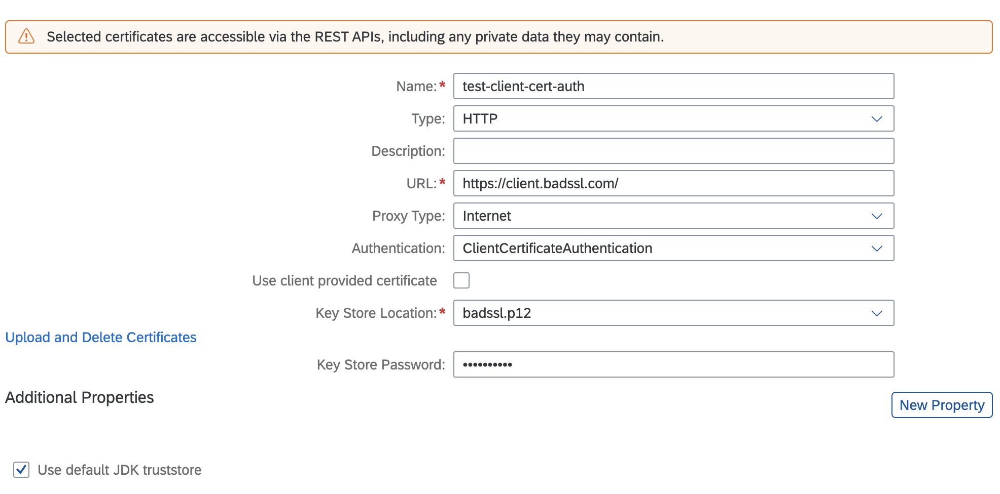

# SAP Cloud SDK Java Client Certificate Authentication

## Overview

There could be extension and application use cases deployed on Kyma runtime where the workload is required to connect to an external system. There external system could have been secured with OAuth2, Basic Authentication, Client Certificate Authentication or any other means.

In all such cases, SAP Destination service can be used to store and retrieve technical information to consume the target external system. SAP Cloud SDK can be used for the boilerplate logic to retrieve the credentials and connect to the external system. The advantage is that the application code is then solely focused on the business logic and all connectivity details are handled by the SAP Cloud SDK.

In this sample, we will connect to an external system that is secured with **Client Certificate Authentication** using SAP Cloud SDK. The certificate and all technical information are stored in the SAP Destination service.


## Prerequisites

* [Kyma Runtime provisioned in your SAP BTP Subaccount](https://blogs.sap.com/2020/05/13/sap-cloud-platform-extension-factory-kyma-runtime-how-to-get-started/)
* JDK 11 or higher
* [kubectl](https://kubernetes.io/docs/tasks/tools/#kubectl)
* Kubectl configured to connect to your provisioned Kyma runtime using downloaded KUBECONFIG
* [Make](https://www.gnu.org/software/make/)
* [docker](https://www.docker.com/products/docker-desktop)

## Setup

### Configuration

1. Create an instance of SAP Destination service and Service binding. The Service binding will create the credentials for calling the destination service API. It will be used to upload the client certificate as well as by the SAP Cloud SDK to connect to the external system.

    ```yaml
    apiVersion: servicecatalog.k8s.io/v1beta1
    kind: ServiceInstance
    metadata:
      name: destination-service-instance
    spec:
      clusterServiceClassExternalName: destination
      clusterServicePlanExternalName: lite
    ---
    apiVersion: servicecatalog.k8s.io/v1beta1
    kind: ServiceBinding
    metadata:
      name: destination-service-binding
    spec:
      instanceRef:
        name: destination-service-instance
    ```

    ```shell
    # only required once to enable istio sidecar. Ignore if done already
    kubectl label namespaces {your-namespace} istio-injection=enabled
    
    kubectl -n {your-namespace} apply -f k8s/destination-service-instance.yaml
    ```

2. Upload the client certificate as a secret. This will be used by a job in next step to upload the certificate to your SAP BTP Subaccount. You can also manually upload the certificate to the destination service.
The certificate for this sample has been retrieved from the [test site](https://badssl.com/download/)

    ```shell
    kubectl -n {your-namespace} create secret generic client-certs --from-file=assets/badssl.p12
    ```

3. Deploy a job in Kyma runtime to upload the client certificate to your SAP BTP Subaccount.

    ```shell
    kubectl -n {your-namespace} apply -f k8s/job-cert-uploader.yaml
    ```

4. Configure the Destination in SAP Business Technology Platform (SAP BTP) Cockpit.


    ```shell
    Name: test-client-cert-auth
    Type: HTTP
    URL: https://client.badssl.com/
    Proxy Type: Internet
    Authentication: ClientCertificateAuthentication
    Key Store Location: badssl.p12
    Key Store Password: badssl.com
    ```

### Application

The Java Spring Application has been generated using the [SAP Cloud SDK](https://sap.github.io/cloud-sdk/docs/java/getting-started)

It has a [controller](./application/src/main/java/sample/kyma/client/cert/auth/controllers/ExternalServiceController.java) which

* Loads the configured destination
* Uses the retrieved credentials (in this case client certificate) to connect to the [external system](https://client.badssl.com/).

Deploy the application to the Kyma runtime:

```shell
kubectl -n {your-namespace} apply -f k8s/deployment.yaml
```

This will deploy:

* A Kubernetes Deployment to run the application
* A Service to expose the application inside the cluster
* An APIRule to expose the application to the outside

### Verify

Access the deployed application URL <https://cloudsdk-client-cert-auth.{your-cluster-domain}/external>

