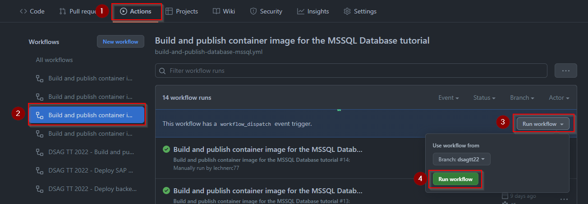
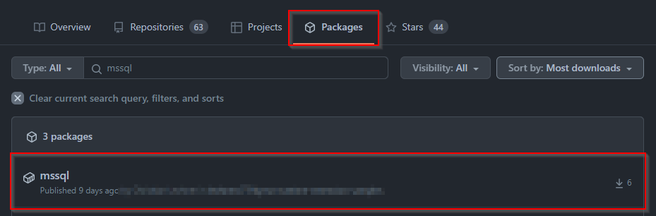
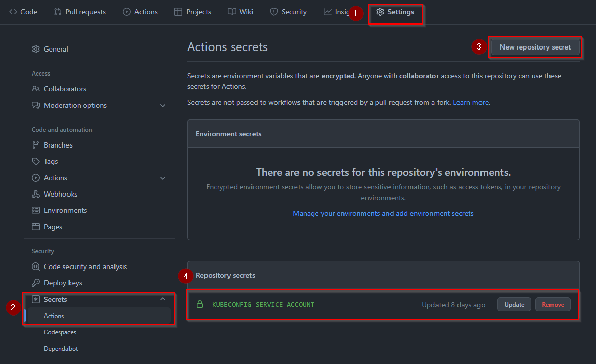
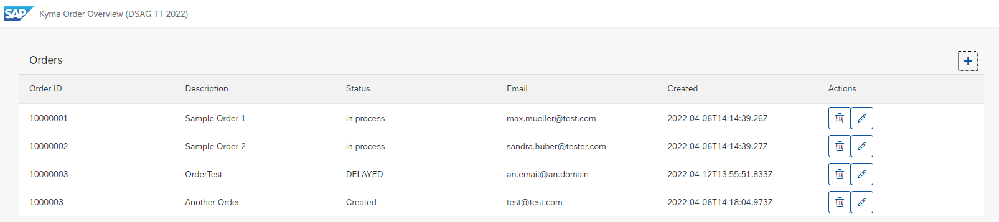

# Step 1 - Set up the order microservice

> DSAG Technologietage 2022 Category: 👀

## Goal 🎯

This step covers the setup and deployment of the order mircoservice. The deployment is executed via GH Actions.

The microservice consists of three parts:

- The database (MS SQL)
- The API layer on top of the database written in Go
- The UI5 frontend

All three components are packaged as images and deployed to Kyma. We build and deploy the images via GitHub Actions.

## Step 1.1 - The database container

The artifacts for the database are grouped in the folder [ordermicroservice/database-mssql](../ordermicroservice/database-mssql/). The database uses as basis a Microsoft SQL Server. The setup of the database i. e. the creation of the database tables and initialization with data is executed during the startup of the database via the scripts in the folder [ordermicroservice/database-mssql/app](../ordermicroservice/database-mssql/app/). The script creates a table called `Orders`. This table consists of the columns `order_id`, `description`, `status`, `email` and `created`.

The [`Dockerfile`](../ordermicroservice/database-mssql/Dockerfile) for the database image fetches the base image for the MS SQL database and copies the scripts for the database setup into the image. The startup of the container triggers the [`entrypoint.sh`](../ordermicroservice/database-mssql/app/entrypoint.sh) script that triggers the creation of the table and stores some order entries in the database table.

You can build the image locally via the Docker CLI. In this exercise we make use of GitHub Action to build the image and store it into the GitHub container registry that is part of GitHub packages. The GitHub Action [`build-and-publish-database-mssql.yml`](../../.github/workflows/build-and-publish-database-mssql.yml) is configured to be triggered manually (`workflow_dispatch` event) and contains the following steps:

- Define of parameters for the build like registry, image name and label:

  ```yaml
  env:
  REGISTRY: ghcr.io
  IMAGE_NAME: mssql
  LABEL: 1.0.0
  ```

- Setup of Docker Buildx:

  ```yaml
  jobs:
  build_and_push:
    runs-on: ubuntu-latest
    steps:
      - name: Set up Docker Buildx
        uses: docker/setup-buildx-action@v1
  ```

- Login to the GitHub registry

  ```yaml
      - name: Log in to the Container registry (GH Packages)
        uses: docker/login-action@v1
        with:
          registry: ${{ env.REGISTRY }}
          username: ${{ github.actor }}
          password: ${{ secrets.GITHUB_TOKEN }}
  ```

  > 🔎 **Observation** - The GitHub action provides us some variables by default like the `github.actor` as well as the secret `secrets.GITHUB_TOKEN` to access the registry.

- Extract the metadata (be aware that we hardcoded the label):

  ```yaml
      - name: Extract metadata (tags, labels) for Docker
        id: meta
        uses: docker/metadata-action@v3
        with:
          images: ${{ env.REGISTRY }}/${{ github.repository }}/${{ env.IMAGE_NAME }}
          tags: |
            type=semver,pattern={{version}},value=${{ env.LABEL }}
  ```

- Build and push of the Docker image

  ```yaml
      - name: Build and push Docker image
        uses: docker/build-push-action@v2.10.0
        with:
          context: "{{defaultContext}}:dsagtt22/ordermicroservice/database-mssql"
          push: true
          tags: ${{ steps.meta.outputs.tags }}
          labels: ${{ steps.meta.outputs.labels }}            
  ```
  
  > 🔎 **Observation** - We need to point the GitHub Action to the Dockerfile if it is not located in the root of the repository. This is achieved via the `context` parameter. We use the variable `{{defaultContext}}` which points to the root directory of the repository as entrypoint fo the path.

  > 📝 **Tip** - If you only want to build but not to push the image (e. g. to make a health check of your build process, you can use the same setup, just set the parameter `push` in the action `docker/build-push-action@v2.10.0` to `false`. 

The action is available in the Actions section of the repository. Trigger it manually to execute build:



After a successful build you find the image in the package section of your repository:

.

> 📝 **Tip** - If you execute the build in your own repository make sure to set the visibility of the container in the GitHub packages to `public`. By default it will be set to `private`.

## Step 1.2 - The API container

We provide an API layer to access and manipulate the data in the database. The code of this layer is available in the folder [ordermicroservice/api-mssql-go/](../ordermicroservice/api-mssql-go/). The service provides HTTP endpoints for CRUD actions on the `Orders` table in the MS SQL database. The endpoints provided by the app are defined in the file [`main.go`](../ordermicroservice/api-mssql-go/cmd/api/main.go).

We follow the same approach as for the database namely we define a [`Dockerfile`](../ordermicroservice/api-mssql-go/Dockerfile) to build the image based on a standard Golang image. We use that docker file to build and push the image via the GitHub action defined in [`build-and-publish-api-mssql-go.yml`](../../.github/workflows/build-and-publish-api-mssql-go.yml).

Run the workflow and check that the image is stored in the GitHub packages.

## Step 1.3 - The frontend container

In addition to API layer, we also provide a UI5 frontend to visualize the data in the database. The frontend calls the API layer to achieve this.

You find the code of the UI5 app in the folder [`ordermicroservice/frontend-ui5-mssql`](../ordermicroservice/frontend-ui5-mssql/).

In case you want to execute the UI5 app locally you need to make one adjustment in the app. Open the file [`config.json`](../ordermicroservice/frontend-ui5-mssql/webapp/config.json) in the directory `ordermicroservice/frontend-ui5-mssql/webapp/config.json` and adjust the value for the `API_URL` by entering you Kyma hostname:

```json
{
  "API_URL": "https://api-mssql-go.<PUT YOU KYMA HOSTNAME HERE>"
}
```

This should look then like:

```json
{
  "API_URL": "https://api-mssql-go.c-1a234b5.kyma-stage.shoot.live.k8s-hana.ondemand.com"
}
```

We will define the endpoint later when we deploy the containers to Kyma via a *API Rule*.

> 📝 **Tip** - For the sake of this hands-on the endpoint will be publicly available. In real-life scenario we must of course place corresponding security measures in place to safeguard the endpoint.

We follow the same approach as for the other image namely we define a [`Dockerfile`](../ordermicroservice/frontend-ui5-mssql/Dockerfile) to build the image based on a Node.js image. We use that docker file to build and push the image via the GitHub action defined in [`build-and-publish-frontend-ui5-mssql`](../../.github/workflows/build-and-publish-frontend-ui5-mssql.yml).

Run the workflow and check that the container is stored in the GitHub packages.

## Step 1.4 - Deployment to SAP BTP, Kyma runtime

As we have build the images for our order microservice we now must deploy the them including their configuration to SAP BTP, Kyma runtime and create API rules to expose the endpoints.

We have already prepared the corresponding files in the `k8s` directories of the components of the order microservice.

For the *database deployment* we create the following artifacts:

- [`secret.yaml`](../ordermicroservice/database-mssql/k8s/secret.yaml): containing the default secrets to access the MS SQL database. This secret will also be used by the API.
- [`pvc.yaml`](../ordermicroservice/database-mssql/k8s/pvc.yaml): defining the persistent volume claim for the database.
- [`deployment.yaml`](../ordermicroservice/database-mssql/k8s/deployment.yaml): defining the deployment of the database container including a service.

For the *API deployment* we create the following artifacts:

- [`configmap.yaml`](../ordermicroservice/api-mssql-go/k8s/configmap.yaml): defining the data base host and port.

  > 📝 **Tip** - you might need to adjust the `hostname` in this file depending on the namespace you use for the deployment.

- [`deployment.yaml`](../ordermicroservice/api-mssql-go/k8s/deployment.yaml): defining the deployment of the API container including a service.
- [`apirule.yaml`](../ordermicroservice/api-mssql-go/k8s/deployment.yaml): defining the API rule to expose the HTTP endpoints of the API.

For the *frontend deployment* we create the following artifacts:

- [`configmap.yaml`](../ordermicroservice/frontend-ui5-mssql/k8s/configmap.yaml): containing the configuration for the endpoint of the API.
  
  > 📝 **Tip** - This needs to be adjusted to point to your Kyma cluster API rule of the API deployment.

- [`deployment.yaml`](../ordermicroservice/api-mssql-go/k8s/deployment.yaml): defining the deployment of the UI5 app container including a service.
- [`apirule.yaml`](../ordermicroservice/api-mssql-go/k8s/deployment.yaml): defining the API rule to expose the HTTP endpoint of the UI5 app.

### 1.4a Deployment via GitHub Actions

We want to automate the deployment via a GitHub Action. To be able to do so we need credentials to access the Kyma cluster from the action. To do so we create a *service account* with the right permissions to deploy the different artifacts.

To do so we create a namespace via:

```bash
kubectl create ns dsagtt22-infra
```

The definition of the service account and the role are defined in the file [`k8s-setup-ghaction/service-account.yaml`](../k8s-setup-ghaction/service-account.yaml).

We navigate to the directory `dsagtt22/k8s-setup-ghaction/` create the service account and the cluster role via:

```bash
kubectl apply -f service-account.yaml -n dsagtt22-infra
```

In addition we need a Cluster Role binding that is defined in the file [`k8s-setup-ghaction/cluster-role-binding.yaml`](../k8s-setup-ghaction/cluster-role-binding.yaml). We apply that file to finalize the setup:

```bash
kubectl apply -f cluster-role-binding.yaml -n dsagtt22-infra
```

Now we fetch the data needed to access the Kyma cluster. For that set an environment variable called `ns` to `dsagtt22-infra`. Then fetch the `kubeconfig` via the provided scripts:

```shell
  chmod +x k8s-setup-ghaction/kubeconfig-sa-mac.sh
  ./k8s-setup-ghaction/kubeconfig-sa-mac.sh
  ```

- If using Windows set `Set-ExecutionPolicy Unrestricted` to change the execution policy if needed and run it:

  ```shell
  .\k8s-setup-ghaction\kubeconfig-sa-windows.ps1
  ```

The script creates a `kubeconfig.yaml` for the Service Account that we will use in the GitHub Action.

> 📝 **Tip** - Do not execute the script multiple times. It will just append the config, which will end up in an invalid config file.

We store the content of the `kubeconfig.yaml` of the Service Account in the secrets of our GitHub repository (Settings -> Secrets -> Actions) and name the secret `KUBECONFIG_SERVICE_ACCOUNT`.



Now we create the workflow file [`deploy-order-microservice-to-kyma.yml`](../../.github/workflows/deploy-order-microservice-to-kyma.yml) containing the steps to deploy the order microservice:

- Set the execution event to `workflow_dispatch`:
  
  ```yaml
  on:
  workflow_dispatch: {}
  ```

- Define the namespace of the deployment as environment variable to the value `dsagtt22`:

  ```yaml
  env:
  NAMESPACE: dsagtt22
  ```

- Run the action on a Ubuntu machine and first checkout the repository:

  ```yaml
  jobs:
  execute_deployment:
    runs-on: ubuntu-latest
    steps:
      - name: Checkout repository
        uses: actions/checkout@v2
  ```

- Authenticate against the Kubernetes cluster using the secret that we stored before:

  ```yaml
  - name: Authenticate with Kubernetes
        uses: azure/k8s-set-context@v2
        with:
          method: kubeconfig
          kubeconfig: ${{ secrets.KUBECONFIG_SERVICE_ACCOUNT }}
  ```

- Create the namespace for the deployment

  ```yaml
  - name: Setup namespace in Kyma
        run: |
          echo "*** Create namespace ***"
          kubectl create ns ${{ env.NAMESPACE }}
  ```

- Deploy the database

  ```yaml
  - name: Setup MS SQL Deployment in Kyma
        run: |
          echo "*** Create secret ***"
          kubectl apply -f dsagtt22/ordermicroservice/database-mssql/k8s/secret.yaml -n ${{ env.NAMESPACE }}
          echo "*** Create persistent volume claim ***"  
          kubectl apply -f dsagtt22/ordermicroservice/database-mssql/k8s/pvc.yaml -n ${{ env.NAMESPACE }}
          echo "*** Create deployment ***"
          kubectl apply -f dsagtt22/ordermicroservice/database-mssql/k8s/deployment.yaml -n ${{ env.NAMESPACE }}
  ```

- Deploy the API

  ```yaml
  - name: Setup GO API for MS SQL in Kyma
        run: |
          echo "*** Create configmap ***"  
          kubectl apply -f dsagtt22/ordermicroservice/api-mssql-go/k8s/configmap.yaml -n ${{ env.NAMESPACE }}
          echo "*** Create deployment ***"
          kubectl apply -f dsagtt22/ordermicroservice/api-mssql-go/k8s/deployment.yaml -n ${{ env.NAMESPACE }}
          echo "*** Create API rule ***"
          kubectl apply -f dsagtt22/ordermicroservice/api-mssql-go/k8s/apirule.yaml -n ${{ env.NAMESPACE }}
  ```

- Deploy the UI5 app

  ```yaml
  - name: Setup UI5 frontend for MS SQL in Kyma
        run: |
          echo "*** Create configmap ***"  
          kubectl apply -f dsagtt22/ordermicroservice/frontend-ui5-mssql/k8s/configmap.yaml -n ${{ env.NAMESPACE }}
          echo "*** Create deployment ***"
          kubectl apply -f dsagtt22/ordermicroservice/frontend-ui5-mssql/k8s/deployment.yaml -n ${{ env.NAMESPACE }}
          echo "*** Create API rule ***"
          kubectl apply -f dsagtt22/ordermicroservice/frontend-ui5-mssql/k8s/apirule.yaml -n ${{ env.NAMESPACE }}
  ```

After the deployment has finished you have access to the UI5 app via the route defined in the corresponding API rule:



## 1.4b Manual Deployment

You can also deploy all artifacts via `kubectl apply -f` CLI. To do so you must deploy the `k8s` folders of the following directories:

- `dsagtt22/ordermicroservice/database-mssql`
- `dsagtt22/ordermicroservice/api-mssql-go`
- `dsagtt22/ordermicroservice/frontend-ui5-mssql`

You can lookup the detailed commands in the section above as defined in the GitHub Actions.

## Summary

🎉 Congratulations - You've now completed the setup and deployment of the order microservice to SAP BTP, Kyma Runtime!

Continue to [Step 2 - Set up the on-premise components](step2.md).

[🔼 Overview](../README.md#tutorial-steps) | [Next step ▶](step2.md)
