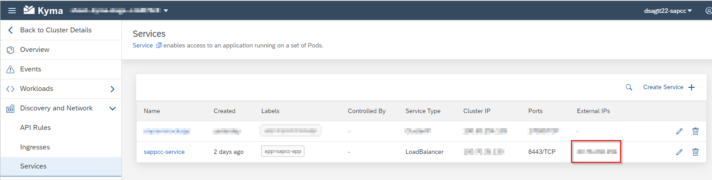
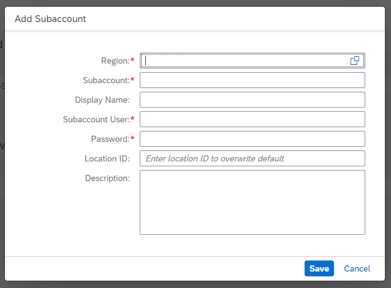
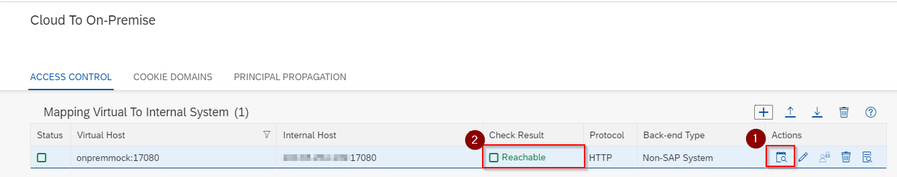
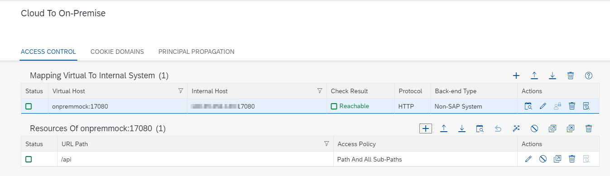

# Step 2 - Set up the on-premise components

> DSAG Technologietage 2022 Category: 👀

## Goal 🎯

This step covers the setup of the on-premise components namely:

- The Cloud Connector
- The on-premise mock application

## Step 2.1 - Setup of the Cloud Connector in Kyma

For this hands-on we want to deploy the Cloud Connector into the Kyma cluster as described in the blog post ["SAP Cloud Connector deployed on SAP Kyma"](https://blogs.sap.com/2022/03/26/sap-cloud-connector-deployed-on-sap-kyma/). In contrast to the approach presented in the blog post we will execute the build of the Cloud Connector container via GitHub Actions, so that no local download is needed.

To achieve this we have defined a [`Dockerfile`](../CloudConnector/Dockerfile) in the directory `CloudConnector` that builds an image containing the downloaded cloud connector.

> 🔎 **Observation** - Be aware that the EULA of the tool are implicitly agreed to via the corresponding cookie.

The build and push of the image to a registry is achieved in analogy to [Step 1 - Set up the order microservice](step1.md) via a GitHub Action defined in the file [`build-and-publish-sapcc.yaml`](../../.github/workflows/build-and-publish-sapcc.yml). After manual execution of the workflow the image is available via GitHub packages.

To deploy the cloud connector to Kyma needs several pieces defined in the folder ``CloudConnector/k8s`i. e.:

- A namespace defined in the file [`namespace.yaml`](../CloudConnector/k8s/namespace.yaml). The namespace has disabled the injection of Istio sidecars.
- A persistent volume claim for the persistent storage of the configuration of the Cloud Connector defined in the file [`pvc.yaml`](../CloudConnector/k8s/pvc.yaml).
- A deployment of the Cloud Connector defined in the file [`deployment.yaml`](../CloudConnector/k8s/deployment.yaml)
- A service that exposes the Cloud Connector defined in the file [`service.yaml`](../CloudConnector/k8s/service.yaml)

Besides the local application of the files we prepared a GitHub action for that defined in the file [`deploy-sapcc-to-kyma.yml`](../../.github/workflows/deploy-sapcc-to-kyma.yml).

After successful deployment of the Cloud Connector you find the IP address in the Kyma Dashboard:

- Go to the namespace `dsagtt22-sapcc`
- Go to the section **Discovery and Network**
- Go to **Services**
- You find the exposed IP in the column **"External IPs"**:
  

You can now access the Cloud Connector via `https://<YOUR EXTERNAL IP>:8443/`

Before we configure the Cloud Connector, we first setup the on-premise mock application.

## Step 2.2 - Setup and deploy the on-prem mock application

To simulate an on-premise backend we created a mock application that exposes a `GET` endpoint to retrieve the orders linked to a specific material.

The code of the app is available in the folder [`onprem-mock`](../onprem-mock) and is implemented using an Azure Function. The code ([`index.ts`](../onprem-mock/OnPremMock/index.ts)) has a predefined list of order entries and returns a random entry from this list:

```typescript
    const orderList = [{ "orderId": 10000001 }, { "orderId": 10000002 }, { "orderId": 10000003 }];

    const randomOrderEntry = orderList[getRandomInt(0, orderList.length - 1)]

    const responseBody = {
        "materialId": context.bindingData.materialid,
        "orderId": randomOrderEntry.orderId
    }

    context.res = {
        body: responseBody
    }
```

The mock application exposes the endpoint `api/OrdersByMaterial/{materialid:int}` and can be addressed via `GET`.

As before we defined a [`Dockerfile`](../onprem-mock/Dockerfile) that defines the image for the on-premise mock application. We define that the exposed port is `17080`

The build and push of the image follows the same procedure as the previous images and is defined in the workflow file [`build-and-publish-onprem-mock`](../../.github/workflows/build-and-publish-onprem-mock.yml). As the code is TypeScript we need to execute the build of the TypeScript sources as part of the workflow.

After the successfull execution of the workflow, we deploy the app to the same namespace as the Cloud Connector. The deployment is defined in the file [`onprem-mock/k8s/deployment.yaml`](../onprem-mock/k8s/deployment.yaml). 

> 🔎 **Observation** - The file only contains a deployment and a service of type ClusterIP. This means that the service is only accessible in the cluster.

As before we deploy the app via a GitHub Action defined in the files [`deploy-onpremmock-to-kyma.yml`](../../.github/workflows/deploy-onpremmock-to-kyma.yml). After manual execution of the action the app is available in the cluster.

For the configuration of the Cloud Connector we need to identify the IP of the service that we just created. To do so go to the Kyma dashboard and:

- Go to the namespace `dsagtt22-sapcc`
- Go to the section **Discovery and Network**
- Go to **Services**
- You find the IP in the column **"Cluster IP"** of the service `onpremmockapp`.

We now need to expose the application via the Cloud Connector.

## Step 2.3 - Configure the Cloud Connector

We open the Cloud Connector UI by navigating to the URL `https://<YOUR EXTERNAL IP>:8443/`. The initial login data is:

- **User Name**: Administrator
- **Password**: manage

After the initial login you must set a new personal password. Next we configure the connection to the target subaccount and expose the mock application:

- First configure the connection to the subaccount you want to consume the app service **from**. Define a "Location ID" in case several Kyma runtime instances should connect via this one Cloud Connector:

  

- Navigate to the **Cloud to On-Premise** section and define a new **Mapping Virtual To Internal System** on the Access Control tab
- Add a new mapping via the plus button with the following data:
  - **Backend-type**: Non-SAP System
  - **Protocoll**: HTTP
  - **Internal Host**: Enter the Cluster IP of the mock application
  - **Internal Port**: 17080
  - **Virtual Host**: onpremmock
  - **Virtual Port**: 17080
  - **Principal Type**: none
  - **Host In Request Header**: Use internal Host
  - Skip the **Description** and Finish the creation

- Check that the connected application is reachable via the corresponding action:

  

- Define the available resources of the mapped system by adding it in the **Resources ...** section below the mapping:
  - **URL Path**: /api
  - Check the **Active** checkbox
  - **Access Policy**: Paths And All Sub-Paths
  - Leave the other fields on the default settings
  - Save your changes

The final setup should then look like this:

.

> 📝 **Tip** - You can also cross-check the connection to the Cloud Connector in the SAP BTP Cockpit in the connected subaccount under **Connectivity** -> **Cloud Connectors**  

## Summary

🎉 Congratulations - You've now completed the setup and deployment of the on-premise components i.e. the Cloud Connector and the on-prem mock application

Continue to [Step 3 - Set up the connectivity proxy](step3.md).

[◀ Previous step](step1.md) | [🔼 Overview](../README.md) | [Next step ▶](step3.md)
