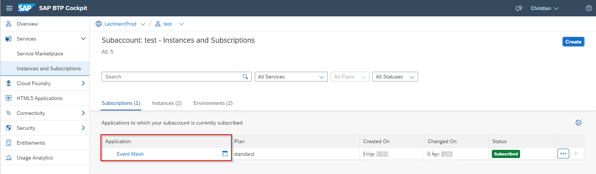
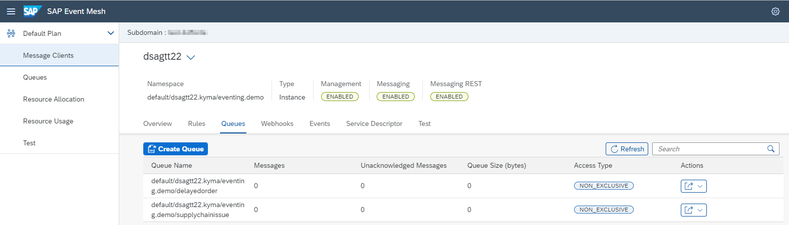

# Step 4 - Set up the SAP Event Mesh

> DSAG Technologietage 2022 Category: 👨‍🔧, steps 4.1 to 4.4 are 👀

## Goal 🎯

This step covers the setup of the event mesh on SAP BTP, i.e.:

- Provisioning the components (service and application)
- Setting up the message queues
- Retrieving the Service Keys

## Option 1 - Setup in SAP BTP Cockpit

This option guides you through the setup of the SAP Event Mesh via the SAP BTP Cockpit.

### Option 1 | Step 4.1 - Enable the SAP Event Mesh Entitlement
> DSAG Technologietage 2022 Category: 👀

- Within your global account…
- Choose **Entitlements -> Entity Assignments**
- Search **for Event Mesh**
- Choose **standard (Application)** for the plan
- Choose **Add 1 Service Plan**
- Choose **Save**
- Search **for Event Mesh**
- Choose **default** for the plan
- Choose **Add 1 Service Plan**
- Choose **Save**

In order to be able to interact with the Event Mesh you must now setup the Event Mesh application including the assignment of the corresponding roles to your user

### Option 1 | Step 4.2 - Subscribe to the Event Mesh application
> DSAG Technologietage 2022 Category: 👀

- Navigate to your subaccount in the SAP BTP Cockpit
- Go to **Services** -> **Instances and Subscriptions**
- Click **Create**
- Select **Event Mesh** and the **standard application** plan
- Click **Create**

You find the link to the Administration UI for the Event Mesh in the section **Services** -> ***Instances and Subscriptions** in the **Application area**:



### Option 1 | Step 4.3 - Assign the roles for the Event Mesh application
> DSAG Technologietage 2022 Category: 👀

- Go to the user overview in your subaccount (**Security** -> **Users**)
- Select your user
- In the **Role Collections** section choose the action **Assign Role Collection** from the detail view
- Assign the following roles to your user:
  - **Enterprise Messaging Administrator**
  - **Enterprise Messaging Developer**
  - **Enterprise Messaging Subscription Administrator**
- Save your changes

You have now the right roles to access the UI for the Event Mesh. The last thing that needs to be done is to subscripe to the Event Mesh application

### Option 1 | Step 4.4 - Create the event mesh service and binding in Kyma runtime

- Navigate to your subaccount in the SAP BTP Cockpit
- Go to **Overview** -> **Link to dashboard**

Inside the Kyma runtime Dashboard, create a namespace

- Go to the Kyma Dashboard
- Got to the **Namespaces Section** and push the **Create Namespace** button
- On the "Simple" tab of the po-up enter the name `dsagtt-handson<userID>` and press **Create**

Continue creating the event mesh service instance

- Open your namespace `dsagtt-handson<userID>`
- Navigate to **Service Management** -> **BTP Service Instances**
- Click on **"Create Service Instance +"**

In the pop-up **"Create Service Instance"** enter the following data in the tab **"Simple"**:

| Field         | Value
| ---           | ---
| Name          | dsagtt22<userID>
| Offering Name | enterprise-messaging
| Plan Name     | default

> You find the information on the service name in the SAP BTP Cockpit by navigating to the Service Marketplace and selecting the service you want to instantiate.

Now switch to the **"Advanced"** tab and copy the following values in the parameters section:

  ```JSON
  parameters:  {
    "emname": "dsagtt22<userID>",
    "namespace": "default/dsagtt22<userID>.kyma/eventing.demo",
    "version": "1.1.0",
    "options": {
        "management": true,
        "messagingrest": true,
        "messaging": true
    },
    "rules": {
        "queueRules": {
            "publishFilter": [
                "${namespace}/*"
            ],
            "subscribeFilter": [
                "${namespace}/*"
            ]
        },
        "topicRules": {
            "publishFilter": [
                "${namespace}/*"
            ],
            "subscribeFilter": [
                "${namespace}/*"
            ]
        }
    }
  }
  ```

After that press the create button to start the creation of the service instance.

After a successful creation of the service instance, create a service binding:

- Navigate to **Service Management** -> **BTP Service Binding**
- Click on **"Create Service Binding +"**
- On the "Simple" tab enter the following values:
  - **"Name"**: `dsagtt22<userID>`
  - **"Service Instance Name"**: Select the service instance for the event mesh `dsagtt22<userID>` from the drop down menu.
- Press the create button.  

> The binding is successfully created when the Status is switched to `Provisoned`. This results in a Kubernetes secret that contains the necessary information to be able to connect to the SAP Event Mesh.

### Option 1 | Step 4.5 - Create the message queues

We now need to create two message queues for your application:

- One for the messages due to the supply chain shortage
- One for the messages that should trigger the outbound communication to the customers because of the delayed order

To do so, execute the following steps:

- Navigate to your subaccount in the SAP BTP Cockpit
- Go to **Services** -> **Instances and Subscriptions**
- Open to the Event Mesh application.
- Click on the tile that represents the Event Mesh service instance called `dsagtt22<userID>`.
- Go to the section `queues`
- Click the **Create Queue** button and enter the following data to create the queue for messages due to the supply chain shortage (exchange the "userID" with your ID):
  - **Queue Name**: `supplychainissue<userID>`
  - Leave the default values for the other fields
  - Press the **Create** button
- Click the **Create Queue** button and enter the following data to create the queue for messages that should trigger the outbound communication to the customers because of the delayed order:
  - **Queue Name**: `delayedorder<userID>`
  - Leave the default values for the other fields
  - Press the **Create** button

The result should look like this:



This finalizes the setup of the Event Mesh, we will later come back to the application to add web hooks for the consumption of the messages. 

## Option 2 - Setup via the BTP Setup Automator

To provision the event mesh you can also use the [BTP setup automator](https://github.com/SAP-samples/btp-setup-automator). You find a description on how to use this tool as well as predefined configuration files in the directory [dsag/2022-technologydays](https://github.com/SAP-samples/btp-setup-automator/tree/main/usecases/other/dsag/2022-technologydays) of the GitHub Repository.

## Summary

🎉 Congratulations - You've now completed the setup and configuration of the Event Mesh!

Continue to [Step 5 - Develop function "trigger supply chain issue"](step5.md).

[◀ Previous step](step3.md) | [🔼 Overview](../README.md) | [Next step ▶](step5.md)
