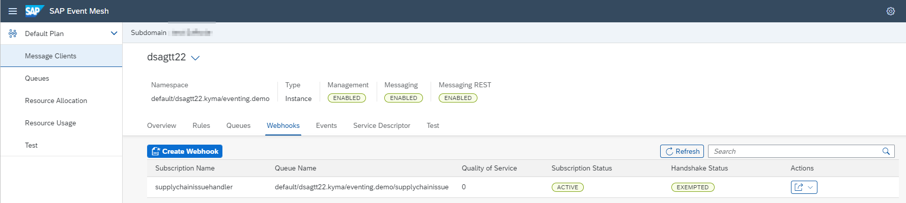
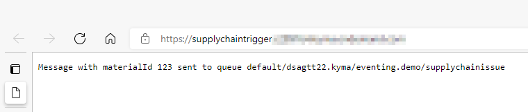
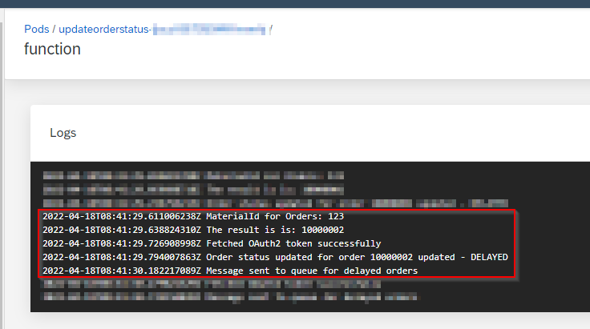

# Step 6 - Develop function "update order status"

> DSAG Technologietage 2022 Category: 👨‍🔧

## Goal 🎯

This step covers the creation of the main business logic for our scenario. We will create a Kyma Function, expose it via an API rule and register it as a webhook for the `supplychainissue<userID>` queue. Invoked by messages delivered to the queue the Kyma Function will:

- Extract the material ID from the message
- Call the on-premise service to identify the orders connected to the material ID via the Connectivity Proxy of Kyma
- Update the status of the order to the value "DELAYED"
- Push a message to the `delayedorder<userID>` queue to trigger the notification of the customers.

## Step 6.1 - Create the Kyma Function `updateorderstatus`

As a first step we create the Kyma Function and expose it via a API rule. In the Kyma dashboard navigate to the namespace `dsagtt-handson`. Then execute the following steps:

- Go to the **Workloads** -> **Functions** area in the navigation sidebar
- Push the **Create Function** button
- Enter following data into the pop-up (**Simple** tab):
  - **Name**: `updateorderstatus<userID>`
  - **Runtime**: `Node.js 14`
- Press the **Create** button.

We leave the Kyma Function as is and create a API rule to expose it. To achieve this execute the following steps in the Kyma Dashboard:

- Go to the **Discovery and Network** -> **API Rules** area in the navigation sidebar
- Push the **Create API Rule** button
- Enter following data into the pop-up (**Simple** tab):
- In the pop-up **Create API Rule** enter the following data:
  - **Name**: `updateorderstatus<userID>`
  - **Service**: Select the service `updateorderstatus` from the drop down list
  - **Gateway**: Leave the default value
  - **Host**: Leave the default value
  - **Subdomain**: `updateorderstatus<userID>`
  - **Path**: Leave the default value
  - **Handler**: `noop`
  - **Methods**: Tick the `POST`
- Press the **Create** button
- After creation copy the Host value of the endpoint of the API rule. We will need this value in the next step.  

As the Kyma Function can be called we register it as a webhook in the Event Mesh.

## Step 6.2 - Register the Webhook

In order to get the Kyma Function triggered by messages posted to the queue `supplychainissue<userID>` we must register it as webhook listening to this queue. For that execute the following steps:

- Navigate to your subaccount in the SAP BTP Cockpit.
- Go to **Services** -> **Instances and Subscriptions**
- Open the Event Mesh application from the **Subscriptions** section.
- In the Event Mesh application open your client.
- Navigate to the webhooks tab.  
- Press the **Create Webhook** button
- Enter the following data:
  - **Subscription Name**: supplychainissuehandler
  - **Queue Name**: Choose the queue `supplychainissue<userID>` from the drop-down menu
  - **Quality of Service**: 0
  - **Exempt Handshake**: Switch the toggle to `Yes`
  - **On Premise**: Leave the toggle at `No`
  - **Webhook URL**: Paste the value of API Rule endpoint you copied in the previous step
  - **Default Content-Type**: `application/json`
  - **Authentication**: Leave the defaault value `NoAuthentication`
  - Press the **Create** button.

After that activate the webhook by selecting **Resume** from the menu available in the **Actions** tab of the webhook table. The result should look like this:



We have now registered the Kyma Function as webhook for the messages in the `supplychainissue<userID>` queue. In the next step we implement the business logic in the Kyma Function.

## Step 6.3 - Implementing the Kyma Function `updateorderstatus`

The implementation of the Kyma Function comprises the following steps:

- Adding the necessary configuration information in the config maps
- Implementing the call to the on-premise system
- Implementing the call to the order microservice
- Implementing the push of a message to the `delayedorder<userID>` queue

We will walk through these steps in the following sections.

### Step 6.3a - Enhancing the configuration

As additional configuration to the one we created in the previous step, we need:

- Path to the message queue `delayedorder<userID>`
- Endpoint of the on-premise service
- Endpoint of the order microservice

We put the queue name in the already existing config map `triggerfunctionconfigmap`. In the Kyma dashboard navigate to the namespace `dsagtt-handson`. Then execute the following steps:

- Go to the **Configuration** -> **Config Maps** area in the navigation sidebar
- Open the existing config map `triggerfunctionconfigmap`
- Press the **Edit** button
- Enter the following key-value pairs into the **Data** section:

    | Key | Value
    | --- | ---
    | **DELAYEDORDER_PATH** | Full name of the `delayedorder<userID>` queue as displayed in the Event Mesh app (**Queues** -> **Queue Name**)

- Press the **Update** button.

Then create a new config map:

- Go to the **Configuration** -> **Config Maps** area in the navigation sidebar
- Push the **Create Config Map** button
- Enter following data into the pop-up (**Simple** tab):
  - **Name**: `orderserviceconfig`
  - Enter the following key-value pairs into the **Data** section:

      | Key                          | Value
      | ---                          | ---
      | **ONPREM_SERVICE_ENDPOINT**  | Value of the virtual service endpoint from the cloud connector, e. g. `http://onpremmock:17080`
      | **ORDER_SERVICE_ENDPOINT**   | Value of the API rule endpoint of the order microservice API (not UI5 app). This should be `https://api-mssql-go.<kyma-domain>`

- Press the **Create** button.

To get the client secrets for the Event Mesh instance injected, you need to add the secret created by the service binding into the function as environment variable:

- In the **Environment Variables** section of the inline editor press the **Add Environment Variable** button.
- Select **Secret Variable**
- In the pop-up **Create Secret Variable** enter the following data:
  - **Name**: `EM_`
  - **Secret**: `dsagtt22<userID>`
  - **Key**: <All Keys>
- Press the **Create** button  

Navigate to the Kyma Function `updateorderstatus<userID>` and open the inline editor:

- In the **Environment Variables** section of the inline editor press the **Add Environment Variable** button.
- Select **Config Map Variable**
- In the pop-up **Create Config Map Variable** enter the following data:
  - **Name**: `EM_`
  - **Config Map**: Select the config map `orderserviceconfig` from the drop down list
  - **Key**: Select `<All keys>` from the drop down list
- Press the **Create** button  

Execute the same procedure for the following variables:

| Variable Name              | Source
| ---                        | ---
| `EM_`                      | Config map `triggerfunctionconfigmap`

### Step 6.3b - The main body of the Kyma Function `updateorderstatus`

As we have all configuration in place we can start with the implementation of the Kyma Function. We first build the body of the function sketching the process flow and then implement the details:  

- First cleanup the function body and add the `async` keyword to the function

  ```javascript
  module.exports = {
  main: async function (event, context) {
   }
  } 
  ```

- Fetch the material ID from the event that we receive when triggered as webhook:

  ```javascript
  module.exports = {
  main: async function (event, context) {
  
    // Extract Material ID from request
    const bodyJson = JSON.parse(event.extensions.request.body)
    const materialId = bodyJson.materialId

    console.log(`MaterialId for Orders: ${materialId} `)

   }
  } 
  ```

  > 📝 **Tip** - All data send to a Kyma Function is stored in the `event` object. The main purpose of this object is to transfer CloudEvents to the Kyma Function. However, the object is also used to transfer the data of incoming HTTP requests (like in our case). To transport the information the `extensions` object of the `event` parameter is used and contains the desired information. You find more information about the `event` object in the [Kyma documentation](https://kyma-project.io/docs/kyma/latest/05-technical-reference/svls-08-function-specification/#event-object).

- Next we call a function that to fetch the orders based on the material ID. For now we just implement the function call in the body of the main function:

  ```javascript
  module.exports = {
  main: async function (event, context) {
  
    // Extract Material ID from request
    const bodyJson = JSON.parse(event.extensions.request.body)
    const materialId = bodyJson.materialId

    console.log(`MaterialId for Orders: ${materialId} `)

    // Call on prem system to fetch order data by material
    const orderId2Update = await getOrderByMaterial(materialId)

   }
  } 
  ```

- Based on that information we update the status of the order via the order microservice. Again we just implement the function call in the body of the main function:

  ```javascript
  module.exports = {
  main: async function (event, context) {
  
    // Extract Material ID from request
    const bodyJson = JSON.parse(event.extensions.request.body)
    const materialId = bodyJson.materialId

    console.log(`MaterialId for Orders: ${materialId} `)

    // Call on prem system to fetch order data by material
    const orderId2Update = await getOrderByMaterial(materialId)
    
    await updateOrderStatus(orderId2Update)

   }
  } 
  ```

- As final step we push a message to the `delayedorder` queue. As before we just implement a function call in the body of the main function

  ```javascript
  module.exports = {
  main: async function (event, context) {
  
    // Extract Material ID from request
    const bodyJson = JSON.parse(event.extensions.request.body)
    const materialId = bodyJson.materialId

    console.log(`MaterialId for Orders: ${materialId} `)

    // Call on prem system to fetch order data by material
    const orderId2Update = await getOrderByMaterial(materialId)
    
    await updateOrderStatus(orderId2Update)

    await pushMessageToNotificationQueue(orderId2Update)

   }
  } 
  ```

- In addition we will require the packages `node-fetch` and `axios`:

  ```javascript
  const fetch = require('node-fetch')
  const axios = require('axios')

  module.exports = {
    ...
  ```  
  
  > 🔎 **Observation** - This time we can not only use `node-fetch`, but need `axios`. The reason is, that for the on-premise call we need a `proxy` as part of the call that is not supported by `node-fetch`.

- Declare the dependency in the **Dependencies** tab under the **Code** section:

  ```json
  { 
    "name": "triggersupplyshortagemessage",
    "version": "1.0.0",
    "dependencies": {
      "node-fetch": "^2.6.7",
      "axios": "^0.26.1"
      }
  }
  ```

- Save your changes.

In the following sections we will implement the logic of the single functions we have just called.

### Step 6.3c - Fetching the orders by material ID from on-premise

First we implement the call to the on-premise system:

- Add a asynchronous function at the end of the Kyma Function editor:

  ```javascript
  module.exports = {
  main: async function (event, context) {
  
    // Extract Material ID from request
    const bodyJson = JSON.parse(event.extensions.request.body)
    const materialId = bodyJson.materialId

    console.log(`MaterialId for Orders: ${materialId} `)

    // Call on prem system to fetch order data by material
    const orderId2Update = await getOrderByMaterial(materialId)
    
    await updateOrderStatus(orderId2Update)

    await pushMessageToNotificationQueue(orderId2Update)

   }
  } 

  async function getOrderByMaterial(materialId) {
  
  }  
  ```

- Fill some basic header information for the call via the Connectivity Proxy. Use the color (in lower case, e.g. "orange") of your subaccount name assigned to you as "Location ID". We have to set this location ID because all subaccounts of this hands-on session share one Cloud Connector instance with the same on-premise mock.

  ```javascript
  async function getOrderByMaterial(materialId) {
  
    const headers = {
      "SAP-Connectivity-SCC-Location_ID": "<subaccount_color_in_lower_case>",
    }
  }  
  ```

- Enter the data for the Connectivity Proxy:

  ```javascript
  async function getOrderByMaterial(materialId) {
  
    const headers = {
      "SAP-Connectivity-SCC-Location_ID": "<subaccount_color_in_lower_case>",
    }

    const proxy = {
      protocol: "http",
      host: "connectivity-proxy.kyma-system.svc.cluster.local",
      port: 20003
    }
  }  
  ```

- Build the URL endpoint for the call to the on premise system:

  ```javascript
  async function getOrderByMaterial(materialId) {
  
    const headers = {
      "SAP-Connectivity-SCC-Location_ID": "<subaccount_color_in_lower_case>",
    }

    const proxy = {
      protocol: "http",
      host: "connectivity-proxy.kyma-system.svc.cluster.local",
      port: 20003
    }

    const url = `${process.env.EM_ONPREM_SERVICE_ENDPOINT}/api/OrdersByMaterial/${materialId}`
  }  
  ```

- Finally implement the call to the on-premise system via a `GET` request:

  > 📝 **Tip** - As we have one on-premise system for all participants, we must cheat a bit: we transfer the userID as an additional information to call of the on-premise system. The mock will then construct the order ID according to the schema <userID>-orderID to return a unique value. The ID of the order will be a random ID from the range 10000001 to 10000003.  

  ```javascript
  async function getOrderByMaterial(materialId) {
  
    const headers = {
      "SAP-Connectivity-SCC-Location_ID": "<subaccount_color_in_lower_case>",
    }

    const proxy = {
      protocol: "http",
      host: "connectivity-proxy.kyma-system.svc.cluster.local",
      port: 20003
    }

     const body = {
      "userId": "<userID>"
    }    

    const url = `${process.env.EM_ONPREM_SERVICE_ENDPOINT}/api/OrdersByMaterial/${materialId}`

    try {
  
      const result = await axios.post(url, body, {
        headers: headers,
        proxy: proxy
      });
  
      console.log(`The result is: ${result.data.orderId}`)
  
      return result.data.orderId
  
    }
    catch (error) {
      console.log(`Error when calling Axios: ${error}`)
  
      return "error"
    }
  }
  
  ```

- Save your changes.

As we have the order ID of the order connected to the material ID we can now update the status of the order via the order micrososervice.

### Step 6.3d - Updating orders via the order microservice

The update of the order consists of two steps:

- Get the order information via the microservice
- Update the status of the order to "DELAYED"

To achieve this add the following logic to your function:

- Add a asynchronous function at the end of the Kyma Function editor:

  ```javascript
  async function updateOrderStatus(orderId2Update) {
  
  }
  ```

- Build the endpoint of the call:

  ```javascript
  async function updateOrderStatus(orderId2Update) {

    const orderApiEndpoint = process.env.EM_ORDER_SERVICE_ENDPOINT

    const readOrderUrl = `${orderApiEndpoint}/orders/${orderId2Update}`
  
  }
  ```

- Call the endpoint and get the order data:

  ```javascript
  async function updateOrderStatus(orderId2Update) {

    const orderApiEndpoint = process.env.EM_ORDER_SERVICE_ENDPOINT

    const readOrderUrl = `${orderApiEndpoint}/orders/${orderId2Update}`

    const responseFromOrderService = await fetch(readOrderUrl,
      {
        method: 'GET',
      })

    let responseBodyFromOrderService = await responseFromOrderService.json()
  
  }
  ```

- Update the order status and send a `PUT` with the updated data to the service:

  ```javascript
  async function updateOrderStatus(orderId2Update) {

    const orderApiEndpoint = process.env.EM_ORDER_SERVICE_ENDPOINT

    const readOrderUrl = `${orderApiEndpoint}/orders/${orderId2Update}`

    const responseFromOrderService = await fetch(readOrderUrl,
      {
        method: 'GET',
      })

    let responseBodyFromOrderService = await responseFromOrderService.json()

    if (responseBodyFromOrderService.length === 1) {
      responseBodyFromOrderService[0].status = "DELAYED"
    }
    else {
      console.log("Error when fetching the order")
      return
    }
  
    const updateOrderUrl = `${orderApiEndpoint}/orders/${orderId2Update}`
  
    const responseFromOrderUpdate = await fetch(updateOrderUrl,
      {
        method: 'PUT',
        body: JSON.stringify(responseBodyFromOrderService[0])
      })
  
    console.log(`Order status updated for order ${orderId2Update} updated - DELAYED`)

  }
  ```

- Save your changes.

### Step 6.3e - Pushing a message to the `delayedorder` queue

The last missing piece is the function that pushes the order ID to the message queue `delayedorder<userID>` to trigger the follow up processing. The logic is the same as for the first Kyma Function we created in [step 5](./step5.md). Copy and paste the logic to a new a asynchronous function `pushMessageToNotificationQueue` at the end of the file. Exchange the parameters i. e. use the `orderId` in the message and the `delayedorder<userID>` as queue. In order to have a cleaner structure we extract the fetching of the Bearer token to a dedicated function.

The code should finally look like this:

```javascript
// Dedicated function to retrieve the Bearer token of the Event Mesh
async function getBearerTokenForEventMesh() {

  const clientId = JSON.parse(process.env.EM_uaa).clientid
  const clientSecret = JSON.parse(process.env.EM_uaa).clientsecret

  const authString = "Basic " + Buffer.from(`${clientId}:${clientSecret}`).toString('base64')

  const messagingTokenEndpoint = JSON.parse(process.env.EM_messaging)[2].oa2.tokenendpoint
  const messagingTokenFetchUrl = `${messagingTokenEndpoint}?grant_type=client_credentials&response_type=token`

  const fetchTokenHeader = {
    "Authorization": authString
  }

 const responseFromTokenEndpoint = await fetch(messagingTokenFetchUrl,
    {
      method: 'POST',
      headers: fetchTokenHeader
    })

  const responseBodyFromTokenEndpoint = await responseFromTokenEndpoint.json()

  let accessTokenEventMesh = ""

  if (responseFromTokenEndpoint.status === 200) {

    accessTokenEventMesh = responseBodyFromTokenEndpoint.access_token
    console.log("Fetched OAuth2 token successfully")

    return accessTokenEventMesh

  }
  else {
    console.log(`Error when fetching the token - status: ${responseFromTokenEndpoint.status}`)
    return
  }

}

// Function to push the message into the queue
async function pushMessageToNotificationQueue(orderId2Update) {

  const accessTokenEventMesh = await getBearerTokenForEventMesh()
  const messagingEndpointBase = JSON.parse(process.env.EM_messaging)[2].uri

  const queuePath = process.env.EM_DELAYEDORDER_PATH
  const queuePathEncoded = encodeURIComponent(queuePath)

  const queueUrl = `${messagingEndpointBase}/messagingrest/v1/queues/${queuePathEncoded}/messages`

  const queueHeader = {
    "Authorization": `Bearer ${accessTokenEventMesh}`,
    "Content-Type": "application/json",
    "x-qos": 0

  }

  const queueBody = {
    "orderId": orderId2Update
  }

  const responseFromQueue = await fetch(queueUrl,
    {
      method: 'POST',
      headers: queueHeader,
      body: JSON.stringify(queueBody)
    })

  if (responseFromQueue.status === 204) {
    console.log("Message sent to queue for delayed orders")
  }
  else {
    console.log(`Error when sending message - status: ${responseFromQueue.status}`)
  }

}

```

Now we have everything in place to give the flow a try.

## Step 6.4 - Test the Setup

Test the setup by triggering a message via the Kyma Function `triggersupplyshortagemessage<userID>` i. e. the corresponding API Rule by opening the endpoint in a browser. This gives you the following screen:



You can then check the processing via the logs of your Kyma Function `updateorderstatus<userID>`:



> 📝 **Tip** - The processing of the first message might take a bit, so be patient or execute the trigger again.

You can of course also the the UI5 frontend which should reflect the status update:


## Summary

🎉 Congratulations - You've now completed the implementation of the Kyma Functions that reacts on the supply chain issues message, identifies and updates the order for the given material and pushes another message to the `delayedorder<userID>` queue.

Continue to [OPTIONAL: Step 7 - Develop function "send delay email"](step7.md).

[◀ Previous step](step5.md) | [🔼 Overview](../README.md) | [Next step ▶](step7.md)
