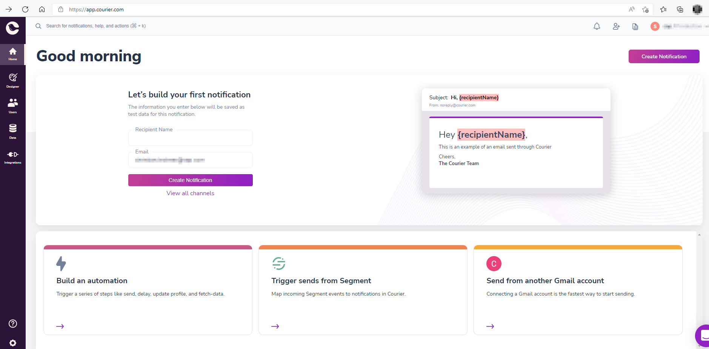
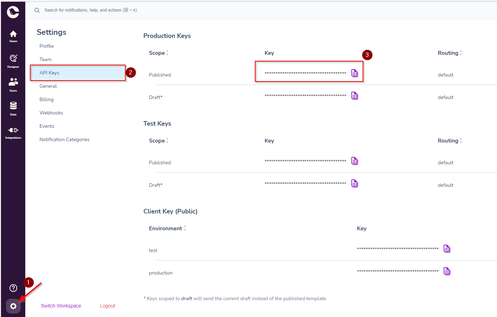
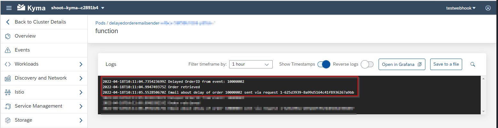

# OPTIONAL: Step 7 - Develop function "send delay email"

> DSAG Technologietage 2022 Category: 👨‍🔧

## Goal 🎯

This step covers the creation of an email to notify the customer about the delayed order. We will create another Kyma Function that will

- be registered as a webhook for the `delayedorder<userID>` queue
- fetch the information about the order including the email address from the order microservice
- send an email by using the 3rd party service [Courier](https://www.courier.com/) <!-- markdown-link-check-disable-line -->

## Step 7.1 - Registering at Courier (OPTIONAL)

> 📝 **Tip - DSAG Technologietage 2022** - If you are doing this hands-on as part of the DSAG Technologietage 2022 you can get an API key by the hands-on tutors, no need to register

In order to be able to send email we want to make use of a third party service that takes care of this task. In this hands on we will use [Courier](https://www.courier.com/). <!-- markdown-link-check-disable-line -->

In order to send email you must first register yourself at <https://app.courier.com/>. There is no credit card required and the service offers a free tier for the sending email. The sign-up flow is self-explanatory, make sure to tick the email channel when setting up your account.

After the successful setup you will have access to the dashboard:



In the left lower corner you find a gear button that brings you to the **Settings** overview. Here in the navigation bar on the left-hand side you find the section **API Keys**. Copy the published production key from there, that we will need later when sending the email.  



## Step 7.2 - Create the Kyma Function `delayedorderemailsender`

As a first step we create the Kyma Function and expose it via a API rule. In the Kyma dashboard navigate to the namespace `dsagtt-handson`. Then execute the following steps:

- Go to the **Workloads** -> **Functions** area in the navigation sidebar
- Push the **Create Function** button
- Enter following data into the pop-up (**Simple** tab):
  - **Name**: `delayedorderemailsender<userID>`
  - **Runtime**: `Node.js 14`
- Press the **Create** button.

We leave the Kyma Function as is and create a API rule to expose it. To achieve this execute the following steps in the Kyma Dashboard:

- Go to the **Discovery and Network** -> **API Rules** area in the navigation sidebar
- Push the **Create API Rule** button
- Enter following data into the pop-up (**Simple** tab):
- In the pop-up **Create API Rule** enter the following data:
  - **Name**: `delayedorderemailsender<userID>`
  - **Service**: Select the service `delayedorderemailsender` from the drop down list
  - **Gateway**: Leave the default value
  - **Host**: Leave the default value
  - **Subdomain**: `delayedorderemailsender<userID>`
  - **Path**: Leave the default value
  - **Handler**: `noop`
  - **Methods**: Tick the `POST`
- Press the **Create** button
- After creation copy the value of the endpoint of the API rule. We will need this value in the next step.  

As the Kyma Function can be called we register it as a webhook in the Event Mesh.

## Step 7.3 - Register the Webhook

> 📝 **Tip** - As we have tested the flow already in step 6, there are already messages in the `delayedorder<userID>` queue. To avoid confusion later when checking the Kyma Function logs, purge the queue via the corresponding action in the Event Mesh application of the `delayedorder<userID>` queue.

In order to get the Kyma Function triggered by messages posted to the queue `delayedorder<userID>` we must register it as webhook listening to this queue. For that execute the following steps:

- Navigate to your subaccount in the SAP BTP Cockpit.
- Go to **Services** -> **Instances and Subscriptions**
- Open the Event Mesh application from the **Subscriptions** section.
- In the Event Mesh application open your client.
- Navigate to the webhooks tab.  
- Press the **Create Webhook** button
- Enter the following data:
  - **Subscription Name**: orderdelayedhandler
  - **Queue Name**: Choose the queue `delayedorder<userID>` from the drop-down menu
  - **Quality of Service**: 0
  - **Exempt Handshake**: Switch the toggle to `Yes`
  - **On Premise**: Leave the toggle at `No`
  - **Webhook URL**: Paste the value of API Rule endpoint you copied in the previous step
  - **Default Content-Type**: `application/json`
  - **Authentication**: Leave the defaault value `NoAuthentication`
  - Press the **Create** button.

After that activate the webhook by selecting **Resume** from the menu available in the **Actions** tab of the webhook table.

We have now registered the Kyma Function as webhook for the messages in the `delayedorder<userID>` queue. In the next step we implement the business logic in the Kyma Function.

## Step 7.4 - Implementing the Kyma Function `delayedorderemailsender`

### Step 7.4a - Enhancing the configuration

In order to store the secret of the Courier API we define another secret in Kyma.

- Go to the **Configuration** -> **Secrets** area in the navigation sidebar
- Push the **Create Secret** button
- Enter following data into the pop-up (**Simple** tab):
  - **Name**: `courierservicesecrets`
  - **Type**: Leave the default value (`Opaque`)
  - Enter the following key-value pairs into the **Data** section:
      | Key                        | Value
      | ---                        | ---
      | **COURIER_API_KEY**      | Paste the value of the Courier API Key of step 7.1 here
- Press the **Create** button.

> 🔎 **Observation** - As we will use the Courier SDK to interact with the Courier service we do not need a Config Map to store the corresponding REST endpoint.

### Step 7.4b - Completing the Kyma Function implementation

As we want to call the order microservice and then trigger an email via Courier, we need to make some data of the configuration available in the Kyma Function via environment variables. Go to the Kyma Function `delayedorderemailsender<userID>` and add the following variables:

| Variable Name            | Source
| ---                      | ---
| `ORDER_SERVICE_ENDPOINT` | Config map `orderserviceconfig`
| `COURIER_API_KEY`        | Secret `courierservicesecrets`

Now we can start with the code of the Kyma Function:

- First cleanup the function body and add the `async` keyword to the function

  ```javascript
  module.exports = {
  main: async function (event, context) {
   }
  } 
  ```

- Import the dependencies to `node-fetch` and the `Courier SDK` via:

  ```javascript

  const fetch = require('node-fetch');
  const { CourierClient } = require("@trycourier/courier");
  
  module.exports = {
       }
  } 
  ```

- Add the packages also as dependencies to the Kyma Function:

  ```json
   { 
     "name": "delayedorderemailsender",
     "version": "1.0.0",
     "dependencies": {
       "node-fetch": "^2.6.7",
       "@trycourier/courier": "^3.12.0"
       }
   }
   ```

- Save your changes.

- Fetch the order ID from the event that we receive when triggered as webhook:

  ```javascript
  module.exports = {
    main: async function (event, context) {
      const bodyJson = JSON.parse(event.extensions.request.body)
      const delayedOrderId = bodyJson.orderId
  
      console.log("Delayed OrderID from event: " + delayedOrderId)
    }
  }
  ```

- Next we get the latest version of the order to fetch the email from there:

  ```javascript
  module.exports = {
    main: async function (event, context) {
      const bodyJson = JSON.parse(event.extensions.request.body)
      const delayedOrderId = bodyJson.orderId
  
      console.log("Delayed OrderID from event: " + delayedOrderId)
      
      const orderApiEndpoint = process.env.ORDER_SERVICE_ENDPOINT
    
      const readOrderUrl = `${orderApiEndpoint}/orders/${delayedOrderId}`

      const responseFromOrderService = await fetch(readOrderUrl,
        {
          method: 'GET',
        })
  
      let responseBodyFromOrderService = await responseFromOrderService.json()
  
      let email = ""
  
      if (responseBodyFromOrderService.length === 1) {
        console.log("Order retrieved")
        // If there is a reasonable email in the order we can use it from there
        //email = responseBodyFromOrderService[0].email
        // or we use some hardcoded value
        email = "<your.email@address.de>"
      }
      else {
        console.log("Error when fetching the order")
        return
      }

    }
  }
  ```

  > 🔎 **Observation** - We could have also provided the email as part of the message that triggered the Kyma Function. However, there might be a delay between the processing and the email might have changed, so it is a more stable setup to fetch the email in this Kyma Function again instead of transporting it via the queue (leaving aside any GDPR implications when transferring the email via the message queue).

- With that we can now send an email to the customer (see [Courier Quick Starts - Using the SDK](https://www.courier.com/docs/guides/getting-started/nodejs/#using-the-sdk)): <!-- markdown-link-check-disable-line -->

  ```javascript
  module.exports = {
    main: async function (event, context) {
      const bodyJson = JSON.parse(event.extensions.request.body)
      const delayedOrderId = bodyJson.orderId
  
      console.log("Delayed OrderID from event: " + delayedOrderId)
      
      const orderApiEndpoint = process.env.ORDER_SERVICE_ENDPOINT
    
      const readOrderUrl = `${orderApiEndpoint}/orders/${delayedOrderId}`

      const responseFromOrderService = await fetch(readOrderUrl,
        {
          method: 'GET',
        })
  
      let responseBodyFromOrderService = await responseFromOrderService.json()
  
      let email = ""
  
      if (responseBodyFromOrderService.length === 1) {
        console.log("Order retrieved")
        // If there is a reasonable email in the order we can use it from there
        //email = responseBodyFromOrderService[0].email
        // or we use some hardcoded value
        email = "<your.email@address.de>"
      }
      else {
        console.log("Error when fetching the order")
        return
      }

      const courierApiKey = process.env.COURIER_API_KEY
  
      const courier = CourierClient({ authorizationToken: courierApiKey })
  
      const emailTitle = `Order ${delayedOrderId} - DELAYED`
      const emailBody = `We are sorry, but your order ${delayedOrderId} is delayed :-(`
  
      const { requestId } = await courier.send({
        message: {
          to: {
            email: email,
          },
          content: {
            title: emailTitle,
            body: emailBody,
          },
          routing: {
            method: "single",
            channels: ["email"],
          },
        },
      })
  
      console.log(`Email about delay of order ${delayedOrderId} sent via request ${requestId}`)

    }
  }
  ```

> 📝 **Tip** - Ensure to put in your email address at <your.email@address.de>

- Save your changes.

With this setup we are now good to test the overall flow.

## Step 7.5 - Test the Setup

Test the setup as in [Step 6.4](./step6.md#step-64---test-the-setup) by triggering a message via the Kyma Function `triggersupplyshortagemessage<userID>`.

You can then check the processing via the logs of your Kyma Function `delayedorderemailsender<userID>`:



And we should also have received an email:


> 📝 **Tip** - Also check your spam folder.

## Summary

🥳 **Congratulations** - You've now successfully completed the hands-on "DSAG Technologietage 2022 - Using Microservices in the SAP BTP, Kyma Runtime to extend SAP Cloud an OnPrem Systems" 🥳

[◀ Previous step](step6.md) | [🔼 Overview](../README.md)
