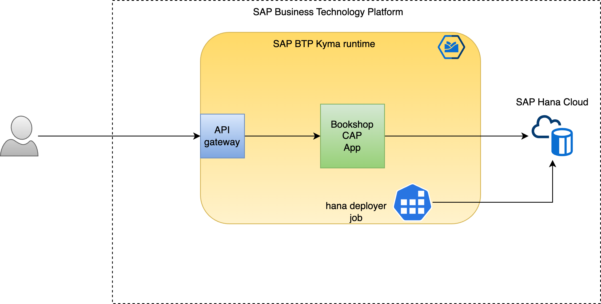
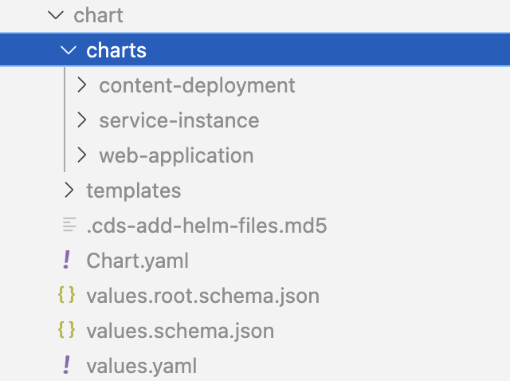

# Overview

In this sample, we will start from scratch / zero to deploying an [CAP](https://cap.cloud.sap/docs/) NodeJS application on Kyma runtime.



- You will create a sample Node.JS based CAP application (Bookshop)
- Using cds, you will create the necessary artifacts and configurations required to deploy on Kyma.
- Last, but not least, you will deploy and verify your running CAP application

> Note: For simplification most of the commands have been defined using the [Makefile](Makefile). In case you want to understand what the actual command is, run `make <command> --just-print`

## Prerequisites

- [SAP BTP, Kyma runtime instance](../prerequisites/#kyma)
- [Docker](../prerequisites/#docker)
- [make](https://www.gnu.org/software/make/)
- [Kubernetes tooling](../prerequisites/#kubernetes)
- [Pack](../prerequisites/#pack)
- [NodeJS 18 or higher](https://nodejs.org/en/download/)
- [SAP CAP](../prerequisites/#sap-cap)
- SAP Hana Cloud Instance
- [SAP Hana Cloud Instance mapped to Kyma](https://blogs.sap.com/2022/12/15/consuming-sap-hana-cloud-from-the-kyma-environment/)

## Pre-setup

- Set up required environment variables

  - In shell

    ```shell
    export DOCKER_ACCOUNT=<your-docker-account>
    export KUBECONFIG=<your-kubeconfig>
    export NAMESPACE=<your-kyma-namespace>
    export CLUSTER_DOMAIN=$(kubectl get cm -n kube-system shoot-info -ojsonpath='{.data.domain}')
    ```

  - In Windows powershell

    ```powershell
    $ENV:DOCKER_ACCOUNT = "<your-docker-account>"
    $ENV:KUBECONFIG="<your-kubeconfig>"
    $ENV:NAMESPACE="<your-kyma-namespace>"
    $ENV:CLUSTER_DOMAIN=$(kubectl get cm -n kube-system shoot-info -ojsonpath='{.data.domain}')
    ```

- For mac users, export the DOCKER_HOST

```shell
export DOCKER_HOST=unix://${HOME}/.docker/run/docker.sock
```

## CAP Application

- Initialize the Cap Bookshop sample

```shell
make init
```

Let's take a minute to inspect our cap application. It is a simple Bookshop sample where you can access Book entries via API calls.

- Data model defined in [./bookshop/db/data-model.cds](./bookshop/db/data-model.cds)
- Core Data Service defined in [./bookshop/srv/cat-service.cds](./bookshop/srv/cat-service.cds)

Directly from CAP website, *CAP promotes getting started with minimal upfront setup, based on convention over configuration, and a grow-as-you-go approach, adding settings and tools later on, only when you need them.*

- Run the application locally

```shell
make run-local
```

- Access the CAP Srv at <http://localhost:4004>
- Terminate the local running app with `^C`

## Add Hana cloud

The local run uses sqlite for storing data. For productive deployment, we would like to use Hana Cloud.

- Let's add Hana Cloud for production deployment

```shell
make add-hana
```

## Add Required Libraries

We need to add certain libraries to our NodeJs project for production

```shell
make add-required-libs
```

## Build Docker images

On Kyma runtime, application run as docker containers. They require a docker image to be created out of the application code / binaries.

The docker image can be stored on the public docker registry. It can be a private docker registry where access is restricted with credentials.

We will use pack to build the docker images.

- Checkout what is happening when building the docker image

```shell
make build-hana-deployer --just-print
```

You will notice that `pack` intelligently identifies how to pack the source code and create the necessary artifacts. The same is also true for Java applications.

- Build and push the Hana deployer image

```shell
make build-hana-deployer
make push-hana-deployer
```

- Build and push the CAP Srv image

```shell
make build-cap-srv
make push-cap-srv
```

### Prepare for Kyma deployment

Let's do a bit of groundwork before we deploy our Helm Chart. In Kyma/Kubernetes, the workloads and required configurations will be deployed in namespaces.

We will create a namespace and enable istio-injection.
You can skip this step if you already have a namespace and have enabled istio-injection.

```shell
make prepare-kyma-for-deployment
```

## Deploy to Kyma runtime

Now that we have our artifacts in place, lets shift our focus to deploying the application.

First we need the configurations to tell Kyma what and how we want to deploy.

We will use [Helm Charts](https://helm.sh/) to define  the required configurations and then deploy them on Kyma runtime.

### Create Helm chart

`cds` can intelligently inspect what all is defined in your cap application and generate the necessary configurations (Helm charts) to deploy it on Kyma runtime.

- Create Helm chart

```shell
make create-helm-chart
```

Now take a moment to understand the generated Helm chart in the [chart](./bookshop/chart) directory.



- [bookshop/chart/Chart.yaml](bookshop/chart/Chart.yaml) contains the details about the chart and all its dependencies.
- [bookshop/chart/values.yaml](bookshop/chart/values.yaml) contains all the details to configure the chart deployment. You will notice that it has sections for `hana deployer`, `cap application` as well as required `service instances` and `service bindings`

### Deploy helm chart

- Check the make command by running

```shell
make deploy-dry-run --just-print
```

You will notice that we are overriding a various properties defined in `chart/values.yaml`. This is standard helm feature where you can override your values by specifying them in the command line. This obviates the need to modify the `values.yaml` file. Of course, you can also update the `values.yaml` directly.

- Run the command to do a dry run

```shell
make deploy-dry-run
```

Take some time to understand what all will be deployed and how does the configuration looks like.
It is interesting to notice that all these deployment configurations are auto-generated via cds.

**This ensures that you as a developer does not need work with the complexities of helm charts and configurations. At the same time, these pre-shipped charts follow the best practices when it comes to deploying on Kyma.**

- You can now proceed to do the actual deployment
  
```shell
make deploy
```

### Verify your deployment

- Check the state of the application pods. **Wait until pods are in running state.**

```shell
make check-pods
```

- Check the hana deployer logs

```shell
make check-hana-deployer-logs
```

- Check the logs for the CAP application

```shell
make check-cap-srv-logs
```

- Access the application at the displayed URL after deploy. It will be of the form <https://cap-bookshop-srv-{your-kyma-namespace}.{your-kyma-cluster-domain}>

```shell
make open-deployed-app
```

> Note: In the sample for the sake of simplicity, [mocked authentication](https://cap.cloud.sap/docs/node.js/authentication#mocked) is used. If credentials are required, you can check the link.

### Cleanup

```shell
make undeploy
```

This will delete the helm chart. Thereby all deployed applications, service instances and their bindings will be cleaned.

## Takeaway

*CAP supports grow-as-you-go model. Once you have familiarized yourself with CAP basics, you can go further and add capabilities such as authentication, multitenancy, extensibility, messaging and many more.*

You can explore CAP further on <https://cap.cloud.sap/docs/>
