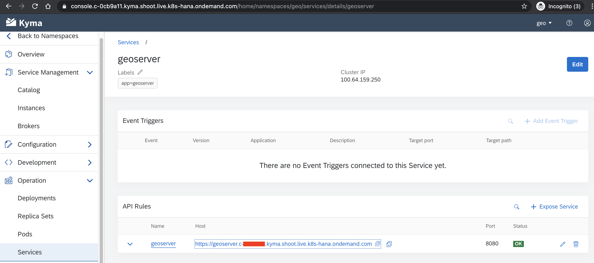
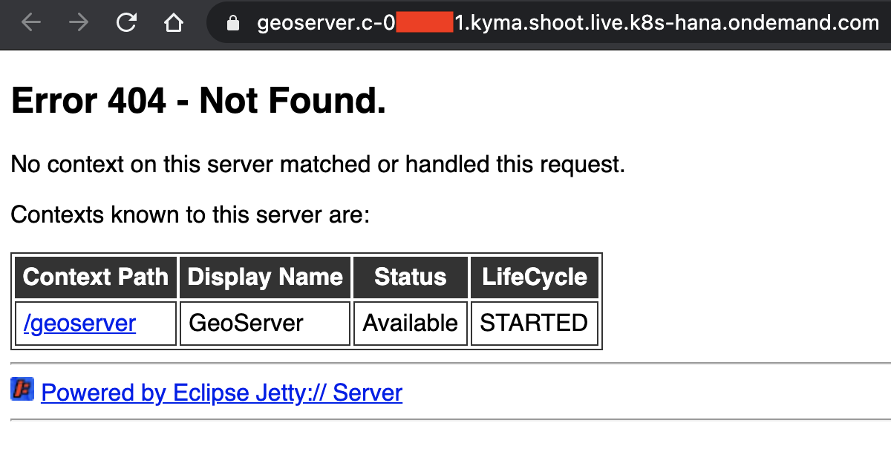
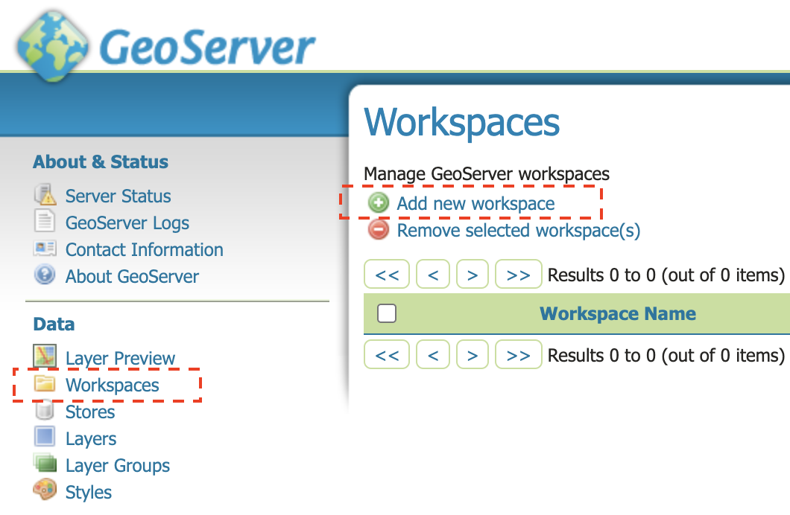
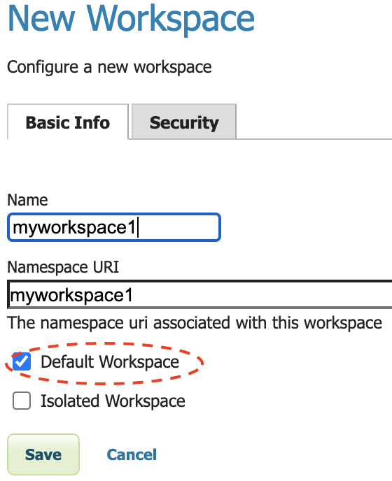

# GeoServer for a geospatial middleware over HANA Cloud

## Overview

This sample provides a [GeoServer](http://geoserver.org/blog/) instance with the plugin for SAP HANA Connectivity. Geoserver exposes in a variety of formats spatial data hosted in SAP HANA.

The docker image used is available [here](./docker/Dockerfile).

## Prerequisites

- SAP BTP, Kyma runtime instance
- [kubectl](https://kubernetes.io/docs/tasks/tools/install-kubectl/) configured to use the `KUBECONFIG` file downloaded from the Kyma runtime.
- A HANA Cloud instance

## Deployment method

You could either deploy geoserver manually or using the provided [helm chart](../helm-charts/geoserver/README.md)

## Deploy the app manually

1. Create a new `geo` Namespace:

   ```shell
   kubectl create namespace geo
   kubectl label namespaces geo istio-injection=enabled
   ```

2. Apply the PersistentVolumeClaim:

   ```shell
   kubectl apply -f ./k8s/geoserver-storage.yaml -n geo
   ```

   This filesystem will be mounted as the data directory, and will contain configuration files including credentials and connection details.

3. Apply the Deployment: Optionally, you could edit [geoserver-deployments](./k8s/geoserver-deployment.yaml) to customize the service URL.

   ```shell
   kubectl apply -f ./k8s/geoserver-deployment.yaml -n geo
   ```

4. Verify that the Pod ad service is up and running:

   ```shell
   kubectl get pods,svc -n geo
   ```

   The expected result shows that the Pod for the `geoserver` Deployment is running:

   ```shell
   % kubectl get pods,svc -n geo
   NAME                             READY   STATUS    RESTARTS   AGE
   pod/geoserver-7b5f774c78-lh72w   2/2     Running   0          5h9m

   NAME                TYPE        CLUSTER-IP      EXTERNAL-IP   PORT(S)    AGE
   service/geoserver   ClusterIP   100.67.44.241   <none>        8080/TCP   5h9m
   ```

## Initial Configuration

Now you could open a web browser to the url https://`<virtual host>.<cluster address>` where

- `<virtual host>` is geoserver or the value set in the section service.host of the deployment yaml file
- `<cluster address>` is the cluster id and domain name of the kyma console. For instance c-a1b2c3.kyma.shoot.live.k8s-hana.ondemand.com

If you have a web browser opened to the kyma dashboard, you could navigate in the namespace, then in the service section.


This should take you to the root of the web server.


Just click on /geoserver to enter the webapp!

Remember, the default credentials are admin/geoserver, _and you should change them right away !_

Before adding connections to SAP HANA, you must create a default workspace.


And make sure you tick the option _Default Workspace_


Since the jdbc drivers are pre-installed in the docker image, you can directly define connections to SAP HANA, you could either follow instructions from:

- [a blog post](https://blogs.sap.com/2019/11/26/open-source-gis-with-sap-hana/)
- [the documentation](https://docs.geoserver.org/latest/en/user/community/hana/index.html)

## Run the Docker image locally

To run the Docker image locally, run this command:

```shell
mkdir /tmp/geoserver_data
docker run -d -it -p 8080:8080/tcp -v /tmp/geoserver_data:/geoserver/data_dir remiremi/geoserver4hana
```
