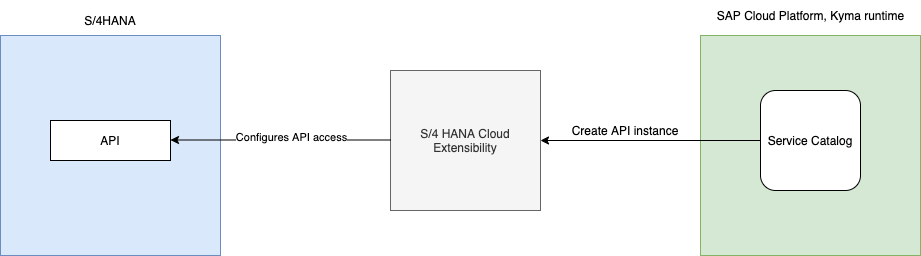
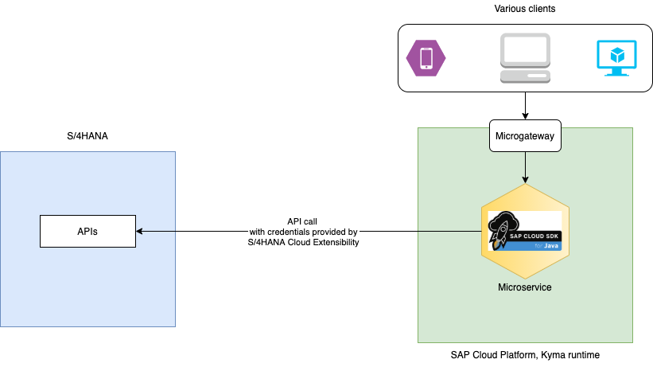

# Overview

A Helm chart definition to deploy the sample java extension.

## Parameters

| Parameter               | Description                                | Default Value                         |
| ---------------------   | ------------------------------------------ | ------------------------------------- |
| image.repository        | The docker image                           | gabbi/sample-cloudsdk-java:0.0.1      |
| image.pullPolicy        | The image pull policy                      | IfNotPresent                          |
| application.tenantName  | The tenant name used in destinations list  | TBA                                   |
| application.servicePath | The Service path for the OData APIs        | TBA                                   |

## To Deploy

### Must Haves

* [kubectl](https://kubernetes.io/docs/tasks/tools/install-kubectl/)
* [Helm3](https://helm.sh/docs/intro/install/)
* `kubectl` is configured to `KUBECONFIG` downloaded from Kyma Runtime.
* Refer to [this blog post](https://blogs.sap.com/2020/09/30/use-sap-cloud-platform-kyma-runtime-to-extend-sap-marketing-cloud/) to learn how to set up API access for an S/4 System from Kyma runtime.

  

  Setting up API access allows you to build a microservice that will call the S/4 System using SAP Cloud SDK for Java.

  

### Helm install

To install the helm chart in `dev` namespace, run the following command.

You can provide the various parameters in the install command as shown below. Change to use your image.

```shell script
helm install kymaapp . --set image.repository=gabbi/sample-cloudsdk-java:0.0.1 -n dev
```

or,

provide a [values.yaml](values.yaml) with parameters configured and run the command

```shell script
helm install kymaapp . -f values.yaml -n dev
```

### Bind the deployment with Service Instance

Bind the Deployment with the ServiceInstance. You can either reuse the existing credentials or create new ones.
    

### Cleanup

* Unbind the service instance from deployment
* Delete the helm chart

    ```shell script
    helm del kymaapp -n dev
    ```
