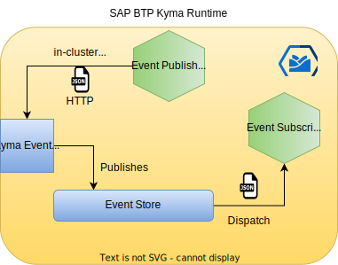

# Overview

Kyma has recently introduced in-cluster eventing. This implies that you can now implement microservices and serverless functions inside the Kyma runtime that rely on Event-Driven architecture. You can have microservices that can produce events as well as consume events inside Kyma runtime. This enables you to achieve asynchronous flows when required.



This is important for business scenarios and use cases where you would like to have asynchronous workflows. Examples include

Triggering a long-running background processing based on user actions. This ensures that we reliably execute the processing while at the same time providing a swift response to the user thus providing a better user experience.
Doing a fan-out and triggering multiple processes on a single event or action
and many others…
Kyma eventing ensures that the event is reliably delivered until the subscriber processes the event successfully.

In this sample, we will walk through a quick tutorial to set up and test the in-cluster eventing in Kyma Runtime using Kyma functions and cloudevents SDK.

## Steps

* Set up namespace

    ```shell
    kubectl create ns in-cluster-events
    ```

* Setup a Git repository in Kyma

    ```shell
    kubectl -n in-cluster-events apply -f functions-javascript/k8s/git-repository.yaml
    ```

* Create a subscriber to consume the event
    The function code for the subscriber is defined in [consumer/handler.js](functions-javascript/consumer/handler.js)

    ```shell
    kubectl -n in-cluster-events apply -f functions-javascript/k8s/consumer.yaml
    ```

* Set up the subscription to configure events to be dispatched to the consumer.

    ```shell
    kubectl -n in-cluster-events apply -f functions-javascript/k8s/subscription.yaml
    ```

* Set up the producer
    The function code for the subscriber is defined in [producer/handler.js](functions-javascript/producer/handler.js)

    ```shell
    kubectl -n in-cluster-events apply -f functions-javascript/k8s/producer.yaml
    ```

### Verify

* Ensure consumer and producer pods are up and running

    ```shell
    kubectl -n in-cluster-events get po
    ```

* For verification purpose, let us expose the producer via API Rule.

    ```shell
    kubectl -n in-cluster-events apply -f functions-javascript/k8s/api-rule.yaml
    ```

* Make an API call so producer can publish an event

    ```shell
    curl https://test-in-cluster-events.$(kubectl get configmap -n kube-system shoot-info -ojsonpath='{.data.domain}') -v
    ```

* Check the logs for the prdoducer and consumer pods

    ```shell
    kubectl -n in-cluster-events logs producer-zjs7z-764fbd8b5d-mhmls function
    kubectl -n in-cluster-events logs consumer-z9vsk-85cb475b59-9bvv2 function
    ```

### Cleanup

Delete all the created resources

```shell
kubectl -n in-cluster-events delete functions,subscriptions,gitrepositories,apirules -l scenario=in-cluster-events

kubectl delete ns in-cluster-events
```
