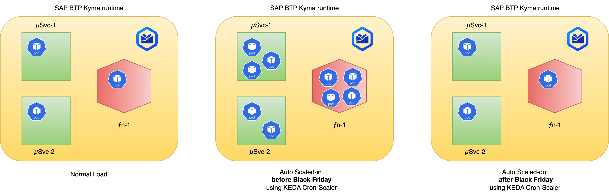
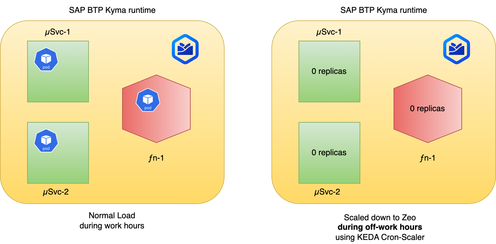

# SAP BTP Kyma Runtime: Leveraging KEDA module capabilities for efficient cost-effective scaling

SAP Business Technology Platform (BTP) Kyma runtime is currently in the process of undergoing a pivotal change as it transitions to a modular architecture. This transformation will provide customers with the advantage of a la carte selection of components or capabilities, thereby reducing unnecessary overhead and complexity. One of the first modules to emerge within this novel framework is KEDA (Kubernetes Event-driven Autoscaling).

## Introduction to KEDA

[KEDA](https://keda.sh/), an open-source initiative that facilitates event-driven autoscaling for Kubernetes workloads, was originally developed by Microsoft and Red Hat. It has since become a sandbox project under the Cloud Native Computing Foundation (CNCF). KEDA focuses on autoscaling applications in response to events sourced from a variety of platforms, including Kafka, RabbitMQ, and cloud-specific services such as Azure Service Bus and Google Pub/Sub.

## The Benefits of KEDA

KEDA ushers in a new era of flexibility and efficiency in autoscaling. It enhances Kubernetes' capacity to support fine-grained autoscaling for event-driven workloads. Leveraging KEDA, you can dynamically scale your deployments from zero to any arbitrary number, contingent on the volume of events they are designed to process.

## Activating the KEDA Module in SAP BTP Kyma Runtime

You can activate KEDA like any other module by adhering to the official guidelines on how to [enable and disable a module](https://help.sap.com/docs/btp/sap-business-technology-platform/enable-and-disable-kyma-module).

## KEDA's Cron-Based Scaler

KEDA offers a broad range of scaling strategies, one of which is the **cron-based scaler**. This scaler allows you to schedule scaling actions according to the time of day, an invaluable feature for managing predictable fluctuations in workload.

As an illustration, the cron-based scaler enables you to:

- **Manage High Traffic and Request Volume Peaks**: With the cron-based scaler, you can program your applications to upscale during peak hours or during high-traffic events, such as Black Friday or New Year sales. The same functionality can be used to schedule your applications to upscale during off-peak hours for batch processing tasks.



- **Optimize Resource Utilization and Reduce Expenses**: The cron-based scaler offers a solution to optimize resource utilization and reduce costs by allowing you to schedule your applications to downscale during non-working hours. This feature is useful for your **dev/stage/QA** clusters, which are not required during off-working hours.

  > **Note:** This only benefits when your workloads require more resources than the base setup. The [current base setup](https://kyma-project.github.io/price-calculator/) consists of 3 VMs, each with 4 CPU and 16 GB of RAM. Therefore, *if you your workloads need 4 or more VMs to be provisioned, this feature can provide benefits to control costs during off-work hours.*



## Scenario

Lets put cron based scaler to action.

Assume we have a **development cluster** where we want to run workloads only during work hours.

Lets say **Monday - Friday, 8 AM to 6 PM**

### Prerequisites

- [SAP BTP, Kyma runtime instance](../prerequisites/#kyma)
- [Kubernetes tooling](../prerequisites/#kubernetes)
- [KEDA and Serverless Modules enabled in Kyma]((https://help.sap.com/docs/btp/sap-business-technology-platform/enable-and-disable-kyma-module))

### Steps

- Export environment variables

```shell
export NS={your-namespace}
```

- Create sample workloads. One deployment and one function

```shell
kubectl -n ${NS} apply -f k8s/deployment.yaml
kubectl -n ${NS} apply -f k8s/function.yaml
```

- Apply the KEDA cron based scaling to these workloads

```shell
kubectl -n ${NS} apply -f k8s/keda-cron-scaler.yaml
```

### How it works

KEDA scaledobject resource can be configured with a trigger of type cron.

In the cron scaler, we can then specify to have the workloads running only during the working hours.

```yaml
  triggers:
    - type: cron
      metadata:
        # The acceptable values would be a value from the IANA Time Zone Database.
        timezone: Europe/Berlin  
        # At 08:00 AM, Monday through Friday
        start: 0 8 * * 1-5
        # At 06:00 PM, Monday through Friday
        end: 0 18 * * 1-5
        # ie. Your MINIMUM replica count for this workload
        desiredReplicas: "1"
```

For each type of workload, the **scaleTargetRef** can be specified

```yaml
spec:
  scaleTargetRef:
    apiVersion: apps/v1
    kind: Deployment
    name: test-keda-cron-nginx
```

```yaml
spec:
  scaleTargetRef:
    apiVersion: serverless.kyma-project.io/v1alpha2
    kind: Function
    name: test-keda-cron-function
```

### View the events

Check the events during the trigger start or end time

```shell
kubectl -n ${NS} get events
```

```shell
LAST SEEN   TYPE      REASON                       OBJECT                                       MESSAGE
7m34s       Normal    Killing                      pod/test-keda-cron-nginx-86b78b79df-r42zd    Stopping container istio-proxy
7m34s       Normal    Killing                      pod/test-keda-cron-nginx-86b78b79df-r42zd    Stopping container nginx
7m31s       Warning   Unhealthy                    pod/test-keda-cron-nginx-86b78b79df-r42zd    Readiness probe failed: HTTP probe failed with statuscode: 503
7m34s       Normal    SuccessfulDelete             replicaset/test-keda-cron-nginx-86b78b79df   Deleted pod: test-keda-cron-nginx-86b78b79df-r42zd
7m34s       Normal    KEDAScaleTargetDeactivated   scaledobject/test-keda-cron-nginx            Deactivated apps/v1.Deployment demos/test-keda-cron-nginx from 1 to 0
7m34s       Normal    ScalingReplicaSet            deployment/test-keda-cron-nginx              Scaled down replica set test-keda-cron-nginx-86b78b79df to 0 from 1
```

> Note: Events are only available until after 1 hour of trigger.