# Configure Auth0 for SAP BTP, Kyma runtime

This sample provides details on how to configure Auth0 as an identity provider for accessing the Kyma runtime. The access will be set up for both, Kyma Dashboard as well as kubectl.

The setup will use SAP Cloud Identity Service (IAS) and configure Auth0 as a proxy via Corporate Identity Providers. This is the recommended approach for using an external Identity Provider with SAP BTP. However, it is also possible to use Auth0 directly for Kyma access.

This sample can be used as a reference for achieving the same when using other identity providers, such as Azure Active Directory.

## Prerequisites

- [SAP BTP, Kyma runtime instance](../prerequisites/README.md#kyma)
- SAP Identity Authentication Service tenant

## Configuration

### Create an Auth0 application

1. Log in to [Auth0]( https://auth0.com/ ). If you don't have an account yet, sign up.
2. Navigate to **Applications** and select **Create Applications**.
  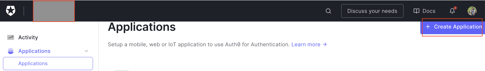

3. Provide a name.
4. Configure the **Application URIs**:
   - Application Login URI: `IAS tenant`
   - Allowed Callback URLs: `Assertion Consumer Service Endpoint`. This can be discovered under `Tenant Settings -> SAML 2.0 Configuration`.
   
5. Download the SAML metadata XML file.
   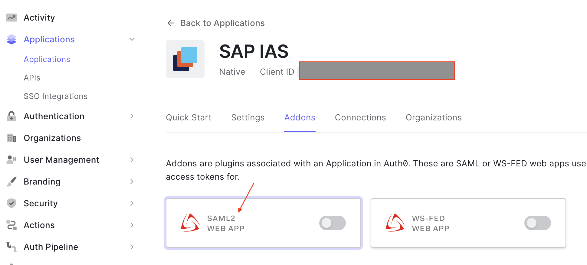
   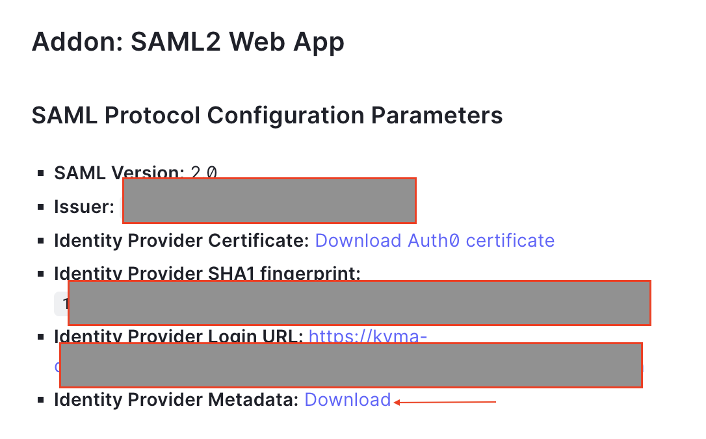
6. Configure one or more users in Auth0. They will be your default administrators of the Kyma runtime. Later, you can set up other users with [role-based access control (RBAC)](#configuring-role-based-access-control-rbac).

### Add Auth0 as corporate identity provider in IAS

The following steps are based on the Identity Authentication documentation about [Corporate Identity Providers](https://help.sap.com/docs/IDENTITY_AUTHENTICATION/6d6d63354d1242d185ab4830fc04feb1/19f3eca47db643b6aad448b5dc1075ad.html).

1. In your IAS tenant, create a new corporate identity provider.
   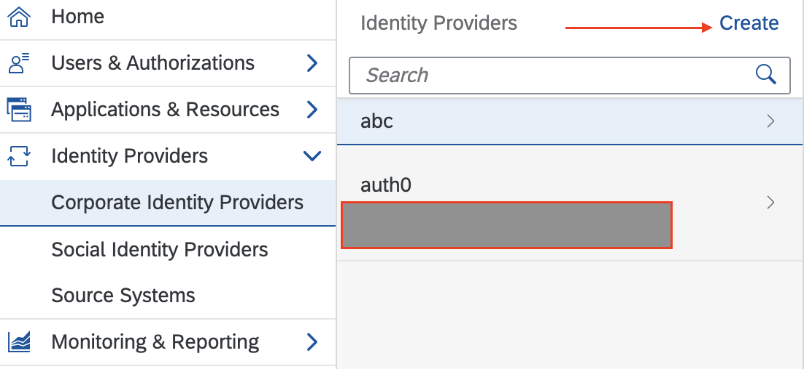
2. Configure the identity provider type to be `SAML 2.0 Compliant`.
3. Under **SAML 2.0 Configuration**, upload the SAML metadata XML file that you downloaded previously, and save the configuration.
   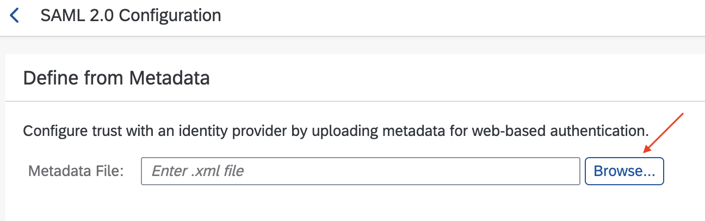

### Create application in IAS

1. Create a new application. You can also use an existing application.
   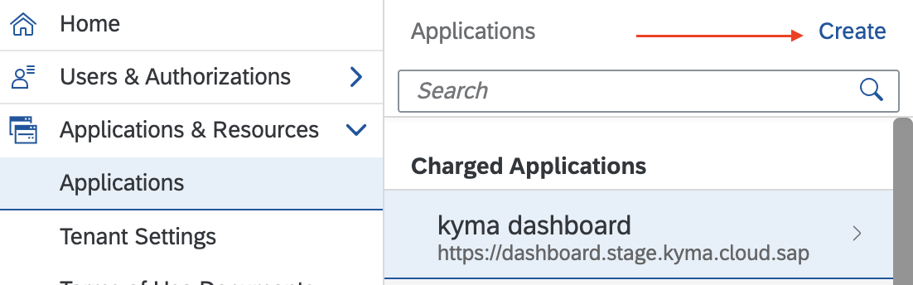
2. Select `Protocol` as `OpenID Connect`.
3. In **Open ID Configuration**, provide the URI for the Kyma Dashboard <https://dashboard.kyma.cloud.sap/>. Additionally, add a local URI <http://localhost:8000>. This will be used for `kubectl` access.

   >Note: If your localhost 8000 port is already bound, provide another port and adjust your Kubeconfig accordingly.

   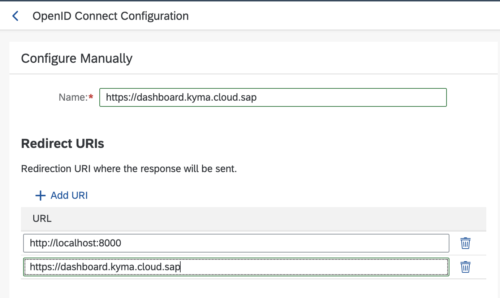

### Provision or update Kyma runtime

While provisioning the Kyma runtime, provide the oidc details among other parameters. Use a similar configuration if you are updating the Kyma runtime.

```json
{
  "administrators": [
    "{email-id-of-users-created-in-auth0}"
  ],
  "autoScalerMax": {as-per-your-scaling-needs},
  "autoScalerMin": 2,
  "machineType": "{as-per-your-scaling-needs}",
  "name": "{this-will-be-default-populated}",
  "oidc": {
    "clientID": "{client-id-of-your-ias-application}",
    "groupsClaim": "groups",
    "issuerURL": "{your-ias-tenant}",
    "signingAlgs": [
      "RS256"
    ],
    "usernameClaim": "sub",
    "usernamePrefix": "-"
  },
  "region": "{region-where-kyma-will-be-provisioned}"
} 
```

### Accessing the Kyma runtime

Once Kyma runtime provisioning is finished, the administrators can open the Kyma Dashboard. They will be redirected to the Auth0 log-in and once that is successful, they can view the Kyma Dashboard.

The same flow applies to kubectl access.

## Configuring role-based access control (RBAC)

For non-admin users, such as developers, you might want to limit the access to the Kyma runtime to one or more namespaces. This can be achieved by using the Kubernetes RBAC. You can create a [RoleBinding](https://kubernetes.io/docs/reference/access-authn-authz/rbac/#rolebinding-example).

You will create a dev namespace and provide `cluster-admin` access to a group called `kyma-dev-ns` for this namespace.

In the following example, I am using the default role `cluster-admin`. If you want, you can copy and customize the default role.

### Kyma configuration for RBAC

1. Create a namespace called `dev`.
2. Create a RoleBinding with the following configuration:
   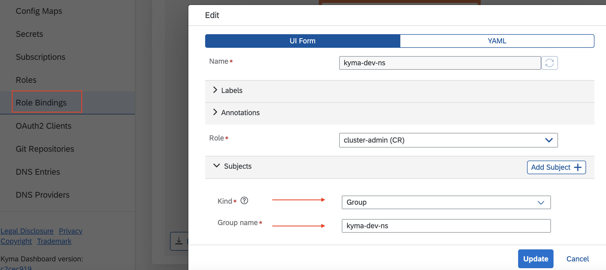

### Create group in Auth0

1. Install the extension **Auth0 Authorization**.
   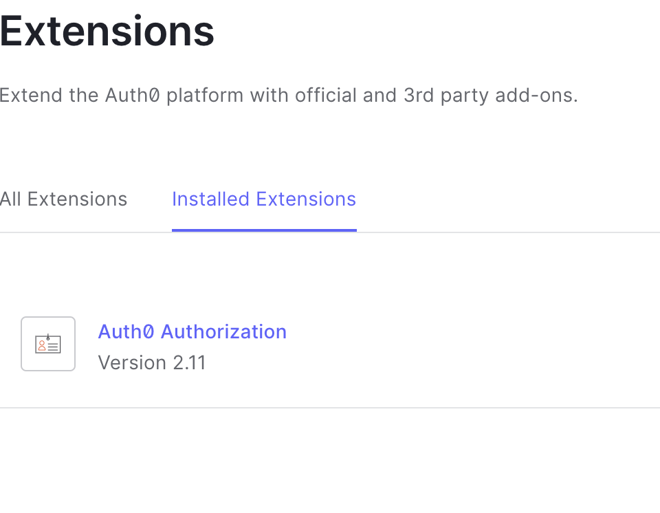
2. After installation, navigate to **Authorization**. It opens a separate tab, where you can create groups and add users to the groups.
   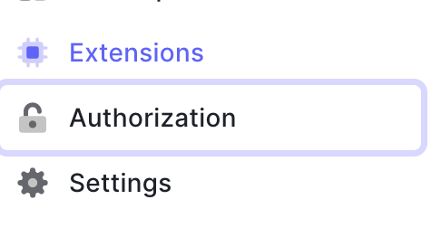
3. Create two groups: `test-group` and `kyma-dev-ns`.
   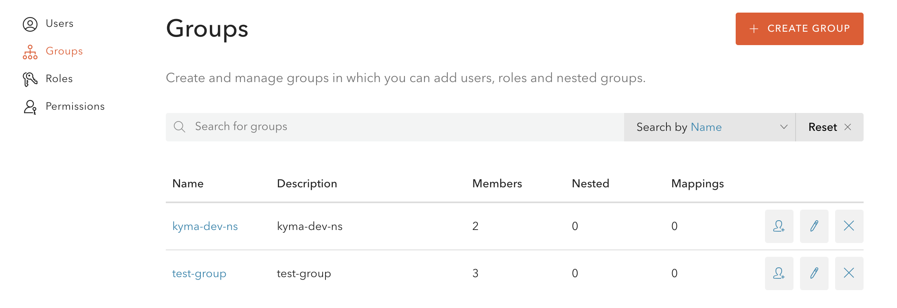
   >Note: This sample uses two groups instead of one, because only then Auth0 sends the group list as a string array. The Kyma RBAC mechanism expects a string array.
   >If you would like to suggest a simpler method to achieve this, please create a GitHub issue.
4. Create one or more users and assign them to both groups.

### Configure IAS for RBAC

The groups configured in Auth0 are manifest as a string array for assertion attribute `http://schemas.xmlsoap.org/claims/Group`. Because the Kyma OIDC is configured to expect the `groupsClaim` attribute as `groups`, you must enrich the assertion attribute that is received from Auth0. <!-- markdown-link-check-disable-line -->

>Note: You can also use the attribute received from Auth0 and configure the same in Kyma. Using `groups` makes it clearer.

1. For the Auth0 configured corporate identity provider, add an entry for `Enriched Assertion Attributes`
   - `Attribute`: groups
   - `Value`: ${http://schemas.xmlsoap.org/claims/Group} <!-- markdown-link-check-disable-line -->
   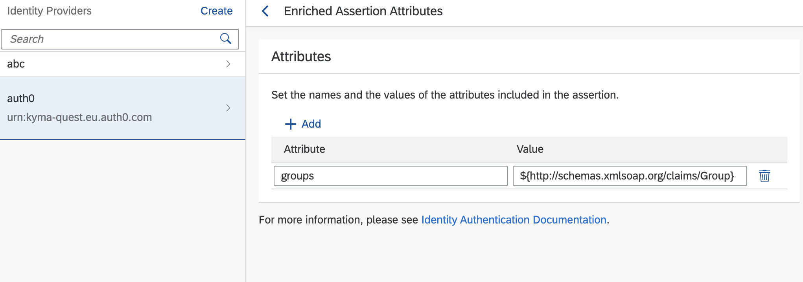
2. In your application in IAS, verify the following:
   - `groups` is an assertion attribute.
     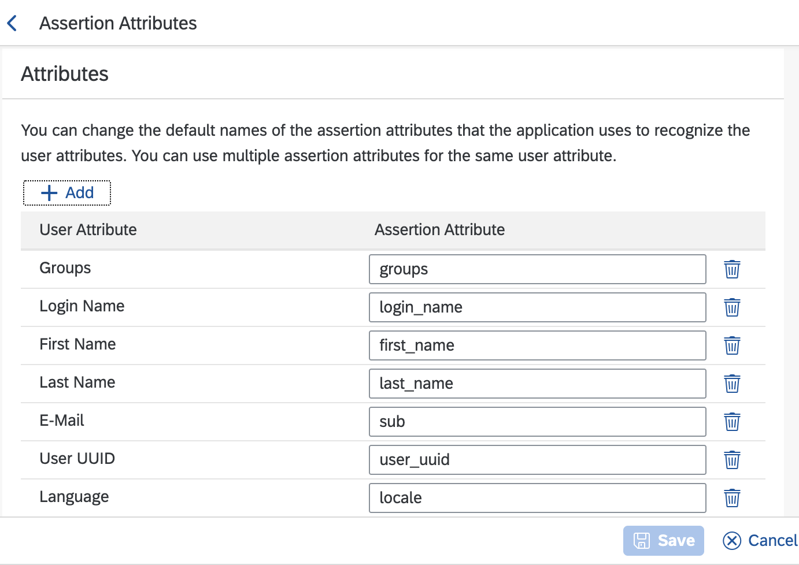
   - The `E-mail` user attribute is mapped to the `sub` assertion attribute.

### Verify RBAC access

After you successfully set up RBAC, the users you added to the `kyma-dev-ns` group can access only the `dev` namespace.
