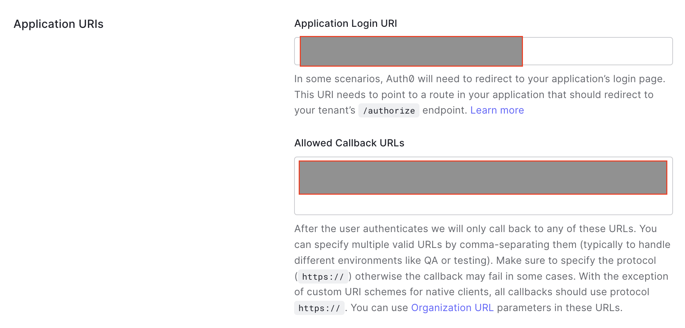

# Overview

This sample provide details on how Auth0 can be configured as an Identity Provider for accessing Kyma runtime. The access will be for both Kyma dashboard as well as via kubectl.

The setup will use SAP Cloud Identity Service (IAS) and configure Auth0 as a proxy via Corporate Identity Providers. This is the recommended approach for using an external Identity Provider with SAP BTP. Although, it is also possible to use Auth0 directly for Kyma access.

It can be used as a reference for achieving the same when using other Identity providers such as Azure Active Directory.

## Prerequisites

- [SAP BTP, Kyma runtime instance](../prerequisites/#kyma)
- SAP Identity Authentication Service tenant

## Configuration

### Create an Auth0 application

- Login to [Auth0]( https://auth0.com/ ) or sign-up if you do not have an existing account.
- Navigate to applications and select `Create Applications`
  

- Provide a name
- Configure the `Application URIs`
  - Application Login URI: `IAS tenant`
  - Allowed Callback URLs: `Assertion Consumer Service Endpoint`. This can be discovered under `Tenant Settings -> SAML 2.0 Configuration`.
  
- Download the SAML metadata xml file.
  
  
- Configure one or more users in Auth0. They will be your default administrators of the Kyma runtime. You will configure the Role-based access control in later steps.

### Add Auth0 as corporate identity provider in IAS

The steps are based on this [official documentation](https://help.sap.com/docs/IDENTITY_AUTHENTICATION/6d6d63354d1242d185ab4830fc04feb1/19f3eca47db643b6aad448b5dc1075ad.html).

- In your IAS tenant, create a new corporate identity provider.
  
- Configure identity provider type to be `SAML 2.0 Compliant`
- In SAML Configuration, upload the SAML metadata downloaded previously and save the configuration.
  

### Create application in IAS

- Create a new application. You can also use an existing application if you like.
  
- Select `Protocol` as `OpenID Connect`.
- In `Open ID Configuration`, provide the URI for the Kyma dashboard <https://dashboard.kyma.cloud.sap/>. Additionally add a local URI <http://localhost:8000>. This will be used for `kubectl` access.

  >Note: If you localhost 8000 port is already bound, provide another port. Then you will need to adjust your Kubeconfig accordingly.

  

### Provision or update Kyma runtime

While provisioning the Kyma runtime, provide the oidc details among other parameters. Use the similar configuration if you are updating the Kyma runtime.

```json
{
  "administrators": [
    "{email-id-of-users-created-in-auth0}"
  ],
  "autoScalerMax": {as-per-your-scaling-needs},
  "autoScalerMin": 2,
  "machineType": "{as-per-your-scaling-needs}",
  "name": "{this-will-be-default-populated}",
  "oidc": {
    "clientID": "{client-id-of-your-ias-application}",
    "groupsClaim": "groups",
    "issuerURL": "{your-ias-tenant}",
    "signingAlgs": [
      "RS256"
    ],
    "usernameClaim": "sub",
    "usernamePrefix": "-"
  },
  "region": "{region-where-kyma-will-be-provisioned}"
} 
```

### Accessing the Kyma runtime

Once Kyma runtime provisioning is finished, the admins will be able to access the Kyma dashboard. They will be redirected to the Auth0 login and once that is successful, they would be able to access the kyma dashboard. Same flow will be applicable for kubectl access.

## Configuring RBAC access

For non-admins / developers, you might need to limit the access to the Kyma runtime to one or more namespaces. This can be achieved by using the Kubernetes RBAC. You can create a [RoleBinding](https://kubernetes.io/docs/reference/access-authn-authz/rbac/#rolebinding-example)

You will create a dev namespace and provide `cluster-admin` access to a group called `kyma-dev-ns` for this namespace.

Here, I am using the Out-of-the-box provided `cluster-admin` role. You can create a customized role if required.

### Kyma configuration for RBAC

- Create a namespace called `dev`
- Create a RoleBinding with the following configuration
  

### Create group in Auth0

- Install the `Auth0 Authorization extension.
  
- After install navigate to `Authorization`. It will open up a separate tab.
  
- Here you can create groups and add users to the groups.
- Create two groups `test-group` and `kyma-dev-ns`
  
  >Note: I am creating two groups instead of one as then only auth0 sends the group list as a string array. Kyma RBAC mechanism expects a string array. There could be other manipulation techniques possible, but I found this the simplest one. If you have any suggestions to improve, please consider creating a github issue.
- Create one or more users and assign them to these two groups.

### Configure IAS for RBAC

The groups configured in Auth0 are manifest as a string array for assertion attribute `http://schemas.xmlsoap.org/claims/Group`. Since the Kyma OIDC is configured to expect the `groupsClaim` attribute as `groups`, you need to enrich the assertion attribute that is received from Auth0.

>Note:It is also possible to use the attribute received from Auth0 and configure the same in Kyma. Using `groups` makes it clearer

- For the Auth0 configured corporate identity provider, add an entry for `Enriched Assertion Attributes`
  - `Attribute`: groups
  - `Value`: ${http://schemas.xmlsoap.org/claims/Group}
  
- In your application in IAS, ensure
  - `groups` is a assertion attribute
    
  - `E-mail` user attribute is mapped to `sub` assertion attribute

### Verify RBAC access

Now your added users for the `kyma-dev-ns` group will only be able to access the `dev` namespace.
