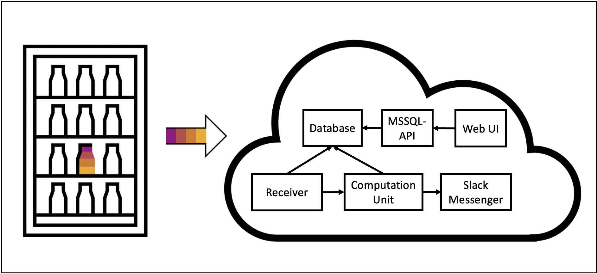
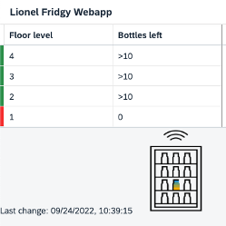

# Lionel-Fridgy

## Overview
This is a project on how to manage the stock (bottles) of a fridge in a Kyma runtime environment.
To detect how many bottles are inside of the fridge, pressure sensors were used. These sensors were placed on every floor of the fridge. 
Furthermore, a magnetic sensor was mounted onto the door of the fridge. Thereby, the closing of the fridge can be detected.
The sensors were all connected to an arduino. The arduino reads the values of the pressure sensors everytime the magnetic sensor detects a closing of the door. The sensor readings are then sent to the Raspberry Pi which depicts the connection point of the hardware and the Kyma runtime environment by transferring the values to the cluster.

Inside of the cluster first a [receiver microservice](#receiver) accepts and validates the data before storing it in an internal [MS SQL database](#mssql-database) and triggering another microservice, the [computational unit](#computational-unit). This estimates the amount of bottles per floor given the raw data from the sensors. If at least one floor runs low or is empty the [slack notification](#slack-messenger) is triggered and the user gets a message. To get up-to-date data of the state of the fridge a user could also always check the [web UI](#web-ui). 

A graphic overview of the architecture of the Kyma cluster can be seen [here](#kyma-cluster). 

## Table of content
- [Lionel-Fridgy](#lionel-fridgy)
  - [Overview](#overview)
  - [Table of content](#table-of-content)
  - [Prerequisites](#prerequisites)
  - [Hardware \& Construction](#hardware--construction)
  - [Kyma cluster](#kyma-cluster)
    - [Receiver](#receiver)
    - [MS SQL Database](#ms-sql-database)
    - [Computational Unit](#computational-unit)
    - [Web UI](#web-ui)
    - [Kyma Functions](#kyma-functions)
      - [MS SQL API](#ms-sql-api)
      - [Slack Messenger](#slack-messenger)
  - [Helm notes](#helm-notes)
  - [Deployment](#deployment)
  - [About the authors](#about-the-authors)

## Prerequisites

- SAP BTP, Kyma runtime instance
- [Docker](https://www.docker.com/)
- [kubectl](https://kubernetes.io/docs/tasks/tools/install-kubectl/) configured to use the `KUBECONFIG` file downloaded from the Kyma runtime
- Raspberry Pi, Arduino, Magnetic door sensor, Weight sensors

## Hardware & Construction
The hardware needs to be capable of getting an overview of the current stock of each floor in the fridge. We therefore developed a simple but effictive hardware design, consisting of two aluminium plates which were tied underneath each floors grating. In this way we reduced the bearing surface to only four contact points. We then equipped each floor with two pressure sensors to get an estimate for the weight of the floor. 

The sensors provided an analog output voltage which we read with an Arduino. To transfer the data to the Kyma cluster we needed a WiFi capable device. We chose a Raspberry Pi due to easy setup, availability and potential for further improvements of the project. The Arduino and Raspberry Pi are connected via USB and communicate with a serial protocol. For more details you can take a look into the programs which are provided [here (for Arduino)](./arduino) and [here (for Raspberry Pi)](./raspberrypi). 

It is recommended to add the Raspberry Pi program into the autostart routine to automatically let it run even in case of (short) power failure. 

## Kyma cluster
In the following we provide more details on the microservices and functions deployed in the Kyma cluster. Note that the general architecture of the cluster does not depend on this specific hardware setup but could be adjusted to work with any other IoT setup easily. 

The modules inside of the kyma cluster are connected as shown below:



### Receiver 
First contact point for the data with the cluster. Runs a Node.js express web server which is listening for POST requests from outside via a Service and an APIRule. Received JSON data gets validated (checks for correct format and existence of necessary data) and after success written to MS SQL database. After that the [Computation Unit](#computational-unit) is triggered via an cluster-internal POST request. 


### MS SQL Database

Simple MS SQL database that is consisted of two data tables. The first one (`RawData`) stores the every closing time of the fridge and the pressure values of each floor. Since we have two sensors in each floor, we have two pressure values for each floor. The second table (`ComputationDataF`) stores the emptiness level of each floor and the date.

### Computational Unit

Computation Unit receives raw data from `RawData` table inside of the `LionelFridgyDB`. It calculates the approximate number of bottles of the latest closing time for each floor and according to that it decides whether the floor is empty, there are less than five bottles or less or more than ten bottles. It writes the values to `ComputationDataF` for Slack Messenger.

* O means the floor is empty
* 1 means there are less than 5 bottles on that floor
* 2 means there are more than 5 and less than 10 bottles on that floor
* 3 means there are more than 10 bottles at that floor

Since computational unit should only be triggered after the door of the fridge is closed, `Flask` is used for that event triggering purpose. For the connection between the database and Python, `pymssql` library is used. For the connection `DB_HOST, DB_NAME, DB_USER, DB_PW` values are used which are stored under `lionel-fridgy-secret` inside of the cluster that is used (`Configuration -> Secrets -> lionel-fridgy-secret`). 

After the connection is established, the last row of `RawData` table is took because Computational Unit only needs to calculate the current values. According to the pressure values of each floor, the approximate number of bottles are calculated and is written to `ComputationDataF` table for Slack Messenger and Web UI to be able to receive the data. 


### Web UI
To allow users an always available and up-to-date view of the state of the fridge, a Web UI is integrated in this project. It can be accessed from everywhere and lists for every floor level an estimate of the number of bottles. Furthermore it includes color codes for improved readability and lists the timestamp of the last update (= closing of the fridge). Below you can see a screenshot of the Web UI:



The Web UI was developed using [SAP's UI5 framework](https://sapui5.hana.ondemand.com). This takes care of a nice look without to much work. It also provides the functionality to easily integrate dynamic JSON data into a table to further speed up the development process. 
While working as required and fulfilling its purpose the Web UI has great potential for improvements. With small adjustments it would be possible to show historic data in a graphical way or even enable actions like reordering. 

### Kyma Functions
For this project, there are two Kyma Functions implemented, the api-mssql-function and the slack-messenger function.
Both will be described in the following.

#### MS SQL API
This function is necessary to allow the client-side running Web UI access to the data stored in the cluster-internal MS SQL database. When triggered it retrieves the current data from the database and returns it in JSON format. Some values are translated from internal storage format to readable values to provide a useful overview of the current state. To further improve the readability a color code ("Success", "Error", etc.) is added to each floor level, which can be used by the Web UI. 


#### Slack Messenger
The slack-messenger is a function that sends an HTTP-POST request to a slack webhook url.
The function can be triggered with an in-cluster event.
The event has to adhere to the following requirements:
The element ```spec.filter.filters.eventType.value``` has to be ```sap.kyma.custom.lionelfridgy.alert.triggered.v1```.
Furthermore, the structure of the data has to be as the following:
```
   {
        "source": "kyma",
        "specversion": "1.0",
        "eventtypeversion": "v1",
        "data": {"alarm_floors": [1, 0, 0, 0], "bottles_floors": [3 , 1, 5, 10]},
        "datacontenttype": "application/json",
        "id": "2",
        "type": "sap.kyma.custom.lionelfridgy.alert.triggered.v1"
  }
```
The values for the alert_floors can either be 0, 1, 2 or 3. 0 is equal to "an alert for that floor has to be sent".
1 is equal to "a warning for this floor has to be sent".
The values 2 and 3 both state that no alarm or warning should be sent.
The values for the bottle amount of each floor is just equal to the amount of the approximated bottles.
The lowest floor corresponds to the value at position 0 in the arrays. The highest floor corresponds to the value at position 3 (last) in the arrays.

## Helm notes
Every module contains a subfolder called "Helm". These folders contain the helm-charts to the given module.
The helm-charts were used during the development for the CI/CD-process.


## Deployment
In this section, the deployment with kubectl is described.
To perform deployment, you have to follow these steps:
1. Go into the given module folder
2. Make sure that you have a docker image built and ready for this given module (Dockerfile sits in ```docker``` folder)
3. Go into the ```k8s``` folder and change the parameters marked with ```< >``` in all files
4. Deploy the objects in the ```k8s``` folder by running the following from inside the ```k8s```folder: <br/>
   ``` kubectl apply -f . ```
   
This then has to be done for all modules. Note that for the kyma functions, there are no docker images that need to be built, so step 2 is skipped.


## About the authors
This project was planned and developed by the STAR (Student Training and Rotation) students [Cansu Doganay](https://github.com/cansudoganaysap), [Jano Hanzlik](https://github.com/janohanzlik) and [Alexander Weers](https://github.com/aweers) during their rotation in the Kyma Product Enablement department from April 2022 to September 2022. 
