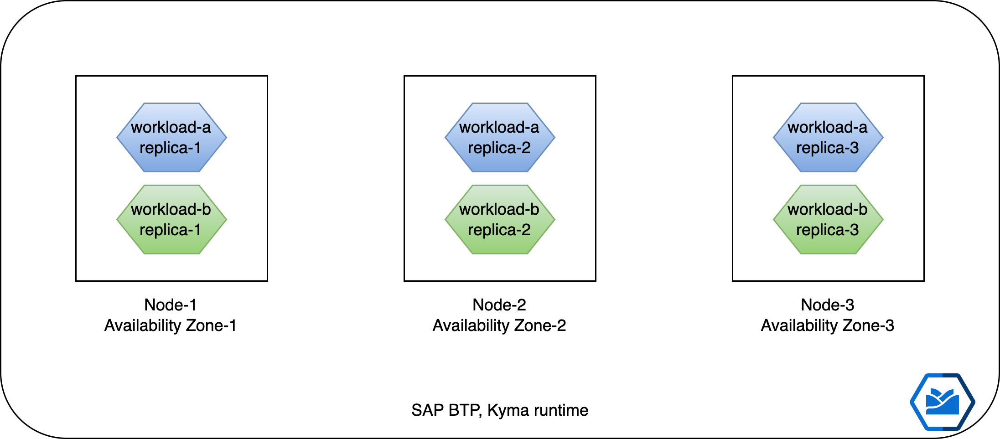
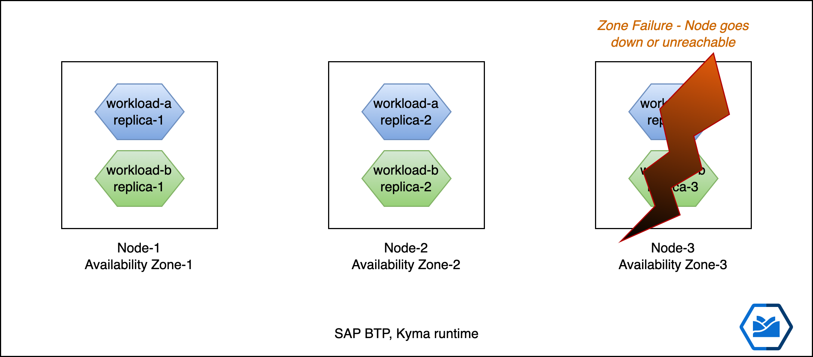

# Overview

As part of the effort to provide high availability (HA) for the SAP BTP Kyma runtime (AWS, Azure, GCP service plans), we have enabled multi-availability-zone worker groups for the Kyma runtime.

> **Note:** The Zone here refers to hyperscalers availability zone. E.g. [Azure Availability Zones](https://learn.microsoft.com/en-us/azure/availability-zones/az-overview#availability-zones)

The worker nodes(Virtual Machines) with the provided machine type and autoscaler parameters will be provisioned in three availability zones of the selected region.

The NAT gateway created to route the public outbound traffic will be provisioned in a zone-redundant manner by all the Azure, AWS and GCP paid service plans.

The critical Kyma managed components hosted on the runtime will be configured to be resilient to node and/or zone failures.

*So what does this mean for you as a customer?*

- You can keep your applications highly available and resilient to zone failures for hyperscalers.
- You can now deploy multiple replicas of your applications in such a way that they are distributed across multiple availability zones.
- So if one zone goes down, you still have replicas of your applications running in multiple zones thus continue to serve your users without disruptions.
- Kyma components such as eventing are also deployed with zone redundancy. This will ensure that all your business scenarios that use Kyma components will also be shielded from zone/node failures.

Workloads distributed across zones


Highly Available despite Zone 3 going down


## Example

### Prerequisites

- [SAP BTP, Kyma runtime instance](../prerequisites/README.md#kyma)
- [Kubernetes tooling](../prerequisites/README.md#kubernetes)

### Steps

Let's deploy a sample application and understand how we can configure an application to be highly available and resilient to zone failures.

We will deploy a simple [httpbin](k8s/httpbin.yaml) example. The key part is to specify the [topologySpreadConstraints](https://kubernetes.io/docs/concepts/scheduling-eviction/topology-spread-constraints/).

Here we can specify various configuration parameters that will influence how the replicas are distributed. The most important ones are:

- `topologyKey` using which Kubernetes will identify the zone and use it to spread the replicas. It is the key of node labels that contains zone information.
- `whenUnsatisfiable` indicates how to deal with a Pod if it doesn't satisfy the spread constraint.
- `maxSkew` describes the degree to which Pods may be unevenly distributed.

```yaml
      topologySpreadConstraints:
      - maxSkew: 1
        topologyKey: topology.kubernetes.io/zone
        whenUnsatisfiable: DoNotSchedule
        labelSelector:
          matchLabels:
            app: multi-zone-ha-httpbin
```

- Set up environment variables

  - OSX

    ```shell
    export NS={your-namespace}
    ```

  - Windows PowerShell

    ```powershell
    $NS={your-namespace}
    ```

- Go ahead and deploy the application. It has 3 replicas specified.

```shell
kubectl -n $NS apply -f k8s/httpbin.yaml
```

- Observe the nodes on which pods (replicas) are deployed

```shell
kubectl -n $NS get po -l app=multi-zone-ha-httpbin -o custom-columns=NAME:.metadata.name,NODE:.spec.nodeName
```

```shell
NAME                                    NODE
multi-zone-ha-httpbin-579594d44-7m6nk   shoot--kyma-stage--ed72781-cpu-worker-0-z2-796d8-4bwfv
multi-zone-ha-httpbin-579594d44-9dv5r   shoot--kyma-stage--ed72781-cpu-worker-0-z3-69c77-p4565
multi-zone-ha-httpbin-579594d44-zjscn   shoot--kyma-stage--ed72781-cpu-worker-0-z1-b859d-7fcm5
```

- Observe the zones in which the respective nodes are deployed

```shell
kubectl get nodes -o custom-columns=NAME:.metadata.name,REGION:".metadata.labels.topology\.kubernetes\.io/region",ZONE:".metadata.labels.topology\.kubernetes\.io/zone"
```

```shell
NAME                                                     REGION        ZONE
shoot--kyma-stage--ed72781-cpu-worker-0-z1-b859d-7fcm5   northeurope   northeurope-1
shoot--kyma-stage--ed72781-cpu-worker-0-z2-796d8-4bwfv   northeurope   northeurope-2
shoot--kyma-stage--ed72781-cpu-worker-0-z2-796d8-8sdx6   northeurope   northeurope-2
shoot--kyma-stage--ed72781-cpu-worker-0-z3-69c77-p4565   northeurope   northeurope-3
```

As you can see they are in different availability zones. This will ensure that if there are zone failures or a zone/node is unreachable, the replicas from other zones will continue to serve. This will ensure high availability and resiliency for your workloads.

## Key Takeaways

- It is possible to deploy applications on SAP BTP Kyma runtime that are highly available and resilient to zone/node failures.
- When designing/planning your workload deployment strategy, check if your workloads need to be highly available. It is recommended to use the [topologySpreadConstraints](https://kubernetes.io/docs/concepts/scheduling-eviction/topology-spread-constraints/).

## References

- [Multiple Zones Best Practices](https://kubernetes.io/docs/setup/best-practices/multiple-zones/)
- [Topology Spread Constraints](https://kubernetes.io/docs/concepts/scheduling-eviction/topology-spread-constraints/)
- [Kubernetes Blog about Topology Spread](https://kubernetes.io/blog/2020/05/introducing-podtopologyspread/)
- [Topology Label](https://kubernetes.io/docs/reference/labels-annotations-taints/#topologykubernetesiozone)
