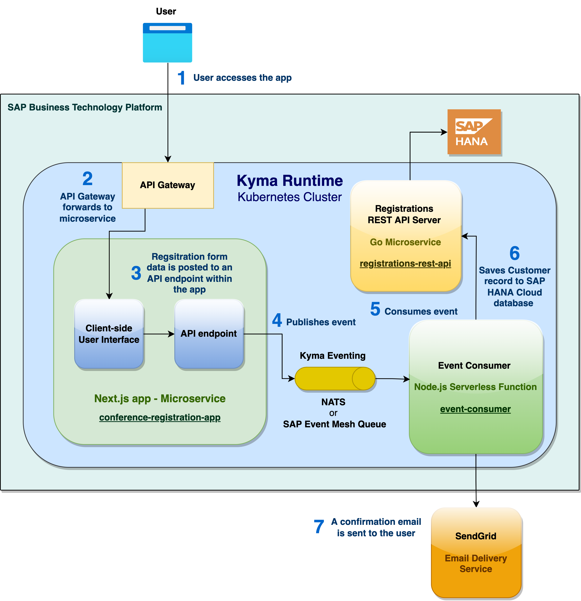
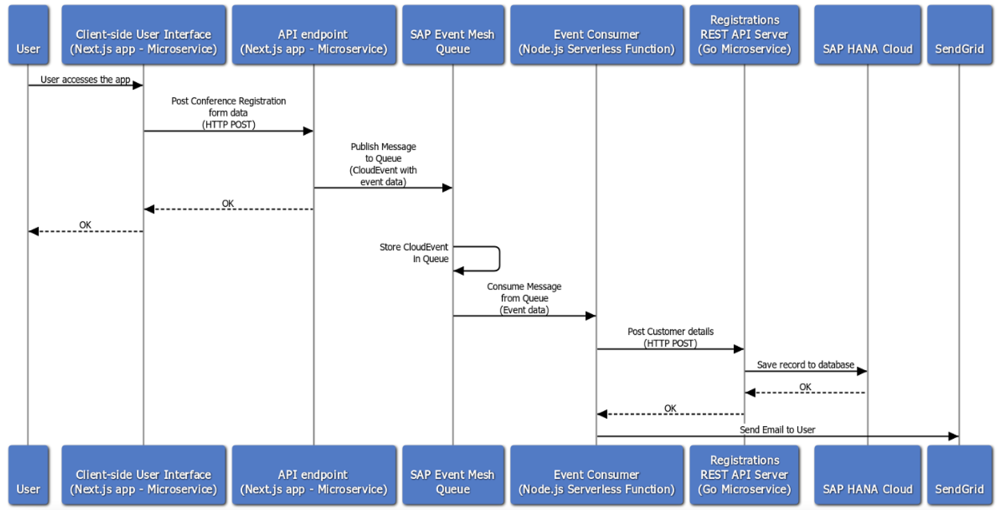
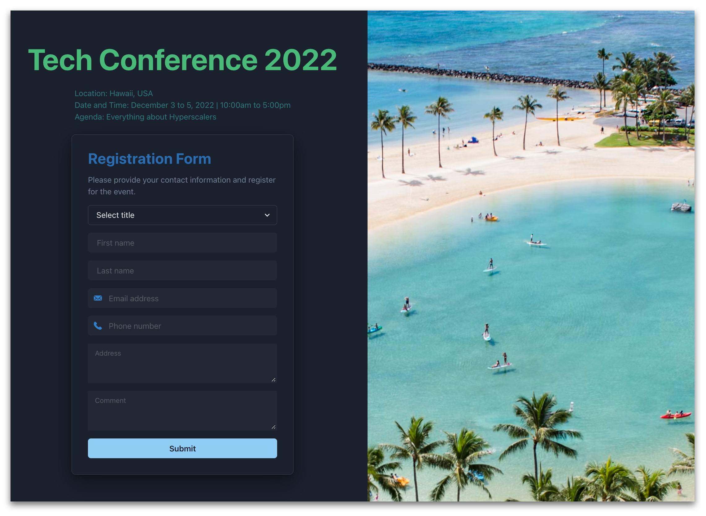

# Next.js app with Kyma eventing & Go backend connected to SAP HANA Cloud database

## Solution Architecture

## Sequence Diagram

## Build and deployment steps

- [**Pre-requisites**](docs/setup/pre-requisites.md)
- [**Step 1** - Pre-requisite SendGrid setup steps](docs/setup/step-1.md)
- [**Step 2** - Build & deploy the **Conference Registration app** (Next.js app)](docs/setup/step-2.md)
- [**Step 3** - Deploy the **Event Consumer function**](docs/setup/step-3.md)
- [**Step 4** - Apply the **Event Registration Subscription**](docs/setup/step-4.md)
- [**Step 5** - Create an instance of **SAP HANA Cloud**](docs/setup/step-5.md)
- [**Step 6** - Deploy the **Registrations REST API Server**](docs/setup/step-6.md)
- [**Step 7** - Connect your web app running on **Kyma Runtime** to a domain via **Cloudflare**](docs/setup/step-7.md)

## Verification steps

- [**Step 1** - Verify that all the resources of the app are running](docs/verification/step-1.md)
- [**Step 2** - View the environment variables in the config map](docs/verification/step-2.md)
- [**Step 3** - View the environment variables in the secret](docs/verification/step-3.md)
- [**Step 4** - View the API Rule](docs/verification/step-4.md)
- :balloon: :tada: [**Step 5** - Launch the app and **Register to attend the Tech Conference** via the app](docs/verification/step-5.md)

### [Troubleshooting steps](docs/verification/troubleshooting-steps.md)
