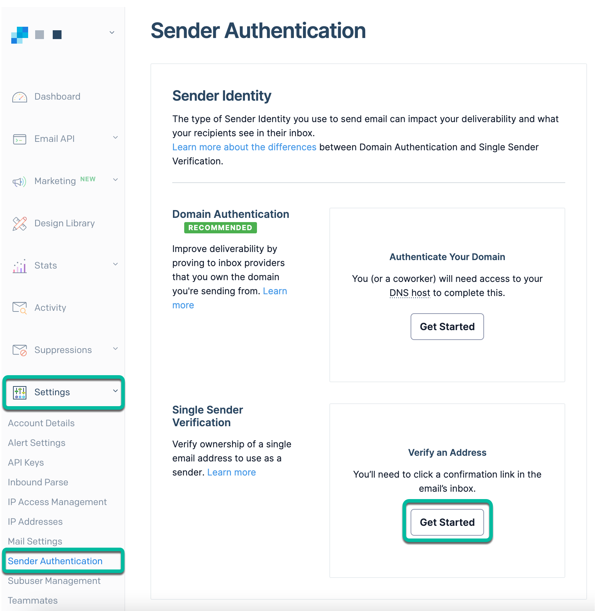
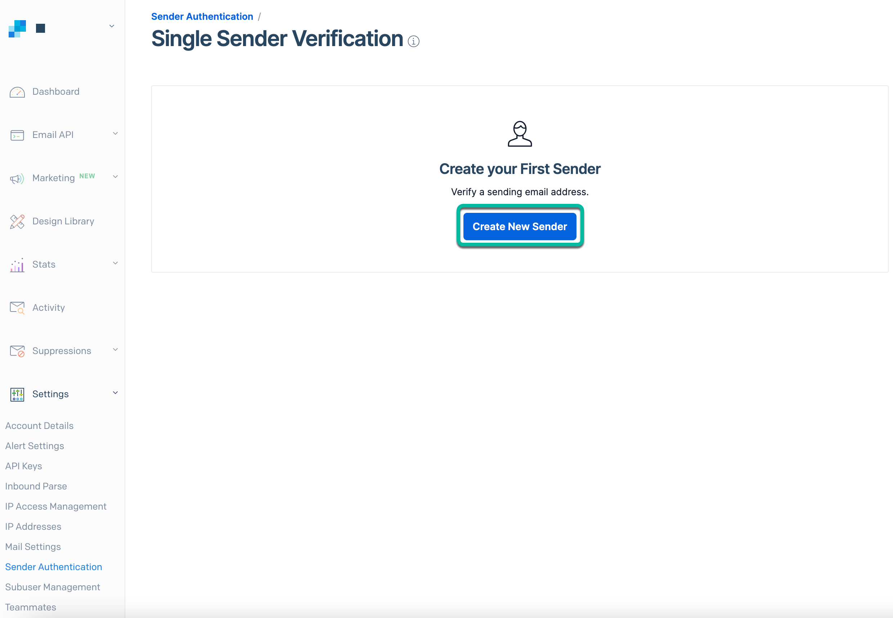
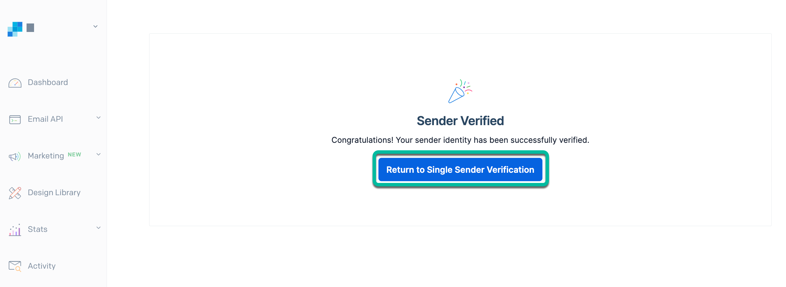
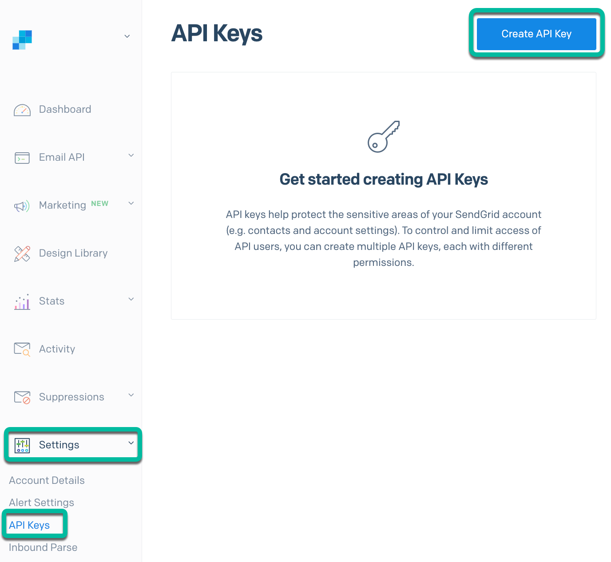
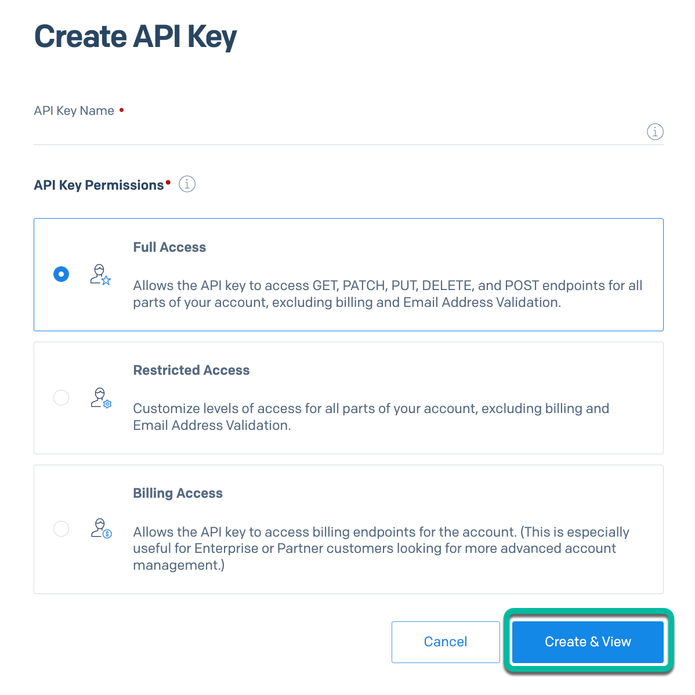

# Step 1 - Pre-requisite SendGrid setup steps

1. Create a **SendGrid** account at <https://app.sendgrid.com>.

2. Then, complete the **Single Sender Verification** steps.

   - Under Settings in the navigation bar, click **Sender Authentication**.

   - Proceed with **Single Sender Verification** by selecting **Get Started** under **Verify an Address**.

   

3. You will be taken to the **Single Sender Verification** page. Under **Create your First Sender**, click **Create New Sender** to load a form modal.

   

4. Fill in all the fields in the form modal and then click **Create**.

   

5. Check the inbox of the email address that you entered and click the link in the email to verify the Sender address.

   If, for any reason, you need to resend the verification email, click the action menu on the **Single Sender Verification** page and select **Resend Verification**. They will deliver a new confirmation email to the address you are attempting to verify.

   

6. You will now see a page confirming the verification of your address. Click **Return to Single Sender Verification** to add more addresses or make any changes to the address you just verified.

   Congratulations, you are now ready to send email with SendGrid.

   

7. As a next step, generate your SendGrid API Key.

   From the left side menu, click on **Settings**, then on **API Keys**.

   Click the **Create API Key** button on the top-right of the page to create a new API key. A new screen will appear.

   

   Enter a name for your API key in the **API Key Name** field.

   In the **API Key Permissions** section, select either **Full Access** or **Restricted Access**. If you decide to restrict access, be sure that the key has access to the Mail Send option.

   Click the **Create & View** button. You will be presented with your SendGrid API key.

   

   Copy and save the API Key as it won't be shown to you again.

   

## Navigation

| [:house:](../../README.md) | :arrow_backward: [Pre-requisites](pre-requisites.md) | :arrow_forward: [Setup : Step 2 - Build & deploy the Conference Registration app (Next.js app)](step-2.md) |
| -------------------------- | ---------------------------------------------------- | ---------------------------------------------------------------------------------------------------------- |
