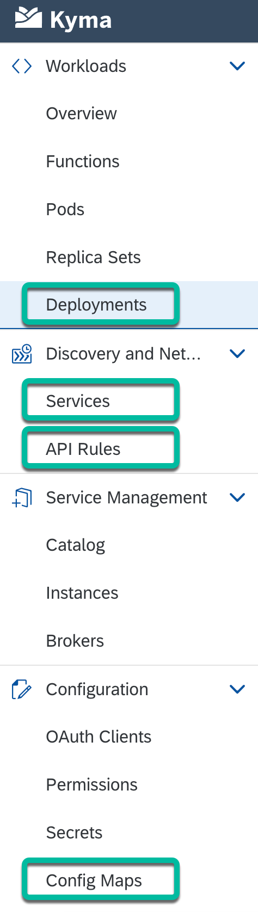

# Step 2 - Build & deploy the Conference Registration app (Next.js app)

1. Download the source code of the **kyma-runtime-extension-samples** GitHub repo.

   ```shell
   git clone https://github.com/SAP-samples/kyma-runtime-extension-samples
   ```

2. Go to the **nextjs-app-with-kyma-eventing/conference-registration-app** folder.

   ```shell
   cd nextjs-app-with-kyma-eventing/conference-registration-app
   ```

3. Build the docker image of the **conference-registration-app microservice**.

   ```shell
   docker build . -t <docker-username>/conference-registration-app -f Dockerfile
   ```

   > Note: Replace `<docker-username>` with your username

4. Push the docker image of the **conference-registration-app microservice** to your Container Image Library.

   ```shell
   docker push <docker-username>/conference-registration-app
   ```

   > Note: Replace `<docker-username>` with your username

5. Update the docker image in the ./conference-registration-app/k8s/deployment.yaml file.

   > Note: Replace `<docker-username>` with your username

6. Go back to the parent folder (i.e. **nextjs-app-with-kyma-eventing** folder).

   ```shell
   cd ..
   ```

7. Create a Kubernetes namespace called **conference-registration**.

   ```shell
   kubectl create namespace conference-registration
   ```

8. Create/update Kubernetes resources of the **conference-registration-app microservice**.

   ```shell
   kubectl apply -f ./conference-registration-app/k8s/config-map.yaml
   kubectl apply -f ./conference-registration-app/k8s/deployment.yaml
   kubectl apply -f ./conference-registration-app/k8s/service.yaml
   kubectl apply -f ./conference-registration-app/k8s/api-rule.yaml
   ```

9. Verify that the config map, deployment, service and API Rule were created by going to the specific screens in the Kyma console.

   

## Navigation

| [:house:](../../README.md) | :arrow_backward: [Setup : Step 1 - Pre-requisite SendGrid setup steps](step-1.md) | :arrow_forward: [Setup : Step 3 - Deploy the Event Consumer function](step-3.md) |
| -------------------------- | --------------------------------------------------------------------------------- | -------------------------------------------------------------------------------- |
