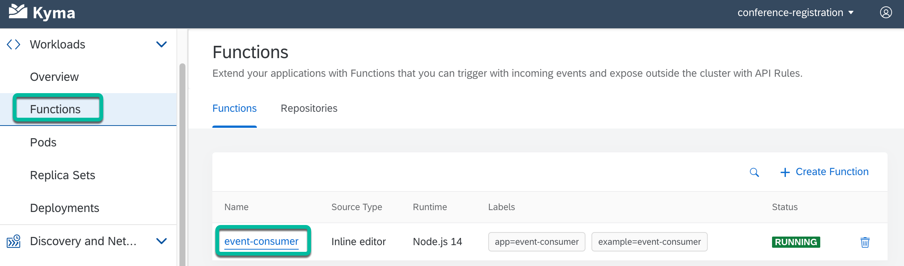

# Step 3 - Deploy the Event Consumer function

1. Update the values of the `SENDGRID_API_KEY` & `SENDGRID_SENDER_EMAIL` environment variables in the ./event-consumer/k8s/function.yaml file, which can be got from your SendGrid account.

2. Create/update Kubernetes resources of the **event-consumer serverless function**.

   ```shell
   kubectl apply -f ./event-consumer/k8s/function.yaml
   ```

3. Check to confirm that the **event-consumer serverless function** function is running in the **conference-registration** namespace.

   

## Navigation

| [:house:](../../README.md) | :arrow_backward: [Setup : Step 2 - Build & deploy the Conference Registration app (Next.js app)](step-2.md) | :arrow_forward: [Setup : Step 4 - Apply the Event Registration Subscription](step-4.md) |
| -------------------------- | ----------------------------------------------------------------------------------------------------------- | --------------------------------------------------------------------------------------- |
