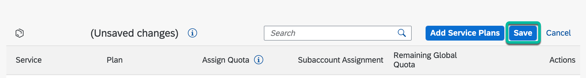
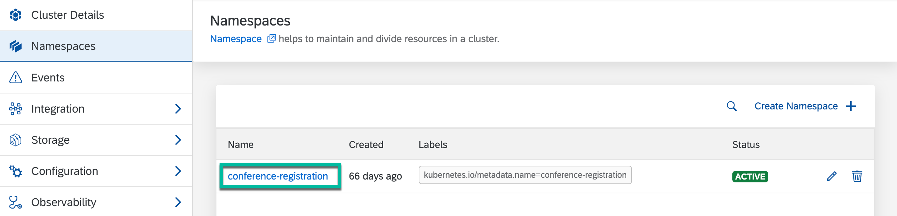

# Step 4 - Apply the Event Registration Subscription

1. Create a Subscription to receive events. The subscription custom resource is used to subscribe to events.

   ```shell
   kubectl apply -f ./event-subscription/k8s/subscription.yaml
   ```

2. Verify that the subscription has been created in the **conference-registration** namespace.

   ```shell
   kubectl get subscription -n conference-registration
   ```

## Optionally, use Kyma Eventing with SAP Event Mesh (only if you're not using a free tier or free trial BTP account)

   > **Note:** By default, Kyma clusters have an Eventing backend based on **[NATS](https://nats.io/)**. However, it is possible to switch this backend to **[SAP Event Mesh](https://help.sap.com/viewer/product/SAP_EM/Cloud/en-US)** if you're not using a free tier or free trial BTP account.

### Create an instance of Event Mesh service in your BTP account

1. Within you BTP subaccount, go to the **Entitlements** page and click on **Configure Entitlements**.

   

2. Search for **Event Mesh**, select the **standard** plan and on **Add 1 Service Plan**.

   

3. Click on **Save**.

   

4. Within you BTP subaccount, go to **Services** > **Service Marketplace**, search for **Event Mesh** and click **Create**.

   

5. Select the **standard** plan and click **create**.

   

### :arrow_lower_right&#58;

### [Use Kyma Eventing with SAP Event Mesh](https://help.sap.com/products/BTP/65de2977205c403bbc107264b8eccf4b/407d1266017f4b529b61665fa7408c41.html)

## Navigation

| [:house:](../../README.md) | :arrow_backward: [Setup : Step 3 - Deploy the Event Consumer function](step-3.md) | :arrow_forward: [Setup : Step 5 - Create an instance of SAP HANA Cloud](step-5.md) |
| -------------------------- | --------------------------------------------------------------------------------- | ---------------------------------------------------------------------------------- |
