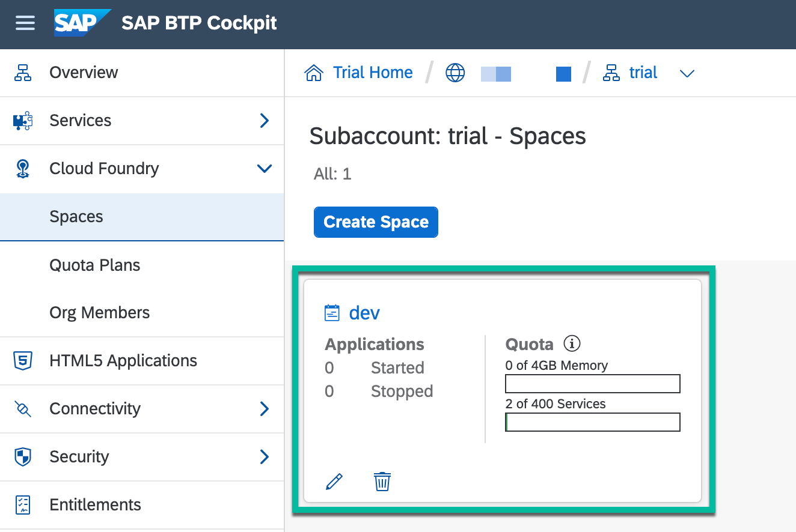
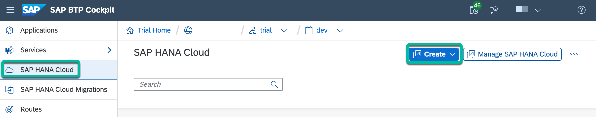

# Step 5 - Create an SAP HANA Cloud Database Instance

## Create the database instance

This can be done by either using the Cloud Foundry CLI or from the BTP cockpit.

   > **Important Note:** The SAP HANA Cloud instance in both the free tier and free trial BTP accounts shuts down at the end of each day automatically to save costs from unused systems. Therefore, you must return to the SAP HANA Cloud administration screen each day you want to use SAP HANA Cloud and choose to start the system from the Action menu.

### Option 1: Use the Cloud Foundry CLI to create a database instance

1. Log in using the Cloud Foundry CLI

   ```shell
   cf login -a <API-endpoint>
   ```

   > **Pre-requisite steps:** [Install the Cloud Foundry Command Line Interface (CLI) and login](https://developers.sap.com/tutorials/cp-cf-download-cli.html)

2. Create the database instance

   ```shell
   cf create-service hana-cloud-trial hana tech-conference-db -c '{"data":{"edition":"cloud","memory":30,"systempassword":"<password>"},"whitelistIPs":["0.0.0.0/0"]}'
   ```

   > **Note:**
   >
   > * Replace `<password>` with your desired password.
   > * Replace `hana-cloud-trial` with `hana-cloud` if you aren't using a trial account.
   > * Optionally, replace `["0.0.0.0/0"]` with your IPs to be whitelisted as this setting currently allows access to your database from all IP addresses.
   > * **Additional information:** [Using the Cloud Foundry CLI with SAP HANA Cloud](https://help.sap.com/viewer/db19c7071e5f4101837e23f06e576495/2020_03_QRC/en-US/921f3e46247947779d69b8c85c9b9985.html)

### Option 2: Use the BTP cockpit to create a database instance

1. Within the BTP cockpit, go to your **subaccount**.

2. Ensure that **Cloud Foundry Environment** is enabled and it has a space with the name **dev**.

   > **Note:** Any other name can also be used for the space.

3. Go to **Cloud Foundry** > **Spaces** > **dev**.

   

4. Click on **SAP HANA Cloud** and click **Create**. Then, click on **SAP HANA database**.

   

5. Click on **Sign in with default identity provider**.

6. Under **Type**, select **SAP HANA Cloud, SAP HANA Database** and click on **Next Step**.

7. Under **General**, enter a desired **instance name** and **administrator password** and click on **Next Step**.

   Example:

   ```shell
   Instance Name: tech-conference-db
   ```

8. Under **SAP HANA Database**, click on **Next Step**.

9. Under **SAP HANA Database Availability Zone and Replicas**, click on **Next Step**.

10. Under **SAP HANA Database Advanced Settings**, select the following value for **Allowed connections** and click on **Next Step**.

    ```shell
    Allowed connections: Allow all IP addresses
    ```

11. Under **Data Lake**, accept the default selection and click on **Review and Create**.

12. Under **SAP HANA Database Instance**, click on **Create Instance**.

## Create the table within your database instance

1. Under **All Instances**, verify that the HANA Cloud database instance has been created and its status is **Running**.

2. Click on **...** under **Actions** and select **Open in SAP HANA Database Explorer**.

    > **Note:** If you get an error with the **Invalid resource** message, then clear your browser's cache and try again, or try again using another browser such as Safari.

3. If prompted, click on **Sign in with default identity provider**.

4. Enter your administrator credentials and click **OK**.

    ```shell
    Username: DBADMIN
    Password: *********
    ```

5. Right-click on **tech-conference-db** and select **Open SQL Console**.

6. Run the following query:

    ```shell
    CREATE SCHEMA REGISTRATIONS;
    ```

7. Run the following query:

    ```shell
    CREATE COLUMN TABLE REGISTRATIONS.CUSTOMER(
    cno VARCHAR(36) PRIMARY KEY,
    title VARCHAR(20) NOT NULL,
    firstname VARCHAR(30) NOT NULL,
    lastname VARCHAR(30) NOT NULL,
    email VARCHAR(50) NOT NULL,
    phone VARCHAR(20),
    address VARCHAR(80) NOT NULL,
    comment VARCHAR(100),
    created VARCHAR(50),
    updated VARCHAR(50)
    );
    ```

## Navigation

| [:house:](../../README.md) | :arrow_backward: [Setup : Step 4 - Apply the Event Registration Subscription)](step-4.md) | :arrow_forward: [Setup : Step 6 - Deploy the Registrations REST API Server](step-6.md) |
| -------------------------- | ----------------------------------------------------------------------------------------- | --------------------------------------------------------------------- |
