# Step 7 - Connect your web app running on Kyma Runtime to a domain via Cloudflare

> **Note:** If you're following the example from the [previous step](step-6.md), then continue to use the `conference-registration` namespace in all the YAML files and steps listed below (i.e. no changes required). Otherwise, change all references of `conference-registration` namespace and use your namespace instead.

## 1. Add your domain to Cloudflare

For the first step, there are three options and you can choose one of them as per your preference.

* **Option 1**: [Register your domain through Cloudflare](https://www.cloudflare.com/products/registrar/).

* **Option 2**: [Transfer your domain to Cloudflare](https://developers.cloudflare.com/registrar/get-started/transfer-domain-to-cloudflare).

* **Option 3**: Register your domain through another domain name registrar and then [add your domain to Cloudflare](https://developers.cloudflare.com/learning-paths/get-started/add-domain-to-cf/).

  > **Note:** Cloudflare also offers a [**free plan**](https://www.cloudflare.com/plans/free/) with **CDN** and **Unmetered DDoS Protection for Layers 3-7** for personal or hobby projects that aren’t business-critical.

Your nameserver change may take up to **48 hours** to propagate. Therefore, it would be best to wait for **48 hours**  before proceeding with the next step.


## 2. Create a Cloudflare API Token

1. Log into the [Cloudflare Dashboard](https://dash.cloudflare.com/) and go to `User Profile` -> `API Tokens` or simply [click here](https://dash.cloudflare.com/profile/api-tokens). From the API Token home screen select `Create Token`. Then, under `Custom token`, select `Get Started`. <!-- markdown-link-check-disable-line -->

    > **Note:** You need to generate an API token and not an API key.

    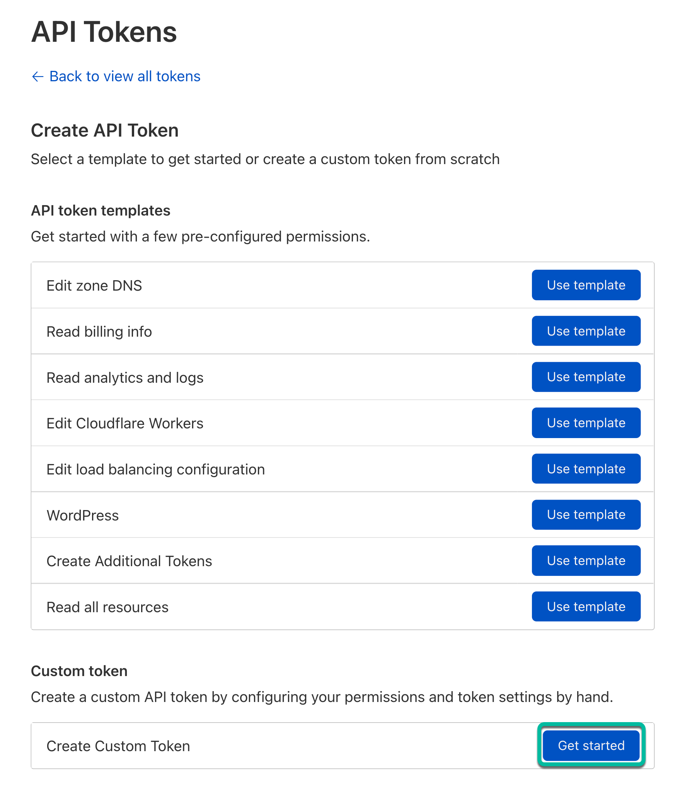

2. To generate the token, make sure the token has `Zone: Read` and `DNS: Edit` permissions for all zones. Optionally you can exclude certain zones. Then select `Continue to summary`.

    > **Note:** You need to Include `All zones` in the `Zone Resources` section. Setting `Specific zone` won't work. However, you can still add one or more Excludes.

    

3. In the next screen, select `Create Token`.

    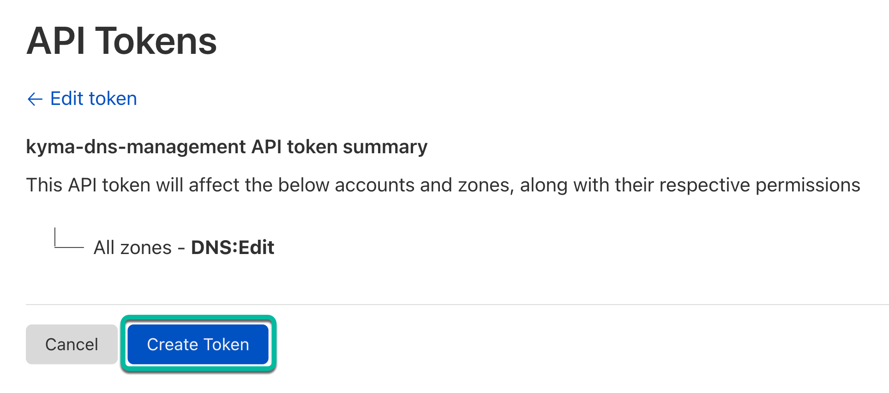

4. The generated token is displayed in the next screen as shown below. Copy and keep it safe as it won't be shown again.

    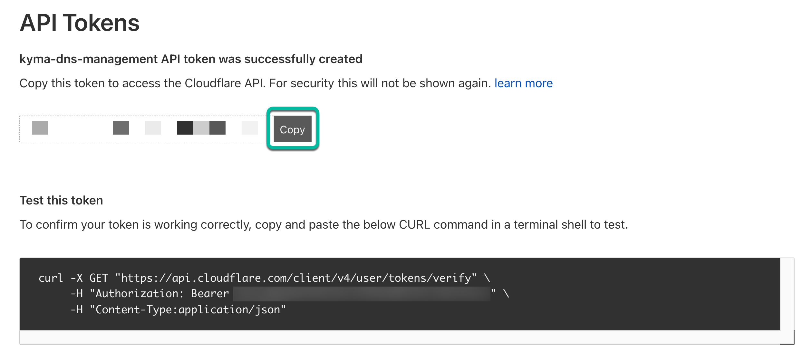

5. Then, Base64 encode the token using the echo command shown below. For example, if the generated token is `1234567890123456`, then the Base64 encoded value of it would be `MTIzNDU2Nzg5MDEyMzQ1Njc4OQ==`.

    ```shell
    echo -n '1234567890123456789' | base64
    ```

## 3. Create a Kubernetes Secret with your Cloudflare API Token

1. Use the Base64 encoded token from the above step to update the value of the resource with `data.CLOUDFLARE_API_TOKEN` in the [`./cloudflare/k8s/secret.yaml`](../../cloudflare/k8s/secret.yaml) file.

2. Create the `cloudflare-credentials` Kubernetes Secret in the `conference-registration` namespace.

   ```shell
   kubectl apply -f ./cloudflare/k8s/secret.yaml
   ```

   > **Note:** Fore more details, refer to the [Cloudflare DNS Provider](https://github.com/gardener/external-dns-management/blob/master/docs/cloudflare/README.md) documentation.

### Create a Kubernetes Secret — Troubleshooting

If you get a permission error communicating with Cloudflare, ensure that the domain name being registered does not exceed the limits of your plan. Hierarchical domains are not supported on the free plan as of this writing.

## 4. Create a DNS Provider

### Option 1: Use the kubectl CLI to create a DNS Provider

1. Replace `app.your-domain.com` in the [`./cloudflare/k8s/dns-provider.yaml`](../../cloudflare/k8s/dns-provider.yaml) file with your desired domain.

2. Create the `cloudflare` DNS Provider resource in the `conference-registration` namespace.

   ```shell
   kubectl apply -f ./cloudflare/k8s/dns-provider.yaml
   ```

### Option 2: Use the Kyma console to create a DNS Provider

In the Kyma console, select the  `conference-registration` namespace. Then, go to `Configuration` -> `DNS Providers` and enter the following values. Select your namespace and for `Secret Name` select the Secret that you created in the previous step. For `Include Domains` use your domain instead of `app.your-domain.com`. Then, click `Create`.

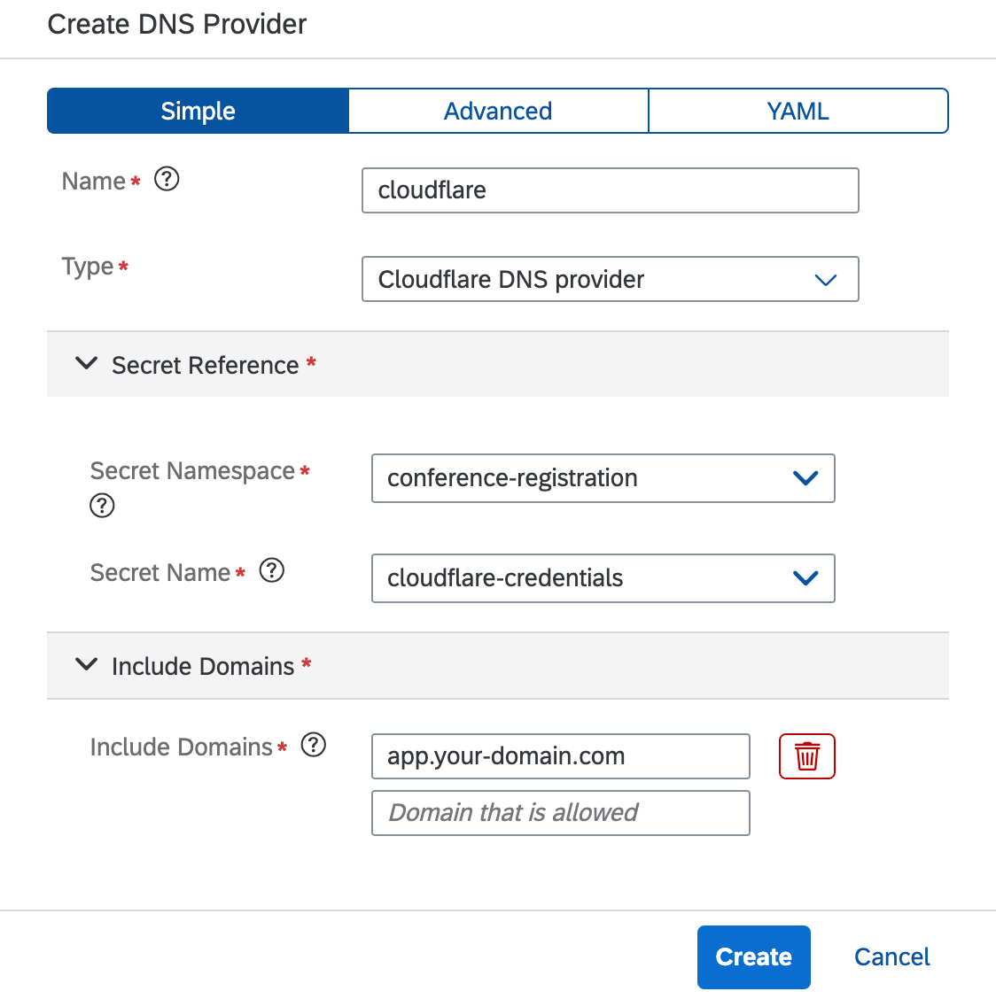

Wait for the status of the `DNS Provider` to change to `READY` before proceeding with the next step.

## 5. Create a DNS Entry

In the Kyma console, select the  `conference-registration` namespace. Then, go to `Configuration` -> `DNS Entries`. Use your domain instead of `app.your-domain.com`. Under `Targets`, select both the options from the dropdown to add both the `istio-ingressgateway` and `vpn-shoot` records as the Targets. Then, click `Create`.

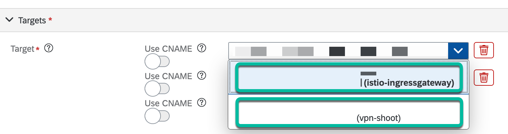

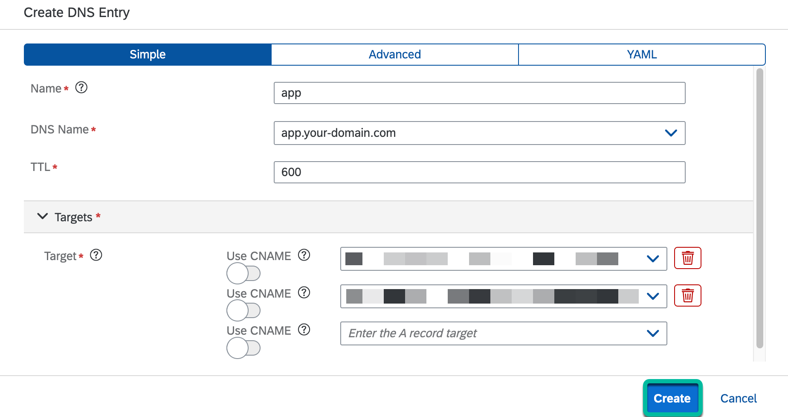

Wait for the status of the `DNS Entry` to change to `READY` before proceeding with the next step.

### Create a DNS Entry — Troubleshooting

#### 403 error

* Check to ensure that the `DNS Provider` created in the previous step has a `READY` status.
* Confirm that the API Token added to the Kubernetes Secret created in the `Create a Kubernetes Secret` step above has the required access to add DNS records to your domain name registrar's account.
* Log into the [Cloudflare Dashboard](https://dash.cloudflare.com/) and go to `Websites` -> Select your account and domain -> `DNS` and verify that the common records of your domain name are displayed there. If there are no records there, then your nameserver change may not have propagated and you would need to wait for up to **48 hours** for them to be displayed. <!-- markdown-link-check-disable-line -->

## 6. Create an Issuer

Create an Issuer in the `istio-system` namespace.

**Note:** This example uses [Let's Encrypt](https://letsencrypt.org/). You can use any other [ACME](https://datatracker.ietf.org/doc/html/rfc8555) server to create the Issuer. You can also use a [Certificate Authority (CA)](https://www.ssl.com/faqs/what-is-a-certificate-authority/) instead.

### Option 1: Use the kubectl CLI to create an Issuer

1. Replace `your-email@domain.com` and `app.your-domain.com` in the [`./cloudflare/k8s/issuer.yaml`](../../cloudflare/k8s/issuer.yaml) file with your desired email and domain, which will be used for registration to the Issuer.

2. Create the `Issuer` resource in the `conference-registration` namespace.

   ```shell
   kubectl apply -f ./cloudflare/k8s/issuer.yaml
   ```

### Option 2: Use the Kyma console to create an Issuer

1. Select `Preferences` from the top-right corner of the Kyma console.

    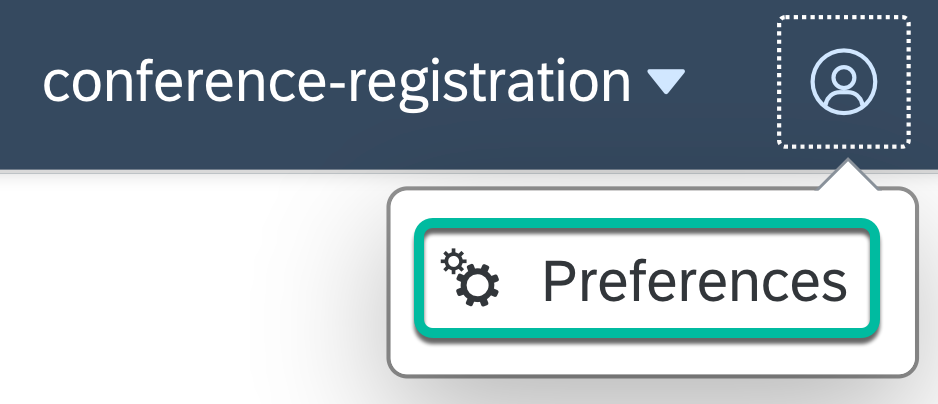

2. Select `Clusters` and enable `Show hidden Namespaces`.

    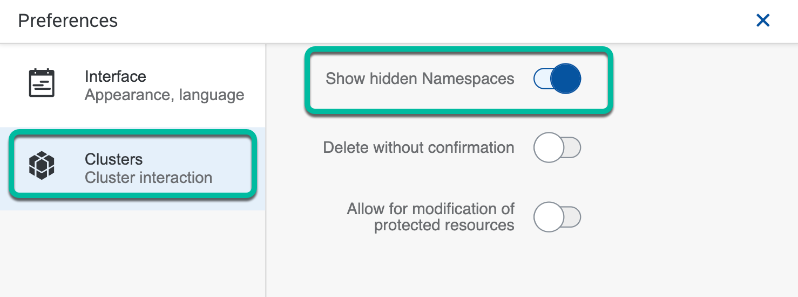

3. Select the `istio-system` namespace in the top-right corner of the Kyma console.

    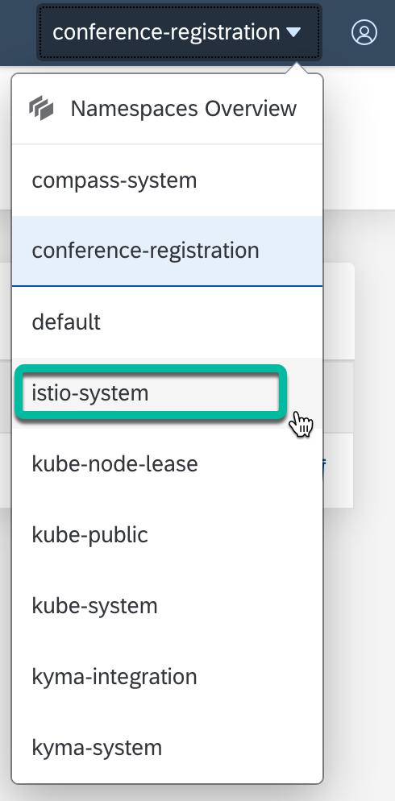

4. Go to `Configuration` -> `Issuers`. Select `Create Issuer` and enter the following values. Use your email instead of `your-email@domain.com` and use your domain instead of `app.your-domain.com`. Then, select `Create`.

    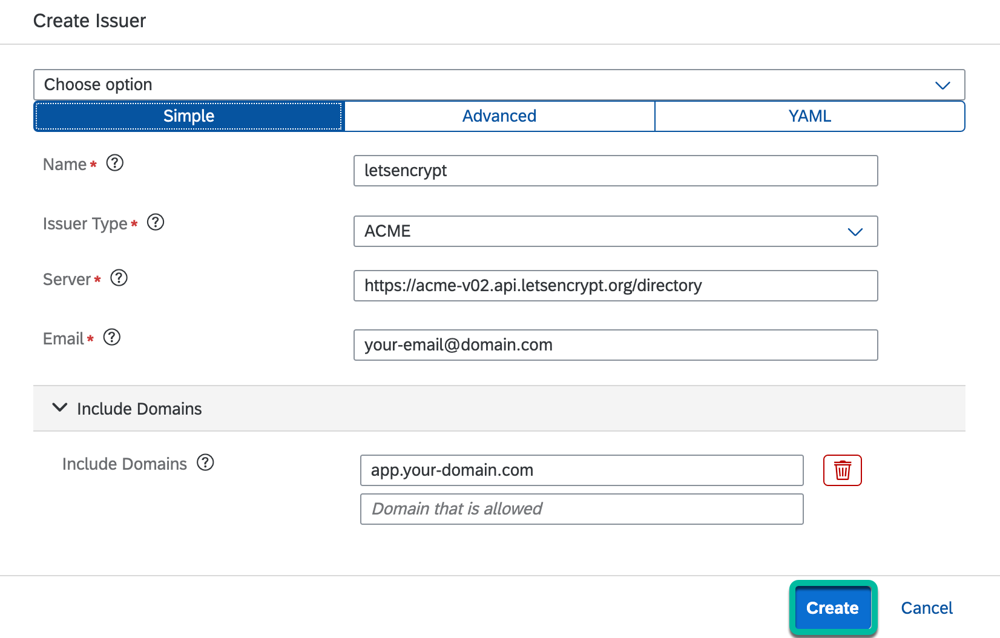

## 7. Create a Certificate

After the Issuer has been created, you can use it to create a Certificate in the `istio-system` namespace.

### Option 1: Use the kubectl CLI to create a Certificate

1. Replace `app.your-domain.com` in the [`./cloudflare/k8s/certificate.yaml`](../../cloudflare/k8s/certificate.yaml) file with your desired domain.

2. Create the `Certificate` resource in the `istio-system` namespace.

   ```shell
   kubectl apply -f ./cloudflare/k8s/certificate.yaml
   ```

### Option 2: Use the Kyma console to create a Certificate

1. Select the `istio-system` namespace in the top-right corner of the Kyma console.

2. Go to `Configuration` -> `Certificates`. Select `Create Certificate` and select the `Advanced` tab. Then, enter the following values. For `Common Name` enter your primary domain name instead of `app.your-domain.com`. For `Issuer Namespace` select `istio-system` and for `Issuer Name` select the Issuer created in the previous step. Then, click `Create`.

    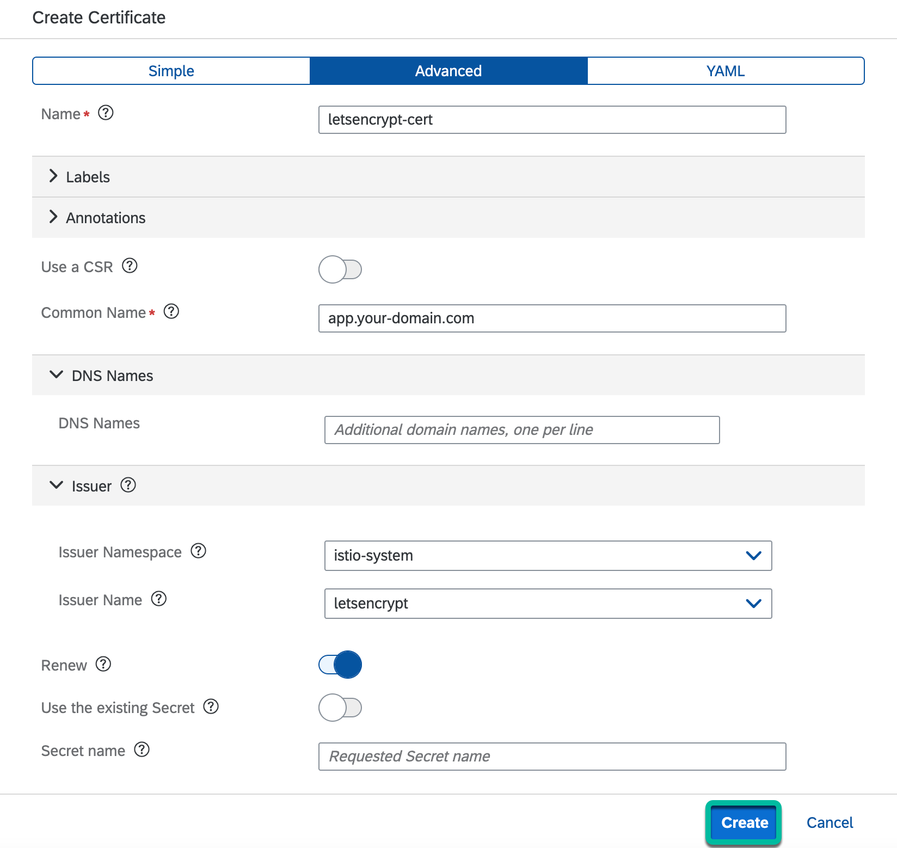

3. Wait for the status of the Certificate to change to `ready`, after which you can create an Istio Gateway using the Certificate.

## 8. Create an Istio Ingress Gateway

After the Certificate has been created, you can use it to create the Istio Ingress Gateway in the `conference-registration` namespace.

### Option 1: Use the kubectl CLI to create an Istio Ingress Gateway

1. Replace `letsencrypt-cert-9t54f` in the [`./cloudflare/k8s/ingressgateway.yaml`](../../cloudflare/k8s/ingressgateway.yaml) file with the `Secret` that was generated in the `istio-system` namespace for the `letsencrypt-cert` Certificate created in the previous step.

    > **Note:** The name of the Secret starts with `letsencrypt-cert-` and end with a random text.

2. Replace all instances of `app.your-domain.com` with your domain name in the [`./cloudflare/k8s/ingressgateway.yaml`](../../cloudflare/k8s/ingressgateway.yaml) file.

3. Create the `Istio Ingress Gateway` resource in the `conference-registration` namespace.

   ```shell
   kubectl apply -f ./cloudflare/k8s/ingressgateway.yaml
   ```

### Option 2: Use the Kyma console to create an Istio Ingress Gateway

1. Select the `conference-registration` namespace in the top-right corner of the Kyma console.

2. Go to `Istio` -> `Gateways` and Select `Create Gateway`. Click on the `Advanced` tab. Then, select `Add Server` and expand the `Servers` section.

    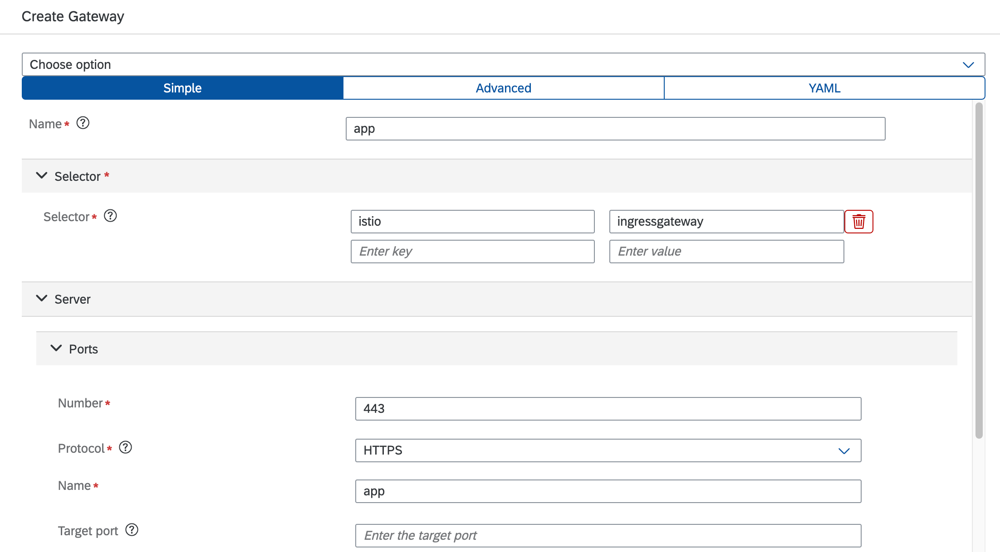

3. Select `Server 1`.

    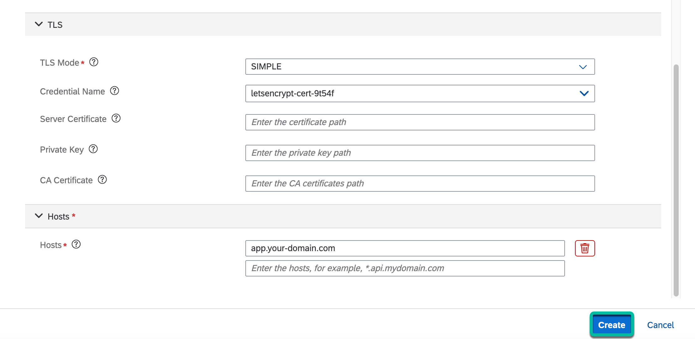

4. Select its protocol as `HTTPS` and give it a name as shown below.

    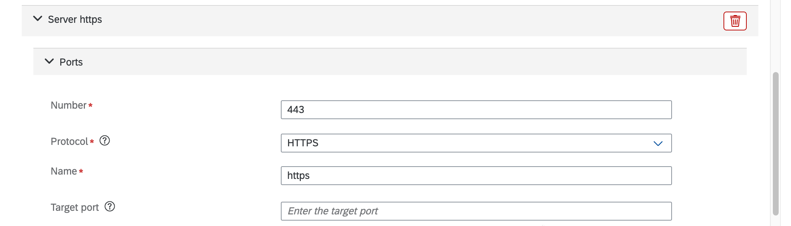

5. Select the `TLS Mode` as `SIMPLE`. For `Credential Name` select the `Secret` that was generated in the `istio-system` namespace for the `letsencrypt-cert` Certificate created in the previous step. Then, add your domain to the `Hosts` field.

    > **Note:** The name of the Secret starts with `letsencrypt-cert-` and end with a random text.

    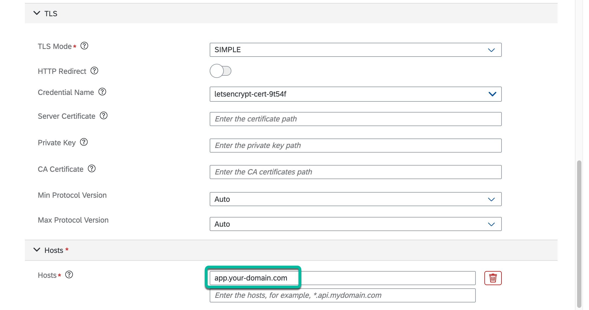

6. Under the other `Server` section, select the `Protocol` as `HTTP` and give it a name as shown below. Then, add your domain to the `Hosts` field.

    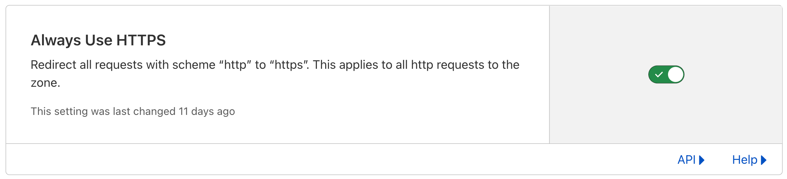

7. Then, click on the `YAML` tab at the top, and enter `httpsRedirect: true` under `tls` within the server with `HTTP` protocol as shown below. Then, select `Create`.

    ```shell
      tls:
        httpsRedirect: true
    ```

    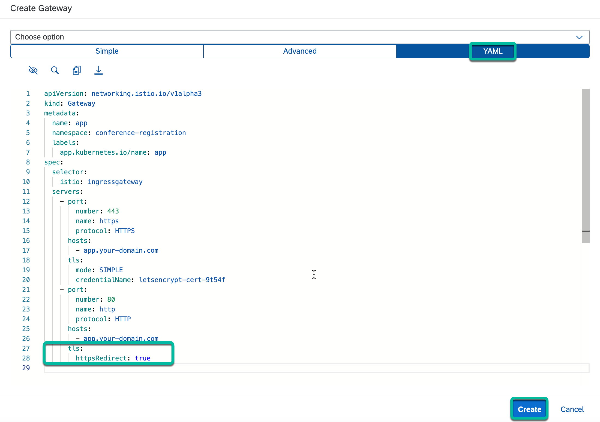

## 9. Create an API Rule with your Istio Ingress Gateway

Create an API Rule to expose your web app running on Kyma Runtime.

After the Istio Gateway has been created, you can use it to create the API Rule in the `conference-registration` namespace.

### Option 1: Use the kubectl CLI to create an API Rule

1. Make the following changes in the [`./cloudflare/k8s/api-rule.yaml`](../../cloudflare/k8s/api-rule.yaml) file:

    * Change the value of the host from `app.your-domain.com` to your domain.

    * Then, change all instances of `app-your-domain-com` to any desired name.

2. Create the `API Rule` resource in the `conference-registration` namespace.

   ```shell
   kubectl apply -f ./cloudflare/k8s/api-rule.yaml
   ```

### Option 2: Use the Kyma console to create an API Rule

1. Select the `conference-registration` namespace in the top-right corner of the Kyma console.

2. Go to `Discovery and Network` -> `API Rules` and Select `Create API Rule`. Then, enter the following values. Use your domain instead of `app.your-domain.com` and use any desired name instead of `app-your-domain-com`. Then, select `Create`.

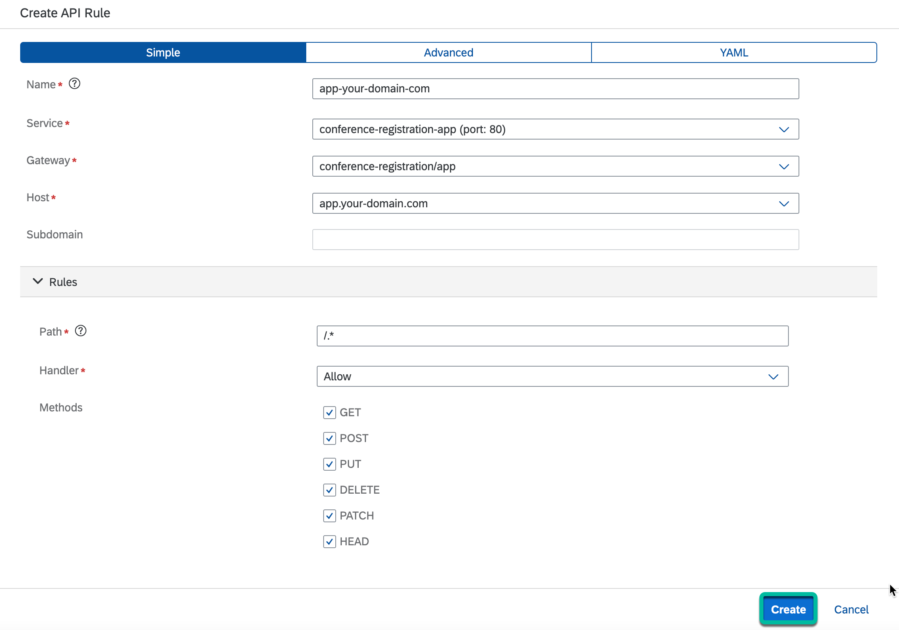

## 10. Set your SSL mode in Cloudflare to Full

1. Go to your [Cloudflare dashboard](https://dash.cloudflare.com/). <!-- markdown-link-check-disable-line -->

2. Select your domain and go to `SSL/TLS` -> `Overview`. Then, select `Full (strict)`.

    

3. Next, go to `SSL/TLS` -> `Edge Certificates`. Then, enable `Always Use HTTPS` if you want all visitors to go to the secure version of your site.

    

| [:house:](../../README.md) | :arrow_backward: [Setup : Step 6 - Deploy the Registrations REST API Server](step-6.md) | :arrow_forward: [Verification : Step 1 - Verify that all the resources of the app are running](../verification/step-1.md) |
| -------------------------- | ----------------------------------------------------------------------------------- | ------------------------------------------------------------------------------------------------------------------------- |
