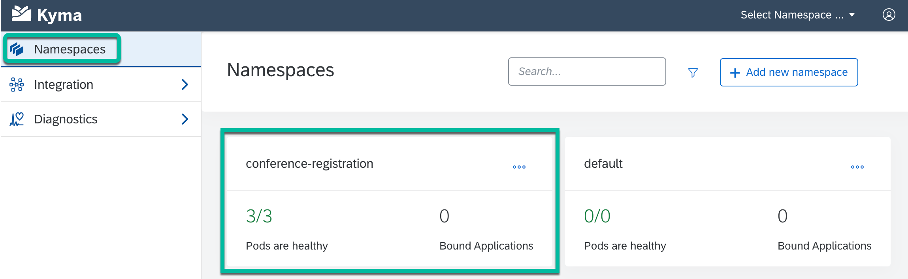

# Step 1 - Verify that all the resources of the app are running

1. Go to your Kyma workspace. You’ll notice that a **conference-registration** namespace has been created. Click on the **conference-registration** namespace to explore it.

    

2. Verify that all the pods are healthy.

    

## Navigation

| [:house:](../../README.md) | :arrow_backward: [Setup : Step 6 - Deploy the Registrations REST API Server](../setup/step-6.md) | :arrow_forward: [Verification : Step 2 - View the environment variables in the config map](step-2.md) |
| -------------------------- | ------------------------------------------------------------------------------- | ----------------------------------------------------------------------------------------------------- |
