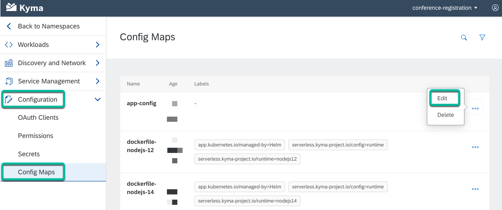
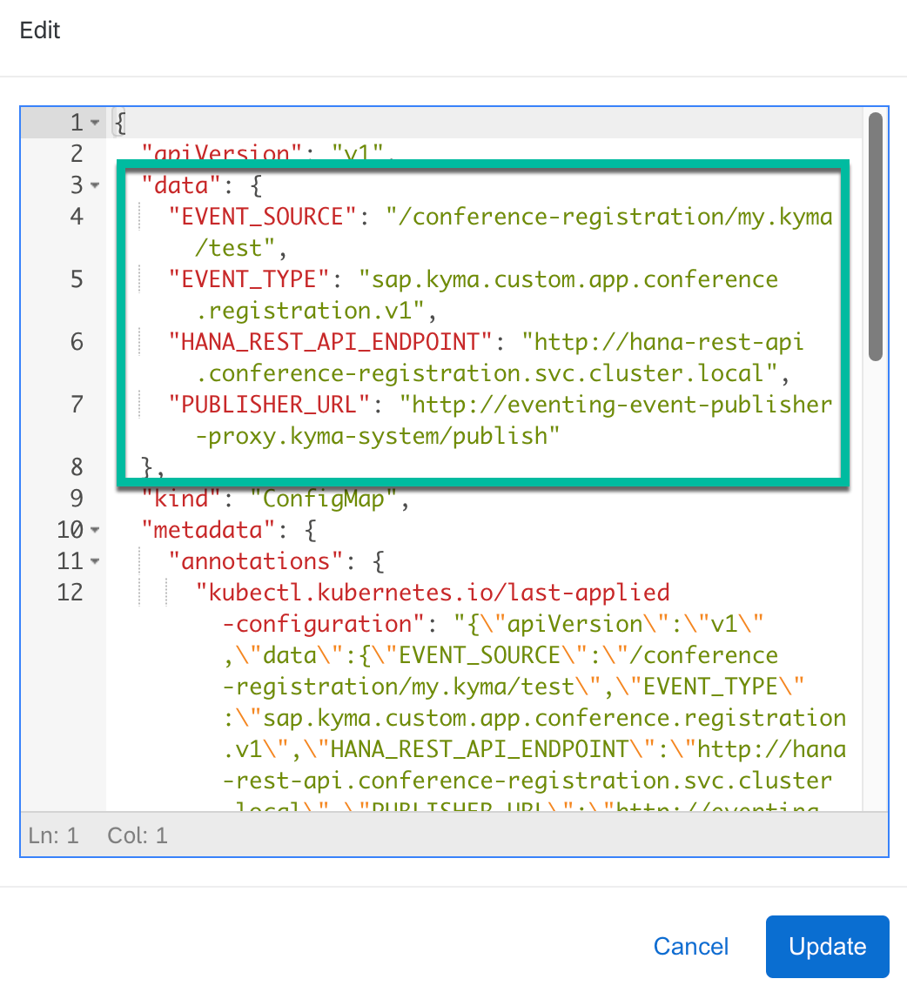

# Step 2 - View the environment variables in the config map

The purpose to show the **config-map** is to see how it can be viewed and edited from the Kyma console.

**What is a Kubernetes ConfigMap?**

A ConfigMap is an API object used to store non-confidential data in key-value pairs. Pods can consume ConfigMaps as environment variables, command-line arguments, or as configuration files in a volume.

> More info: [ConfigMaps](https://kubernetes.io/docs/concepts/configuration/configmap/)

## :arrow_lower_right&#58;

1. In the Kyma console, go to **Configuration** > **Config Maps**.

2. Click on **Edit** next to the **app-config** config map to view its configuration details.

    

3. You’ll notice the environment variables within the data object.

    

## Navigation

| [:house:](../../README.md) | :arrow_backward: [Verification : Step 1 - Verify that all the resources of the app are running](step-1.md) | :arrow_forward: [Verification : Step 3 - View the environment variables in the secret](step-3.md) |
| -------------------------- | ---------------------------------------------------------------------------------------------------------- | ------------------------------------------------------------------------------------------------- |
