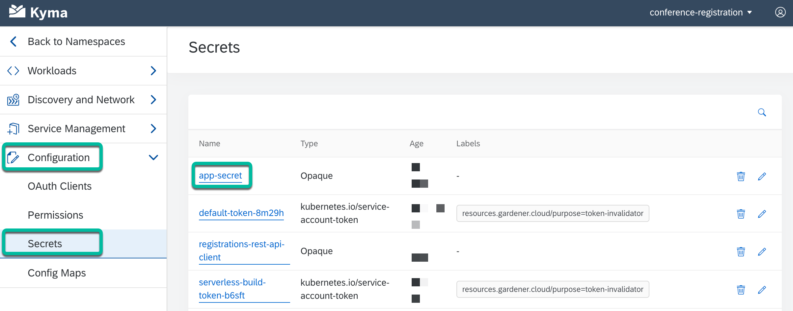
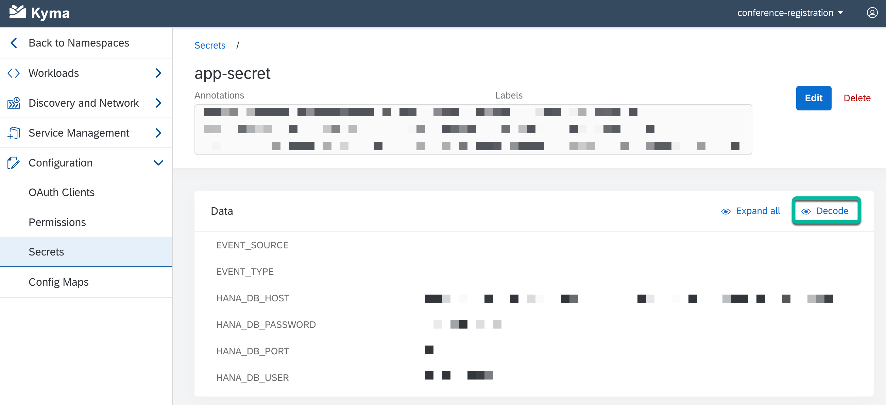

# Step 3 - View the environment variables in the secret

The purpose to show the **secret** is to see how it can be viewed from the Kyma console.

**What is a Kubernetes secret?**

A Secret is an object that contains a small amount of sensitive data such as a password, a token, or a key. Such information might otherwise be put in a Pod specification or in a container image. Using a Secret means that you don't need to include confidential data in your application code.

> More info: [Secrets](https://kubernetes.io/docs/concepts/configuration/secret/)

## :arrow_lower_right&#58;

1. In the Kyma console, go to **Configuration** >
   **Secrets**.

2. Click on the **app-secret** secret.

   

3. The secrets will be displayed within the data section. Click on **Decode** to see the decoded values.

   

## Navigation

| [:house:](../../README.md) | :arrow_backward: [Verification : Step 2 - View the environment variables in the config map](step-2.md) | :arrow_forward: [Verification : Step 4 - View the API Rule](step-4.md) |
| -------------------------- | ------------------------------------------------------------------------------------------------------ | ---------------------------------------------------------------------- |
