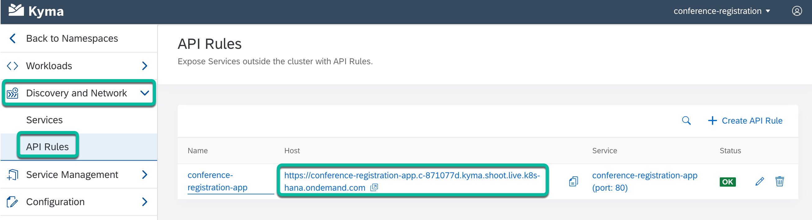

# Step 4 - View the API Rule

1. In the Kyma console, click to expand **Discovery and Network**. Then, click on **API Rules**.

2. You’ll notice that the **conference-registration-app** API Rule has been created. This will provide access to the **conference-registration-app** microservice.

3. Click on the URL to view the front-end application.

   **Example:**

   <https://conference-registration-app.c-871077d.kyma.shoot.live.k8s-hana.ondemand.com/>

   

## Navigation

| [:house:](../../README.md) | :arrow_backward: [Verification : Step 3 - View the environment variables in the secret](step-3.md) | :arrow_forward: [Verification : Step 5 - Launch the app and Register to attend the Tech Conference via the app](step-5.md) |
| -------------------------- | -------------------------------------------------------------------------------------------------- | -------------------------------------------------------------------------------------------------------------------------- |
