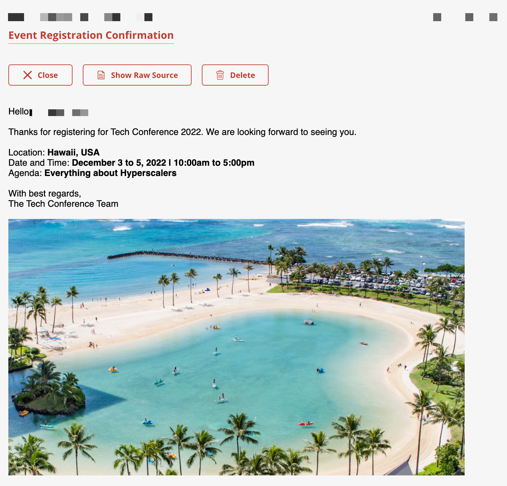

# Step 5 - Launch the app and Register to attend the Tech Conference via the app

1. Click on the URL to view the front-end application.

   **Example:**

   <https://conference-registration-app.c-871077d.kyma.shoot.live.k8shana.ondemand.com/>

   

2. Provide some sample contact information and a valid email address in the registration form and click on the Submit button.

3. If there are no errors in your form, you’ll get a success message.

   > **Note:** Please refer to the [troubleshooting](troubleshooting-steps.md) section for the steps to see the logs of the various pods.

4. If all goes well, you’ll receive a confirmation email.

   

## Navigation

| [:house:](../../README.md) | :arrow_backward: [Verification : Step 4 - View the API Rule](step-4.md) | :arrow_forward: [Troubleshooting steps](troubleshooting-steps.md) |
| -------------------------- | ----------------------------------------------------------------------- | ----------------------------------------------------------------- |
