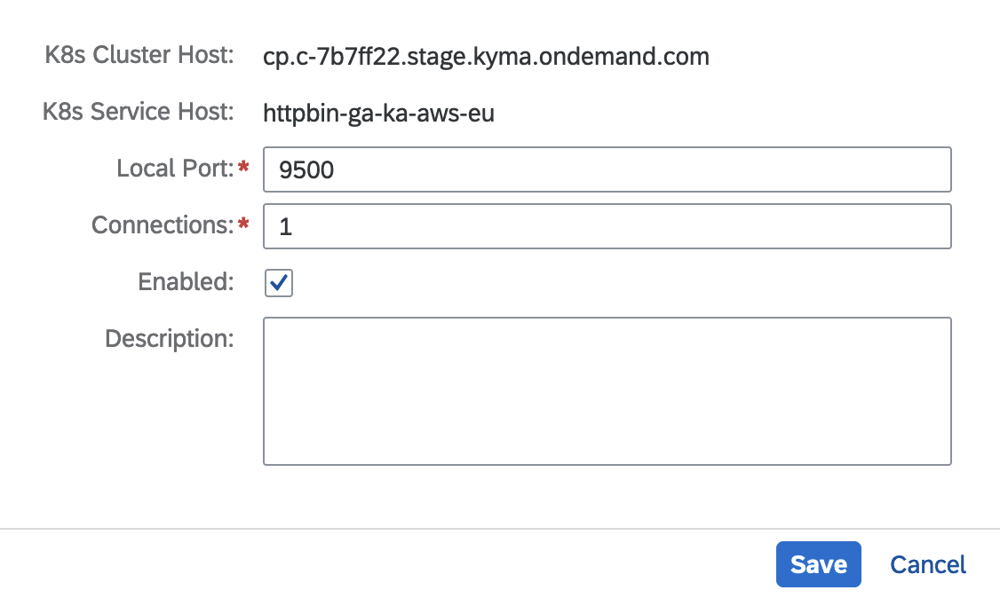

# Connectivity: Accessing a Workload in SAP BTP, Kyma Runtime From the Corporate Network

## Context

If you have to access a workload deployed on SAP BTP, Kyma runtime without exposing it to the public Internet, you can use SAP BTP, Connectivity. SAP BTP, Connectivity provides Cloud Connector service channels to connect your on-premises network to specific services on SAP BTP, Kyma runtime. For more information, see [Configure a Service Channel for a Kubernetes Cluster](https://help.sap.com/docs/connectivity/sap-btp-connectivity-cf/configure-service-channel-for-kubernetes-cluster?version=Cloud). The following diagram presents all the involved elements and the high-level flow:


## Prerequisites

* SAP BTP, Kyma runtime instance
* [curl](https://curl.se/)
* [Kubernetes tooling](../prerequisites/README.md#kubernetes)
* You have the Istio and Connectivity Proxy modules added. See [Adding and Deleting a Kyma Module](https://help.sap.com/docs/btp/sap-business-technology-platform/enable-and-disable-kyma-module?version=Cloud).
* You have Cloud Connector set up in the corporate network. See [Installation](https://help.sap.com/docs/connectivity/sap-btp-connectivity-cf/installation?version=Cloud).

## Procedure

1. Export the environment variables.

   ```bash
   export SUBACCOUNT_ID=<your-subaccount-id>
   export SERVICE_ID=<your-service-id> # e.g. httpbin-ga-ka-aws-eu
   export LOCATION_ID=<as-specified-in-cloud-connector> # e.g. ga-ka-aws-frankfurt
   export NS=<namespace where the kyma workload is deployed> # e.g. default
   ```

2. Deploy a httpbin service in SAP BTP, Kyma runtime.

   ```bash
   kubectl -n ${NS} apply -f k8s/httpbin.yaml
   ```

3. Create a ServiceMapping custom resource (CR) in SAP BTP, Kyma runtime.

   ```bash
   cat <<EOF | kubectl apply -f -
   apiVersion: connectivityproxy.sap.com/v1
   kind: ServiceMapping
   metadata:
     name: httpbin
   spec: 
     type: TCP
     serviceId: ${SERVICE_ID}
     subaccountId: ${SUBACCOUNT_ID}
     internalAddress: httpbin.${NS}.svc.cluster.local:80
     locationIds:
     - ${LOCATION_ID}
   EOF
   ```

4. Create a service channel in the cloud connector.

* K8s Cluster host can be read from status of service mapping
* K8s Service Host is same as service id in service mapping

   

## Test

To test the sample, access the httpbin service in SAP BTP, Kyma runtime. Run:

```bash
curl "http://localhost:9500/headers?show_env=true"
```
