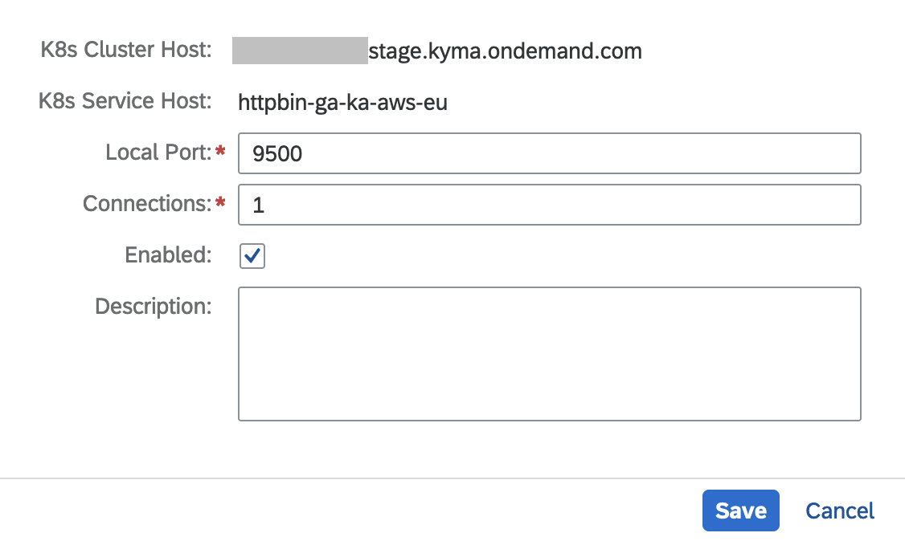

# Connectivity: Accessing a Workload in SAP BTP, Kyma Runtime From the Corporate Network

## Context

If you are using a corporate network, you can access a workload located in SAP BTP, Kyma runtime. The access is possible using the SAP BTP, Connectivity. See the following diagram that presents all the involved elements and the high-level flow:


## Prerequisites

* [curl](https://curl.se/)

## Procedure

1. Export the environment variables.

   ```bash
   export SUBACCOUNT_ID=<your-subaccount-id>
   export SERVICE_ID=<your-service-id> # e.g. httpbin-ga-ka-aws-eu
   export LOCATION_ID=<as-specified-in-cloud-connector> # e.g. ga-ka-aws-frankfurt
   export NS=<namespace where the kyma workload is deployed> # e.g. default
   ```

2. Deploy a httpbin service in SAP BTP, Kyma runtime.

   ```bash
   kubectl -n ${NS} apply -f k8s/httpbin.yaml
   ```

3. Create a ServiceMapping custom resource (CR) in SAP BTP, Kyma runtime.

   ```bash
   cat <<EOF | kubectl apply -f -
   apiVersion: connectivityproxy.sap.com/v1
   kind: ServiceMapping
   metadata:
     name: httpbin
   spec: 
     type: TCP
     serviceId: ${SERVICE_ID}
     subaccountId: ${SUBACCOUNT_ID}
     internalAddress: httpbin.${NS}.svc.cluster.local:80
     locationIds:
     - ${LOCATION_ID}
   EOF
   ```

4. Create a service channel in the cloud connector.

* K8s Cluster host can be read from status of service mapping
* K8s Service Host is same as service id in service mapping

   

## Test

To test the sample, access the httpbin service in SAP BTP, Kyma runtime. Run:

```bash
curl "http://localhost:9500/headers?show_env=true"
```
