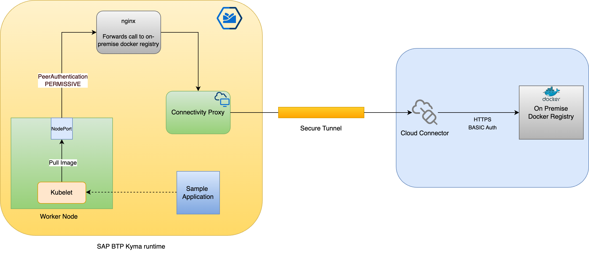
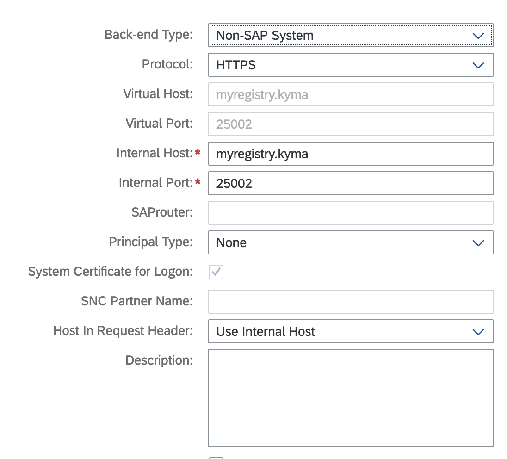

# Overview

If you want to build applications and deploy them on SAP BTP, Kyma runtime, you must package their application binaries as Docker images. These images then must be stored on a Docker registry server.

You can use a third-party Docker registry hosted on public clouds, such as Google Artifact Registry, Azure Container Registry, or AWS Elastic Container Registry.

However, due to various reasons public cloud might not be suitable for your use case, for example:

- Security and compliance requirements that prohibit storing artifacts on public clouds
- You want to use the bundled on-premise Docker registry licenses with your source versioning offerings.
- You do not wish to set up contract with public cloud vendor.

Instead of public cloud, you can use a Docker registry running on-premise. In this case, Docker images are pulled by connecting the Kubernetes cluster to the registry with Connectivity Proxy and Cloud Connector.

See the following sample flow of how this can be achieved:



Here, nginx as a reverse proxy forwards the HTTP requests for pulling Docker images from the on-premise Docker registry using Connectivity Proxy and Cloud Connector.

> **NOTE:** In this sample, nginx as a reverse proxy pulls the images from an on-premise Docker registry. The setup relies on the Docker registry API v2 and proves the concept. You can replace it with another reverse proxy or a custom implementation based on API and requirements.

## Prerequisites

- [SAP BTP, Kyma runtime instance](../prerequisites/#kyma)
- [Docker](../prerequisites/#docker)
- [GNU Make](https://www.gnu.org/software/make/)
- [Kubernetes tooling](../prerequisites/#kubernetes)
- [Cloud Connector on your machine or test system](../prerequisites/#sap-cloud-connector)
- [Connectivity Proxy instance configured in Kyma](https://help.sap.com/docs/btp/sap-business-technology-platform/configure-sap-btp-connectivity-in-kyma-environment)
- [OpenSSL](https://www.openssl.org/) or another similar tool to generate the certificates
- [htpasswd](https://httpd.apache.org/docs/2.4/programs/htpasswd.html) installed

## Setup

The commands have been verified on OSX. However, it should be possible to adapt them for Windows.

### Environment variables

Export the following environment variables:

```shell
export KUBECONFIG=<path-to-kubeconfig>
export NAMESPACE={kyma-namespace-used-for-this-sample}
export CLUSTER_DOMAIN={kyma-cluster-domain}
export REG_USER_NAME={docker-registry-user}
export REG_USER_PASSWD={docker-registry-password}
export EMAIL={your-email}
```

### On-premise Docker registry

In this sample, you set up a simple Docker registry running on your machine. You can replace it with a productive alternate deployed in your corporate network, as long as it is reachable using Cloud Connector.

1. To enable HTTPS for the Docker registry, generate the self-signed certificate and specify the `CN` as `myregistry.kyma`.

   ```shell
   make generate-self-signed-cert
   ```

2. Add the newly created certificate to your trust storage.

   ```shell
   make trust-self-signed-cert
   ```

3. To access the on-premise Docker registry, generate the `htpasswd`.

   ```shell
   make generate-htpasswd
   ```

4. Start the Docker registry server:

   ```shell
   make start-docker-registry
   ```

5. Add the DNS entry to the `/etc/hosts` file:

   ```shell
   127.0.0.1 myregistry.kyma
   ```

6. To access the on-premise Docker registry, configure Cloud Connector:
  

## nginx as reverse proxy

This sample uses nginx as a reverse proxy to forward the HTTP requests for pulling Docker images from the on-premise Docker registry with Connectivity Proxy and Cloud Connector.

nginx is exposed as the `NodePort` service. This exposes the Service on the Kubernetes worker Node on a port. On each worker Node, [kubelet](https://kubernetes.io/docs/reference/command-line-tools-reference/kubelet/) runs as the component that pulls the Docker images (among other tasks).

When creating a deployment, specify the Docker registry as `localhost:{NodePort}`. This is the address of the nginx reverse proxy. Then, the nginx reverse proxy forwards the call to the on-premise Docker registry with Connectivity Proxy and Cloud Connector.

This sample shows a simple configuration with nginx as a reverse proxy. You can use any other reverse proxy implementation based on your on-premise Docker registry behavior and APIs.

1. Create a Namespace and make sure Istio sidecar injection is enabled.

   ```shell
   kubectl create namespace ${NAMESPACE}
   kubectl label namespace ${NAMESPACE} istio-injection=enabled
   ```

2. Deploy nginx as a reverse proxy:

   ```shell
   make deploy-nginx-reverse-proxy
   ```
   The following components are deployed:
   - [ConfigMap](./k8s/configmap.yaml) for nginx configuration
   - [Deployment and Service](./k8s/deployment.yaml)
   - [PeerAuthentication](./k8s/peer-authentication.yaml) set to `PERMISSIVE`, which allows communication between kubelet and the nginx reverse proxy
   The following components are deployed:

   - [ConfigMap](./k8s/configmap.yaml) for nginx configuration
   - [Deployment and Service](./k8s/deployment.yaml)
   - [PeerAuthentication](./k8s/peer-authentication.yaml) set to `PERMISSIVE`, which allows communication between kubelet and the nginx reverse proxy

3. Wait for the nginx reverse proxy to be up and running. To check the status, run:

   ```shell
   make check-nginx-reverse-proxy
   ```

4. Export NodePort for the nginx reverse proxy as an environment variable:

   ```shell
   export NGINX_NODE_PORT=$(kubectl get svc nginx -o jsonpath='{.spec.ports[0].nodePort}')
   ```

## Test workload

To test the setup, deploy a sample workload that uses an image from the on-premise Docker registry.

1. Log in to the created on-premise Docker registry:

   ```shell
   make docker-login
   ```

2. Create and store a sample Docker image in the on-premise Docker registry. It uses an image tag based on the current time.

   ```shell
   make create-test-image
   ```

3. In the [deployment.yaml for test workload](./test-image-deployment/deployment.yaml), replace the following placeholders:

   - For `{nginx-reverse-proxy-node-port}`, enter the `NGINX_NODE_PORT` value.
   - For `{generate-image-tag}`, enter the tag of the generated image.

4. Create a Kubernetes Secret with credentials to pull the Docker image.

   ```shell
   make create-secret-to-pull-image
   ```

5. Deploy the test workload.
   > **NOTE:** In the [deployment file](./test-image-deployment/deployment.yaml), the image is specified as `localhost:30930/....`. This is the localhost wrt to the Kubernetes worker node, and the port is the NodePort of the nginx reverse proxy service.

   ```shell
   make deploy-test-workload
   ```

6. Wait until the Pod is up and running. Check the status with the following command:

   ```shell
   make check-test-workload
   ```

7. When the Pod is up and running, access the application:

   ```shell
   make access-test-workload
   ```

## Cleanup

1. Remove the test workload, the nginx reverse proxy, and the local Docker registry:

   ```shell
   make cleanup
   ```

2. Remove the entry from Cloud Connector.

## Takeaways

- You can have a setup to pull Docker images from the on-premise Docker registry for applications deployed on SAP BTP, Kyma runtime.
- Docker images are pulled using Connectivity Proxy and Cloud Connector.
- The reverse proxy component must be installed from the customer side. This will adapt and forward the requests to the on-premise Docker registry using Connectivity Proxy.
- The reverse proxy can be an off-the-shelf component such as nginx or a custom implementation depending upon what APIs and behavior are supported by the on-premise Docker registry.
