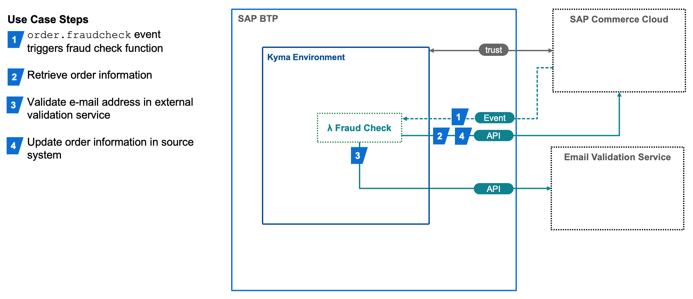

# Order Validation Demo

## Introduction

SAP Commerce Cloud is highly extensible and includes a very flexible dynamic business process module.  The order fulfillment process leverages this module heavily to allow organizations to customize their fullfillment process to their business needs.  This example shows an example of an external fraud check process running in the SAP BTP, Kyma runtime that is invoked asyncronously via the dynamic business process for order management.

The example fraud check function performs the following checks:

- Email address validation using external email validation service

- Number of customer orders

- Total order value (e.g. > $500) 


For more information about extending SAP Commerce Cloud business processes please see the [SAP Help Portal - Extending BPM Processes](https://help.sap.com/docs/SAP_COMMERCE_CLOUD_PUBLIC_CLOUD/bad9b0b66bac476f8a4a5c4a08e4ab6b/adbcae53f43942d0b30c936c4c97762b.html?q=dynamic%20business%20process)

## Architecture




The architecture diagram describes use case flow.

## Videos

- [Order Validation Theoretical Explanation](https://microlearning.opensap.com/media/Order%20Validation%20Demo%20Theoretical%20Explanation%20-%20SAP%20Cloud%20Platform%20Extension%20Factory/1_9clsyk8i)
- [Order Validation Event Configuration and Lambda Creation](https://microlearning.opensap.com/media/%5BARCHIVED%5D+Order+Validation+Demo+Event+and+Lambda+Creation+-+SAP+Cloud+Platform+Kyma+Runtime/1_q1z4bpxr)
- [Order Validation Extended Scenario](https://microlearning.opensap.com/media/Order+Validation+Demo+Extended+Scenario+-+SAP+Cloud+Platform+Kyma+Runtime/1_fvj4p1e6)

## Prerequisites

- [SAP BTP, Kyma runtime instance](../prerequisites/README.md#kyma)

- [Kubernetes tooling](../prerequisites/README.md#kubernetes)

- [SAP Commerce Cloud environment connected to SAP BTP Kyma runtime.](https://help.sap.com/docs/BTP/65de2977205c403bbc107264b8eccf4b/83df31ad3b634c0783ced522107d2e73.html)  
	- v2011 or greater in order to use the Integration APIs with OAUTH and Admin API (available since v1811.)
	- Include the `adminapi` and `yacceleratorfulfilmentprocess` extensions
	- `adminapi` requires the `OAuthClientDetails` for Kyma to have the `ROLE_ADMINGROUP` Authority.


## Configuration

Ensure the Commerce system has the `kymaintegrationservices`, `odata2webservices` and `adminapi` extensions.

The extension requires a `Secret` named `order-validation` configured in the Kyma namespace containing the following values:

- `baseSite`:  The SAP Commerce Cloud baseSite value e.g. `electronics-spa`, required by the SAP Commerce Cloud OCC API.

- `gateway_url_occ` - URL for the SAP Commerce Cloud OCC API provided by the Kyma Central Application Gateway

- `gateway_url_fraudreport` - URL for the SAP Commerce Cloud Integration API for Customer Reviews provided by the Kyma Central Application Gateway

- `gateway_url_adminapi` - URL for the SAP Commerce Cloud Integration API for Customer Reviews provided by the Kyma Central Application Gateway

- `url_email_check_service` - URL for the third-party email validation API

- `slackUrl` - The Slack webhook for posting messages to the notification channel.


## Deploy


- Set up environment variables

  - OSX

    ```shell script
    export NS={your-namespace}
    ```

  - Windows PowerShell

    ```powershell
    $NS={your-namespace}
    ```
```
kubectl apply -n $NS -f order-validation.yaml
kubectl apply -n $NS -f subscription.yaml
```

### SAP Commerce Cloud Integration API

Import the following files in [commerce-impex](commerce-impex) in your SAP Commerce Cloud environment via the Adminstration Cockpit (hAC) or alternative method.  

```
commerce/businessprocess.impex 
commerce/fraudcheck-event.impex 
commerce/odata-service.impex 
```

See the SAP Commmerce Help topic on  [Data Management with Impex](https://help.sap.com/docs/SAP_COMMERCE/d0224eca81e249cb821f2cdf45a82ace/1b6dd3451fc04c3aa8e95937e9ef2471.html?q=impex).

Add the Integration Object to the registered Kyma Destination Target using SAP Commerce Cloud Backoffice as described in **Expose Your API – Existing Destination Target** section in this [blog post](https://blogs.sap.com/2022/10/14/commerce-cloud-exposing-integration-apis-to-sap-btp-kyma-runtime-with-oauth2/) on SAP Community

### Functions

Deploy the function:

[handler.js](lambda/handler.js) 
    
```
kubectl apply -n $NS -f lambdas/k8s/function.yaml
kubectl apply -n $NS -f lambdas/k8s/subscription.yaml
```

## Verify

- Access the SAP Commerce Cloud tenant web shop storefront
- Add a high value item (> $500.00) to the cart and complete checkout
- In a few moments a Slack message appears showing the order has failed validation due to high order value.
- In Commerce backoffice, find the order and view the fraud report and resulting scores.

