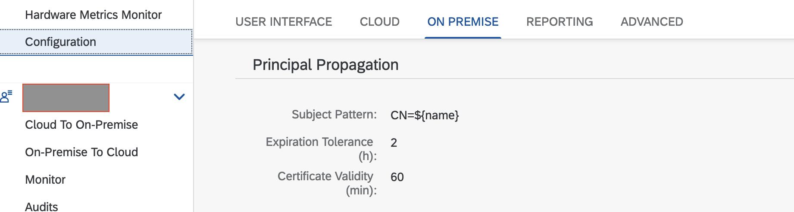

# Overview

This sample provides details on how a principal propagation flow can be achieved when extending an on-prem system using SAP BTP, Kyma runtime.

The sample can use XSUAA as well as SAP Identity Authentication Service (IAS) as an external identity provider with user federation.

The principal propagation relies on the exchange of the JWT token received in Kyma. The exchanged token is then forwarded to the SAP Cloud Connector and is used to identify the logged-in user.

In the sample flow, a logged-in user will fetch his sales data from the on-prem system.


Using standalone SAP application router an API `sap/com/onprem/mysales` is hosted on the Kyma runtime. This API then calls the on-prem system via Connectivity Proxy.

## Prerequisites

* [SAP BTP, Kyma runtime instance](../prerequisites/#kyma)
* [Kubernetes tooling](../prerequisites/#kubernetes)
* [Cloud Connector on your laptop or test system](../prerequisites/#sap-cloud-connector)
* [Node.js](https://nodejs.org/en/download/) | The Node.js runtime including the node package manager NPM. Install an _LTS_ version.
* [OpenSSL](https://www.openssl.org/) or another similiar tool to generate the certificates

## Set up

### Configure cloud connector

Refer [Configuring Principal configuration on help.sap.com](https://help.sap.com/docs/CP_CONNECTIVITY/cca91383641e40ffbe03bdc78f00f681/c84d4d0b12d34890b334998185f49e88.html)

* [Configure Trusted Entities in the Cloud Connector](https://help.sap.com/docs/CP_CONNECTIVITY/cca91383641e40ffbe03bdc78f00f681/a4ee70f0274248f8bbc7594179ef948d.html)
  >Note: Ensure that you Synchronize
  

* [Configure a CA Certificate for Principal Propagation](https://help.sap.com/docs/CP_CONNECTIVITY/cca91383641e40ffbe03bdc78f00f681/d0c4d5675d4f4bc78a5b7a7b8687c841.html)
  * Use the Option 3: (As of version 2.10) Generate a self-signed certificate.
  
* Ensure that for Principal Propagation, the Subject Pattern is `CN=${name}`
  
* [Setup a System Certificate](https://help.sap.com/docs/CP_CONNECTIVITY/cca91383641e40ffbe03bdc78f00f681/3f974eae3cba4dafa274ec59f69daba6.html)
  * Use third option - generating a self-signed certificate.

### On prem backend

You can run the on-prem backend on your laptop or a test system. For simplicity, use the same system where you SAP Cloud Connector is running.

* Download the CA certificate from the Cloud Connector under `certs` directory as `ca_cert.der`.

* Convert it to `PEM` format

  ```shell script
  openssl x509 -inform der -in certs/ca_cert.der -out certs/ca_cert.pem
  ```

* Generate self-signed server key and certificate

  ```shell script
  # Generate a key file
  openssl genrsa -out certs/server_key.pem

  # Generate a Certificate Signing Request
  openssl req -new -key certs/server_key.pem -out certs/server_csr.pem

  # Generate the certificate by signing it with the key
  openssl x509 -req -days 9999 -in certs/server_csr.pem -signkey certs/server_key.pem -out certs/server_cert.pem
  ```

* Update the mock sales data in [on-prem-backend/sales.json](on-prem-backend/sales.json) to provide your `{logged-in-user-email}`.

* Run the app locally

  ```shell script
  # go to the nodejs project
  cd on-prem-backend

  # install dependencies if not done earlier
  npm install

  # start the application locally
  HTTPS=true && npm start
  ```

* Configure the on-prem-backend in cloud connector as a virtual host
  
* Configure the resources to path and all sub-paths
  

### Kyma configuration

* Set up environment variables

  ```shell script
  export NS={your-namespace}
  # only required once to enable istio sidecar. Ignore if done already
  kubectl label namespaces $NS istio-injection=enabled
  ```

* Create Connectivity Service Instance in any namespace.
  >Note: Only one instance is required for the cluster. If you have deployed it previously, simply skip this step.
  
  

* Create a destination Configuration in BTP Cockpit.
  

* Create xsuaa instance. Update the [app-router/k8s/xsuaa-instance.yaml](app-router/k8s/xsuaa-instance.yaml) to provide `{your-cluster-domain}`

  ```shell script
  kubectl -n $NS apply -f app-router/k8s/xsuaa-instance.yaml
  ```

* Create a Destination Service instance.

  ```shell script
  kubectl -n $NS apply -f app-router/k8s/destination-instance.yaml
  ```

* For the application router to automatically exchange the token using the destination configuration, it needs to be provided with the necessary credentials as well as the details of the connectivity proxy running inside the Kyma cluster.

* Create the configmap containing connection details about connectivity-proxy running inside kyma runtime.

  ```shell script
  kubectl -n $NS apply -f app-router/k8s/connectivity-proxy-info.yaml
  ```

* Create the configuration required for application router.

  ```shell script
  kubectl -n $NS apply -f app-router/k8s/config.yaml
  ```

* Deploy the application router. Update the [app-router/k8s/deployment.yaml](app-router/k8s/deployment.yaml) to provide `{your-cluster-domain}`

  ```shell script
  kubectl -n $NS apply -f app-router/k8s/deployment.yaml
  ```

  >Note: The application router image is based on the [stand-alone application router sample](../standalone-approuter/README.md)

* Expose it over internet using API Rule. Update the [app-router/k8s/api-rule.yaml](app-router/k8s/api-rule.yaml) to provide `{your-cluster-domain}`

  ```shell script
  kubectl -n $NS apply -f app-router/k8s/api-rule.yaml
  ```

### Test

Access the sales data for the logged-in user <https://principal-prop-on-prem.{your-cluster-domain}/sap/com/onprem/mysales>
