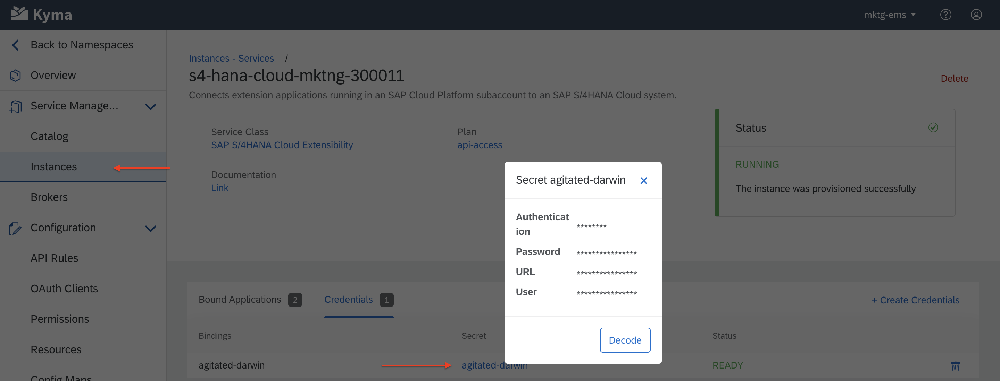

# Overview

This sample describes the steps and configurations to build and deploy microservice-based extensions on SAP Cloud Platform, Kyma runtime using SAP Cloud SDK for Java.

The microservice makes API calls to an S/4 System to perform various read/write operations based on the extension logic. The microservice itself can be triggered with an event or an API call. In this example, we will trigger it with an API call by exposing it through Microgateway in Kyma runtime (APIRules).

## Prerequisites

* SAP Cloud Platform, Kyma runtime instance
* [Docker](https://www.docker.com/)
* [make](https://www.gnu.org/software/make/)
* [kubectl](https://kubernetes.io/docs/tasks/tools/install-kubectl/) configured to use the `KUBECONFIG` file downloaded from the Kyma runtime
* [maven](http://maven.apache.org/download.cgi)
* Java 8+
* Refer to [this blog post](https://blogs.sap.com/2020/09/30/use-sap-cloud-platform-kyma-runtime-to-extend-sap-marketing-cloud/) to learn how to set up API access for an S/4 System from Kyma runtime.

  

  Setting up API access allows you to build a microservice that will call the S/4 System using SAP Cloud SDK for Java.

  

## Steps

1. Generate the maven project.

    ```shell script
    mvn archetype:generate "-DarchetypeGroupId=com.sap.cloud.sdk.archetypes" "-DarchetypeArtifactId=scp-cf-spring" "-DarchetypeVersion=RELEASE"
    ```

2. [Generate a typed OData client for Java](https://sap.github.io/cloud-sdk/docs/java/features/odata/generate-typed-odata-v2-and-v4-client-for-java/). For the purpose of this sample, generate the code for [SAP Marketing Cloud Campaign OData APIs](https://help.sap.com/viewer/0f9408e4921e4ba3bb4a7a1f75f837a7/1911.500/en-US/f2ae5a181b274befbb07183d2c4ac61a.html) using the [metadata file](application/edmx/campaigns.xml).

3. Implement the code to make API calls using the generated services:

    ```java
    @RestController
    @RequestMapping("/campaigns")
    public class CampaignController {
        private final DefaultErpHttpDestination destination;
        private final DefaultCampaignsService campaignsService;

        @Autowired
        public CampaignController(ApplicationConfig applicationConfig) {
            this.destination = DestinationAccessor
                    .getDestination(applicationConfig.getTenantName())
                    .asHttp()
                    .decorate(DefaultErpHttpDestination::new);
            this.campaignsService = new DefaultCampaignsService()
                    .withServicePath(applicationConfig.getServicePath());
        }

        @RequestMapping(method = RequestMethod.GET)
        public List<Campaign> getCampaigns() {

            return this.campaignsService
                    .getAllCampaign()
                    .top(2)
                    .select(
                            Campaign.CAMPAIGN_ID,
                            Campaign.NODE_ID,
                            Campaign.CATEGORY_NAME
                    )
                    .executeRequest(this.destination);
        }
    }
    ```

4. Build and push the image

    ```shell script
    DOCKER_ACCOUNT={your-docker-repo} make push-image
    ```

5. [Create a ServiceInstance](https://blogs.sap.com/2020/09/30/use-sap-cloud-platform-kyma-runtime-to-extend-sap-marketing-cloud/) of the `api-access` plan type for your S/4 System.

    * Create credentials, if not already created.
    
    * These credentials will be injected as environment variables to the microservice while creating a ServiceBinding.

6. Deploy the application on the Kyma runtime.

    * Since the Cloud SDK relies on an environment variable in the form of `destinations:[{ARRAY OF DESTINATIONS}]`, use a Kubernetes Deployment to reference pre-defined variables, such as **User**, **Password** and **url**, to create such a variable.

    * These predefined variables will be injected automatically when performing a service binding with this Deployment.  

    ```yaml
    env:
    - name: destinations
      value: '[{name: "$(APPLICATION_TENANT_NAME)", url: "$(URL)", username: "$(User)", password: "$(Password)"}]'
    ```

    For reference, see the full [Deployment definition](k8s/deployment.yaml).

    ```shell script
    kubectl -n {NAMESPACE-TO-DEPLOY} apply -f k8s/deployment.yaml
    ```

7. Bind the Deployment with the ServiceInstance. You can either reuse the existing credentials or create new ones.
    

8. Verify that the Deployment is running by checking the logs:

    ```shell script
    kubectl -n {NAMESPACE-TO-DEPLOY} logs -l app=sample-cloudsdk-java -c sample-cloudsdk-java
    ```

9. Expose the application using an APIRule:

    ```shell script
    kubectl -n {NAMESPACE-TO-DEPLOY} apply -f k8s/api-rule.yaml
    ```

## Test

Call the API to get two top campaigns at this address:

```shell-script
 <https://sample-cloudsdk-java.{CLUSTER-DOMAIN}/campaigns>
```
