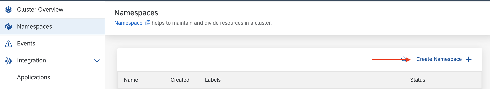
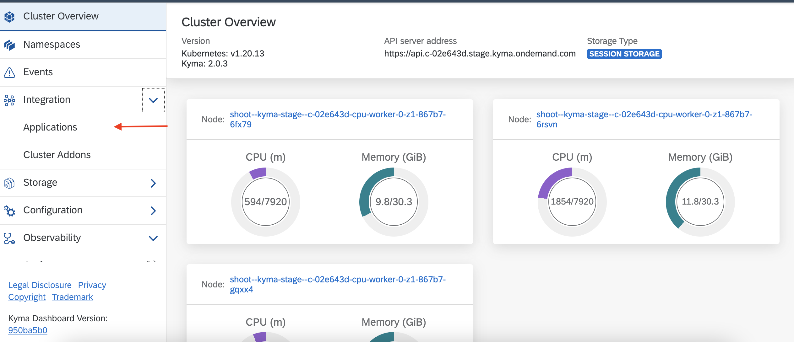
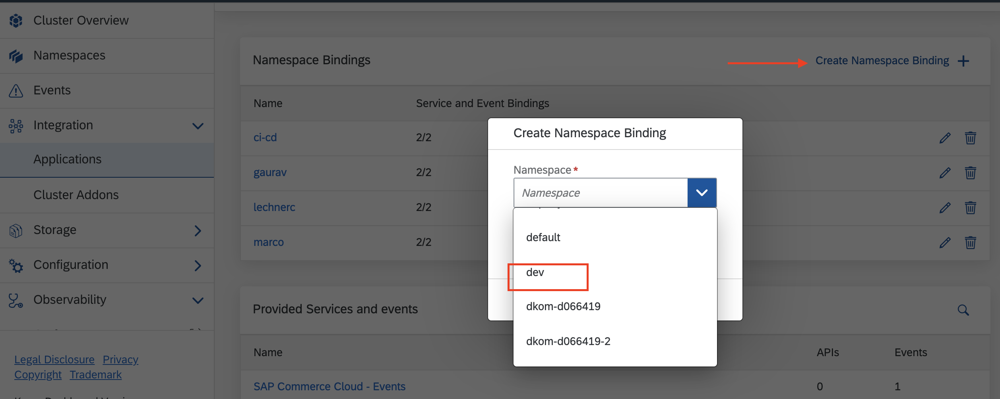
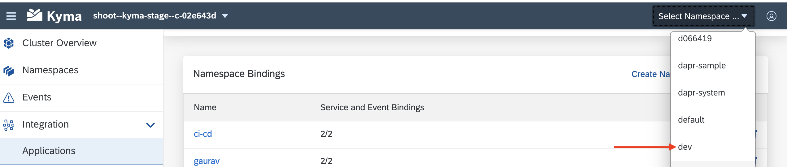
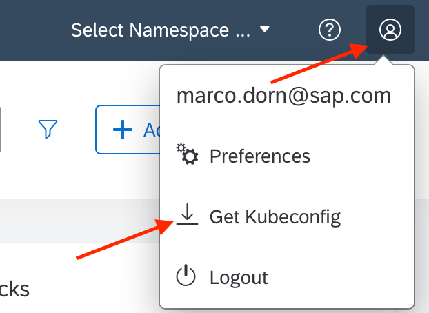

# Overview

This sample demonstrates how to build and deploy a Java based microservice as an event trigger in SAP Cloud Platform Extension Factory, Kyma Runtime using **cloudevents-sdk**.

It uses the cloudevents sdk to deserialize events.
Kyma eventing dispatches the cloudevents v1, so the v1 library of [cloudevents sdk](https://github.com/cloudevents/sdk-java/blob/master/README_v1.md) is used.

`order.created` event from SAP Commerce Cloud is used as an example trigger in this sample.


This sample demonstrates the following:

* Setting up development namespace in Kyma Runtime.
* Configuring `kubectl` to use the Kyma Runtime `KUBECONFIG`
* Setting up Event Triggers in Kyma.
* Creating and deploying a Spring Boot Application to handle the event using **cloudevents-sdk** library.
* Configuring the Spring Boot Application to use the event trigger.
* Using `kubectl` to verify the state.
* Observe the logs using `kubectl`

## Prerequisites

* SAP Cloud Platform, Kyma Runtime instance
* [Docker](https://www.docker.com/)
* [make](https://www.gnu.org/software/make/)
* [Gradle](https://gradle.org/)
* [kubectl](https://kubernetes.io/docs/tasks/tools/install-kubectl/)
* [Java 11+](https://openjdk.java.net/projects/jdk/11/)
* A commerce cloud system connected to the Kyma runtime. You can also use the mock. Refer to [this blog post](https://blogs.sap.com/2020/06/17/sap-cloud-platform-extension-factory-kyma-runtime-mock-applications/) to set up the mock commerce.

## Kyma Configuration

### Namespace

* Create a new namespace `dev`


### Namespace application binding

* Navigate to Applications/Systems.
  
* Select the commerce cloud system.
  
* Create Binding with `dev` namespace.
  

### Service instance for Commerce Events

* Navigate to the namespace

* Navigate to Service catalog and select the bounded commerce cloud system.

* Choose the `SAP Commerce Cloud - Events` as the Service Plan.

* Create the instance.


With the instance creation part, the events can be consumed by functions and microservices deployed in `dev` namespace.

## Application

### Spring Boot Application

Event trigger is implemented as a Spring Boot application using gradle as a build tool.

* The cloudevents library is added as a dependeny to [build.gradle](./build.gradle).

```groovy
implementation('io.cloudevents:cloudevents-api:1.3.0')
```

* A [POJO](src/main/java/dev/kyma/samples/trigger/model/OrderCreated.java) is defined for the `order.created` event.

The POJO reflects the `order.created` event definition which can be accessed from the Service Catalog.


```java
public class OrderCreated {
    private String orderCode;

    public String getOrderCode() {
        return orderCode;
    }

    public void setOrderCode(String orderCode) {
        this.orderCode = orderCode;
    }

    @Override
    public String toString() {
        return "OrderCreated{" +
                "orderCode='" + orderCode + '\'' +
                '}';
    }
}
```

* The controller logic unmarshalls the event payload using the cloudevents sdk apis.

```java
@PostMapping(consumes = MediaType.APPLICATION_JSON_VALUE)
    public void eventTrigger(@RequestHeader Map<String, Object> headers, @RequestBody String payload) {
        CloudEvent<AttributesImpl, OrderCreated> cloudEvent =
                Unmarshallers.binary(OrderCreated.class)
                        .withHeaders(() -> headers)
                        .withPayload(() -> payload)
                        .unmarshal();
        System.out.println(cloudEvent.getAttributes());
        System.out.println(cloudEvent.getData());

        //implement your business extension logic here
    }
```

### Deploying the application

* Configure kubectl kubeconfig

  * Download the KUBECONFIG
    
  * Set kubectl to use KUBECONFIG

    ```shell script
    export KUBECONFIG={path-to-kubeconfig}
    ```

* Build the and push image to the docker repository.
  
```shell script
DOCKER_ACCOUNT={your-docker-account} make push-image
```

* Update image name in the [Kubernetes Deployment](k8s/deployment.yaml).

* Deploy the application as a Kubernetes Service.

These are standard Kubernetes [Deployment](https://kubernetes.io/docs/concepts/workloads/controllers/deployment/) and [Service](https://kubernetes.io/docs/concepts/services-networking/service/) definitions.

```shell script
kubectl -n dev apply -f ./k8s/deployment.yaml
```

* Verify the Pods are up and running

```shell script
kubectl -n dev get po
```

You should see the pod for deployment `sample-event-trigger-java` running.

```shell script
NAME                                         READY   STATUS    RESTARTS   AGE
default-broker-filter-766bb5bf5f-llnvk       2/2     Running   2          5h1m
default-broker-ingress-55b8794cb4-62q48      2/2     Running   2          5h1m
dev-gateway-554dc9bd4b-mvxtk                 2/2     Running   0          5h1m
sample-event-trigger-java-68f8dfd98c-mnpdv   2/2     Running   0          15s          42s
```

### Event Trigger Configuration

* Create the event trigger to receive `order.created` event from the source.
The source is the connected SAP  Commerce Cloud System.

```yaml
apiVersion: eventing.knative.dev/v1alpha1
kind: Trigger
metadata:
  name: sample-event-trigger-java
spec:
  broker: default
  filter:
    attributes:
      eventtypeversion: v1
      source: mp-gaurav-10-mock-commerce  # name of the application/system
      type: order.created # event type
  subscriber:
    ref:
      apiVersion: v1
      kind: Service
      name: sample-event-trigger-java
```

```shell script
kubectl -n dev apply -f ./k8s/event-trigger.yaml
```

* Verify trigger is correctly deployed

```shell script
kubectl -n dev get trigger
NAME                        READY   REASON   BROKER    SUBSCRIBER_URI                                            AGE
sample-event-trigger-java   True             default   http://sample-event-trigger-java.dev.svc.cluster.local/   13s
```

### Trying it out

* Simulate the event from the SAP Solution. In my case, I use the mock to simulate `order.created` event.

  * Go to Remote APIs. It list all registered APIs and Events.
    
  * Navigate to `SAP Commerce Cloud - Events` and send the `order.created` event.
    

* Observe the logs using kubectl

```shell script
kubectl -n dev logs deploy/sample-event-trigger-java -c sample-event-trigger-java
```

You should see logs similiar to below:

```shell script
2020-06-19 17:45:12.092  INFO 8 --- [nio-8080-exec-1] o.s.web.servlet.DispatcherServlet        : Completed initialization in 6 ms
AttibutesImpl [id=e2174d4a-29b5-47da-b212-e87735ed08f8, source=mp-gaurav-10-mock-commerce, specversion=1.0, type=order.created, datacontenttype=application/json, dataschema=null, subject=null, time=2020-06-19T17:45Z]
Optional[OrderCreated{orderCode='76272727'}]
```

### Cleanup

Delete the resources created.

```shell script
kubectl -n dev delete -f ./k8s/
```
