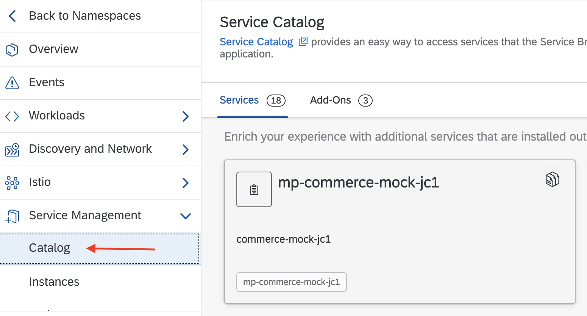
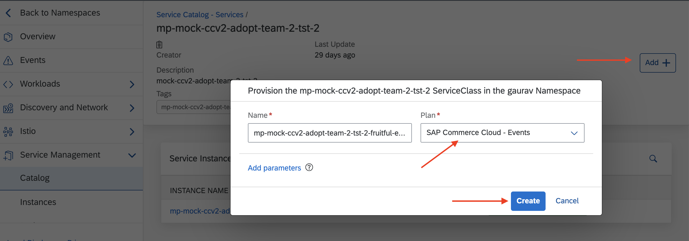

## Overview

This sample demonstrates how to build and deploy a Java-based microservice as an Event Trigger in SAP BTP, Kyma runtime using **CloudEvents SDK**.

The sample uses the CloudEvents SDK to deserialize events. Kyma eventing dispatches the CloudEvents v1, so the v1 library of [CloudEvents SDK](https://github.com/cloudevents/sdk-java/blob/v1.0.0/README.md) is used.

The `order.created` event from SAP Commerce Cloud is used as an example of a trigger.


This sample demonstrates how to:

* Set up the development Namespace in the Kyma runtime.
* Configure `kubectl` to use the `KUBECONFIG` file downloaded from the Kyma runtime.
* Set up Event Triggers in the Kyma runtime.
* Create and deploy a Spring Boot application to handle the event using the **CloudEvents SDK** library.
* Configure the Spring Boot application to use the Event Trigger.
* Use `kubectl` to verify the state.
* Observe the logs using `kubectl`.

## Prerequisites

* SAP BTP, Kyma runtime instance
* [Docker](https://www.docker.com/)
* [make](https://www.gnu.org/software/make/)
* [Gradle](https://gradle.org/)
* [kubectl](https://kubernetes.io/docs/tasks/tools/install-kubectl/)
* [Java 11+](https://openjdk.java.net/projects/jdk/11/)
* SAP Commerce Cloud system connected to the Kyma runtime. You can also use the mock. Refer to [this blog post](https://blogs.sap.com/2020/06/17/sap-cloud-platform-extension-factory-kyma-runtime-mock-applications/) to set up the commerce mock.

## Steps

### Configure Kyma

1. Create a new `dev` Namespace:


2. Bind your application to the Namespace:

  * Navigate to **Applications/Systems**:
  

  * Select the SAP Commerce Cloud system:
  

  * Create a Binding to the `dev` Namespace:
  

3. Create a ServiceInstance for the Commerce Events:

  * Navigate to your Namespace:


  * Navigate to the **Service Catalog** tab and select the bounded SAP Commerce Cloud system:


  * Choose the `SAP Commerce Cloud - Events` as the ServicePlan:


  * Create the ServiceInstance:


After creating the ServiceInstance, the events can be consumed by Functions and microservices deployed in the `dev` Namespace.

### Configure the application

Event Trigger is implemented as a Spring Boot application using gradle as a build tool.

* The CloudEvents library is added as a dependency to [build.gradle](./build.gradle).

```groovy
implementation('io.cloudevents:cloudevents-api:1.3.0')
```

* A Plain Old Java Object [(POJO)](src/main/java/dev/kyma/samples/trigger/model/OrderCreated.java) is defined for the `order.created` event.

The POJO reflects the `order.created` event definition which you can access from the Service Catalog.


```java
public class OrderCreated {
    private String orderCode;

    public String getOrderCode() {
        return orderCode;
    }

    public void setOrderCode(String orderCode) {
        this.orderCode = orderCode;
    }

    @Override
    public String toString() {
        return "OrderCreated{" +
                "orderCode='" + orderCode + '\'' +
                '}';
    }
}
```

* The controller logic unmarshalls the event payload using the CloudEvent SDK APIs.

```java
@PostMapping(consumes = MediaType.APPLICATION_JSON_VALUE)
    public void eventTrigger(@RequestHeader Map<String, Object> headers, @RequestBody String payload) {
        CloudEvent<AttributesImpl, OrderCreated> cloudEvent =
                Unmarshallers.binary(OrderCreated.class)
                        .withHeaders(() -> headers)
                        .withPayload(() -> payload)
                        .unmarshal();
        System.out.println(cloudEvent.getAttributes());
        System.out.println(cloudEvent.getData());

        //Implement your business extension logic here
    }
```

### Prepare for deployment

* Configure the `KUBECONFIG` file:

  * Download the `KUBECONFIG` file for the Kyma runtime:
    

  * Set `kubectl` to use the `KUBECONFIG` file:

    ```shell script
    export KUBECONFIG={path-to-kubeconfig}
    ```

* Build and push the image to the Docker repository:

   ```shell script
   DOCKER_ACCOUNT={your-docker-account} make push-image
   ```

* Update the image name in the [Kubernetes Deployment](k8s/deployment.yaml). Refer to the standard Kubernetes [Deployment](https://kubernetes.io/docs/concepts/workloads/controllers/deployment/) and [Service](https://kubernetes.io/docs/concepts/services-networking/service/) definitions.

### Kubernetes Deployment

This section details out deploying the application and event trigger as standard Kubernetes resources.

To deploy as Helm chart, please refer to [Helm Chart Deployment](#helm-chart-deployment)

#### Deploy the application

* Deploy the application as a Kubernetes Service.

   ```shell script
   kubectl -n dev apply -f ./k8s/deployment.yaml
   ```

* Verify that the Pods are up and running:

   ```shell script
   kubectl -n dev get po
   ```

The expected result shows that the Pod for the `sample-event-trigger-java` Deployment is running:

```shell script
  NAME                                         READY   STATUS    RESTARTS   AGE
  default-broker-filter-766bb5bf5f-llnvk       2/2     Running   2          5h1m
  default-broker-ingress-55b8794cb4-62q48      2/2     Running   2          5h1m
  dev-gateway-554dc9bd4b-mvxtk                 2/2     Running   0          5h1m
  sample-event-trigger-java-68f8dfd98c-mnpdv   2/2     Running   0          15s
```

#### Configure the Event Trigger

* Create the Event Trigger to receive the `order.created` event from the source. The source is the connected SAP Commerce Cloud system.

```yaml
apiVersion: eventing.knative.dev/v1alpha1
kind: Trigger
metadata:
  name: sample-event-trigger-java
spec:
  broker: default
  filter:
    attributes:
      eventtypeversion: v1
      source: mp-gaurav-10-mock-commerce  # name of the application/system
      type: order.created # event type
  subscriber:
    ref:
      apiVersion: v1
      kind: Service
      name: sample-event-trigger-java
```

```shell script
kubectl -n dev apply -f ./k8s/event-trigger.yaml
```

* Verify that the Trigger is correctly deployed:

```shell script
kubectl -n dev get trigger
NAME                        READY   REASON   BROKER    SUBSCRIBER_URI                                            AGE
sample-event-trigger-java   True             default   http://sample-event-trigger-java.dev.svc.cluster.local/   13s
```

### Helm Chart Deployment

A [Helm Chart definition](../helm-charts/sample-event-trigger-java/README.md) is also available for developers to try out.

#### Must Haves

* [kubectl](https://kubernetes.io/docs/tasks/tools/install-kubectl/)
* [Helm3](https://helm.sh/docs/intro/install/)

#### Helm install

To install the helm chart in `dev` namespace, run

 ```shell script
helm install kymaapp ../helm-charts/sample-event-trigger-java --set image.repository=gabbi/sample-event-trigger-java:0.0.1 --set trigger.source=mp-mock-commerce-2 --set trigger.eventType=order.created -n dev
```

To verify, the installed chart

```shell script
helm -n dev ls
NAME            NAMESPACE       REVISION        UPDATED                                 STATUS          CHART                           APP VERSION
dev-gateway     dev             1               2020-09-14 17:34:58.607853163 +0000 UTC deployed        gateway-0.0.1
kymaapp         dev             1               2020-09-14 20:20:03.464428 +0200 CEST   deployed        sample-event-trigger-java-0.1.0 1.16.0
```

### Try it out

* Simulate the event from the SAP Solution. For the purpose of this tutorial, use the mock to simulate the `order.created` event.

  * Go to **Remote APIs**. It lists all registered APIs and Events.
    

  * Navigate to `SAP Commerce Cloud - Events` and send the `order.created` event.
    

* Observe the logs using kubectl:

    ```shell script
    kubectl -n dev logs deploy/sample-event-trigger-java -c sample-event-trigger-java
    ```

The expected logs look as follows:

```shell script
2020-06-19 17:45:12.092  INFO 8 --- [nio-8080-exec-1] o.s.web.servlet.DispatcherServlet        : Completed initialization in 6 ms
AttibutesImpl [id=e2174d4a-29b5-47da-b212-e87735ed08f8, source=mp-gaurav-10-mock-commerce, specversion=1.0, type=order.created, datacontenttype=application/json, dataschema=null, subject=null, time=2020-06-19T17:45Z]
Optional[OrderCreated{orderCode='76272727'}]
```

### Cleanup

Delete the created resources:

```shell script
kubectl -n dev delete -f ./k8s/
```

or, for helm 

```shell script
helm del kymaapp -n dev
```
