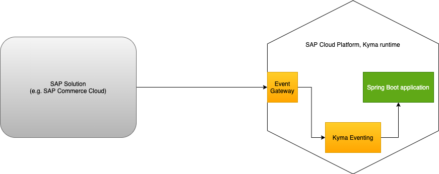
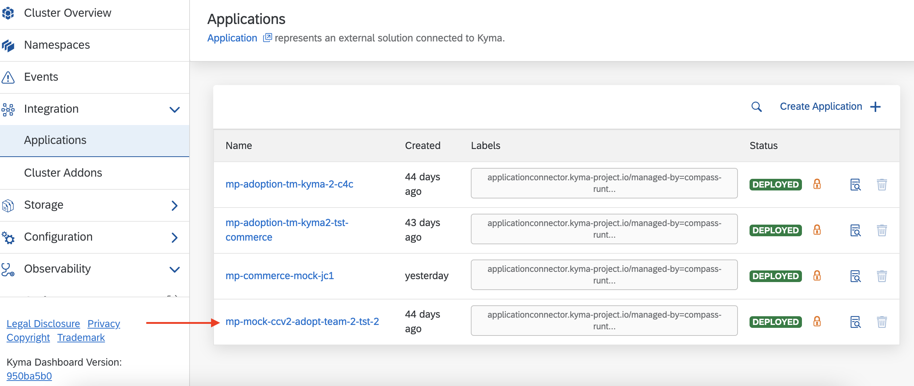

# Java-based microservice as an Event Trigger using CloudEvents SDK

## Overview

This sample demonstrates how to build and deploy a Java-based microservice as an Event Trigger in SAP BTP, Kyma runtime using **CloudEvents SDK**.

The sample uses the CloudEvents SDK to deserialize events. Kyma eventing dispatches the CloudEvents to the Spring Boot microservice. The controller uses `io.cloudevents:cloudevents-spring` to deserialize the event.

You can find further details in the [Spring documentation]( https://cloudevents.github.io/sdk-java/spring.html)

The `order.created` event from SAP Commerce Cloud is used as an example of a trigger.



This sample demonstrates how to:

* Set up the development Namespace in the Kyma runtime.
* Configure `kubectl` to use the `KUBECONFIG` file downloaded from the Kyma runtime.
* Set up Event Triggers in the Kyma runtime.
* Create and deploy a Spring Boot application to handle the event using the **CloudEvents SDK** library.
* Configure the Spring Boot application to use the Event Trigger.
* Use `kubectl` to verify the state.
* Observe the logs using `kubectl`.

## Prerequisites

* [SAP BTP, Kyma runtime instance](../prerequisites/#kyma)
* [Docker](../prerequisites/#docker)
* [make](https://www.gnu.org/software/make/)
* [Gradle](https://gradle.org/)
* [Kubernetes tooling](../prerequisites/#kubernetes)
* [Java 17+](https://openjdk.java.net/projects/jdk/17/)
* SAP Commerce Cloud system connected to the Kyma runtime. You can also use the mock. Refer to [this blog post](https://blogs.sap.com/2020/06/17/sap-cloud-platform-extension-factory-kyma-runtime-mock-applications/) to set up the commerce mock.

## Steps

### Configure Kyma

* Create a new `dev` Namespace:


* Ensure that the events are configured for the connected application.

  * Navigate to **Integration -> Applications**:
  

  * Select the SAP Commerce Cloud system:
  

  * Ensure that the SAP Commerce Cloud Events are a part of the Provided Service and Events.
  

  * If not, configure the events from the SAP Commerce Cloud Backoffice or mock commerce whichever you are using.

### Configure the application

Event Trigger is implemented as a Spring Boot application using gradle as a build tool.

* The CloudEvents library is added as a dependency to [build.gradle](./build.gradle).

```groovy
implementation('io.cloudevents:cloudevents-spring:2.3.0')
```

* A Plain Old Java Object [(POJO)](src/main/java/dev/kyma/samples/trigger/model/OrderCreated.java) is defined for the `order.created` event. The POJO reflects the `order.created` event definition.

* The [controller](src/main/java/dev/kyma/samples/trigger/controllers/EventHandler.java) logic unmarshalls the event payload using the CloudEvent SDK APIs.

### Prepare for deployment

* Configure the `KUBECONFIG` file:

  * Set `kubectl` to use the `KUBECONFIG` file:

    ```shell script
    export KUBECONFIG={path-to-kubeconfig}
    ```

* Build and push the image to the Docker repository:

   ```shell script
   DOCKER_ACCOUNT={your-docker-account} make push-image
   ```

* Update the image name in the [Kubernetes Deployment](k8s/deployment.yaml). Refer to the standard Kubernetes [Deployment](https://kubernetes.io/docs/concepts/workloads/controllers/deployment/) and [Service](https://kubernetes.io/docs/concepts/services-networking/service/) definitions.

### Kubernetes Deployment

This section details out deploying the application and event trigger as standard Kubernetes resources.

To deploy as Helm chart, please refer to [Helm Chart Deployment](#helm-chart-deployment)

#### Deploy the application

* Deploy the application as a Kubernetes Service.

   ```shell script
   kubectl -n dev apply -f ./k8s/deployment.yaml
   ```

* Verify that the Pods are up and running:

   ```shell script
   kubectl -n dev get po -l app=sample-event-trigger-java
   ```

The expected result shows that the Pod for the `sample-event-trigger-java` Deployment is running:

```shell script
NAME                                         READY   STATUS    RESTARTS   AGE
sample-event-trigger-java-5fb6856f4d-xk64k   2/2     Running   0          45m
```

#### Configure the Event Trigger

* Create the Event Subscription to receive the `order.created` event from the source. The source is the connected SAP Commerce Cloud system. Update [subscription.yaml](./k8s/subscription.yaml), Replace `{your-connected-commerce-application-name}` with your connected commerce application name as shown in **Integration -> Applications**

```shell script
kubectl -n dev apply -f ./k8s/subscription.yaml
```

* Verify that the Subscription is correctly deployed:

```shell script
kubectl -n dev get subscriptions.eventing.kyma-project.io
NAME                                    READY   AGE
sample-event-trigger-java-subscription  true    10m
```

### Helm Chart Deployment

A [Helm Chart definition](../helm-charts/sample-event-trigger-java/README.md) is also available for developers to try out.

#### Must Haves

* [kubectl](https://kubernetes.io/docs/tasks/tools/install-kubectl/)
* [Helm3](https://helm.sh/docs/intro/install/)

#### Helm install

To install the helm chart in `dev` namespace, run

 ```shell script
helm install kymaapp ../helm-charts/sample-event-trigger-java --set image.repository=gabbi/sample-event-trigger-java:0.0.2 --set subscription.application={your-connected-application-as-shown-in-kyma} --set subscription.eventType=order.created -n dev
```

To verify, the installed chart

```shell script
helm -n dev ls
NAME            NAMESPACE       REVISION        UPDATED                                 STATUS          CHART                           APP VERSION
dev-gateway     dev             1               2020-09-14 17:34:58.607853163 +0000 UTC deployed        gateway-0.0.1
kymaapp         dev             1               2020-09-14 20:20:03.464428 +0200 CEST   deployed        sample-event-trigger-java-0.1.0 1.16.0
```

### Try it out

* Simulate the event from the SAP Solution. For the purpose of this tutorial, use the mock to simulate the `order.created` event.

  * Go to **Remote APIs**. It lists all registered APIs and Events.
    

  * Navigate to `SAP Commerce Cloud - Events` and send the `order.created` event.
    

  * Observe the logs using kubectl:

      ```shell script
      kubectl -n dev logs deploy/sample-event-trigger-java -c sample-event-trigger-java
      ```

      The expected logs look as follows:

      ```shell script
      datacontenttype: application/json
      specversion: 1.0
      id: c3603dcf-a401-4cb4-b5cb-d928f65cc1a8
      source: kyma
      time: 2022-02-02T14:51:05.633Z
      type: sap.kyma.custom.mpmockccv2adoptteam2tst2.order.created.v1
      OrderCreated{orderCode='0202-2'}
      ```

#### Troubleshooting

Confirm that event is published and compare the naming by looking at the Kyma component `eventing-publisher-proxy`

```shell script
kubectl -n kyma-system logs -l app.kubernetes.io/name=eventing-publisher-proxy -c eventing-publisher-proxy
```

### Cleanup

Delete the created resources:

```shell
kubectl -n dev delete -f ./k8s/
```

or, for helm

```shell
helm del kymaapp -n dev
```
